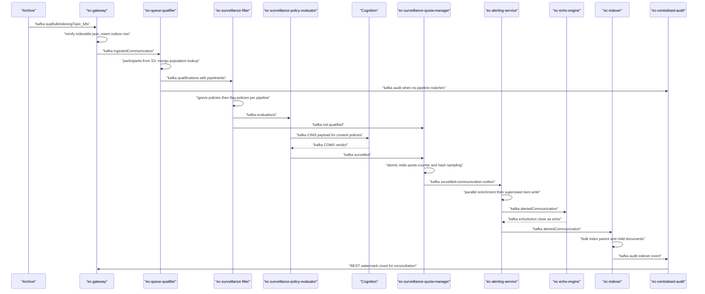
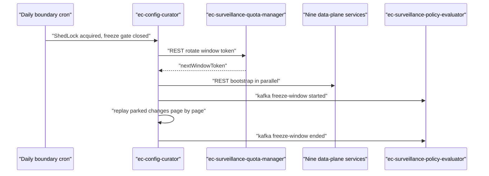
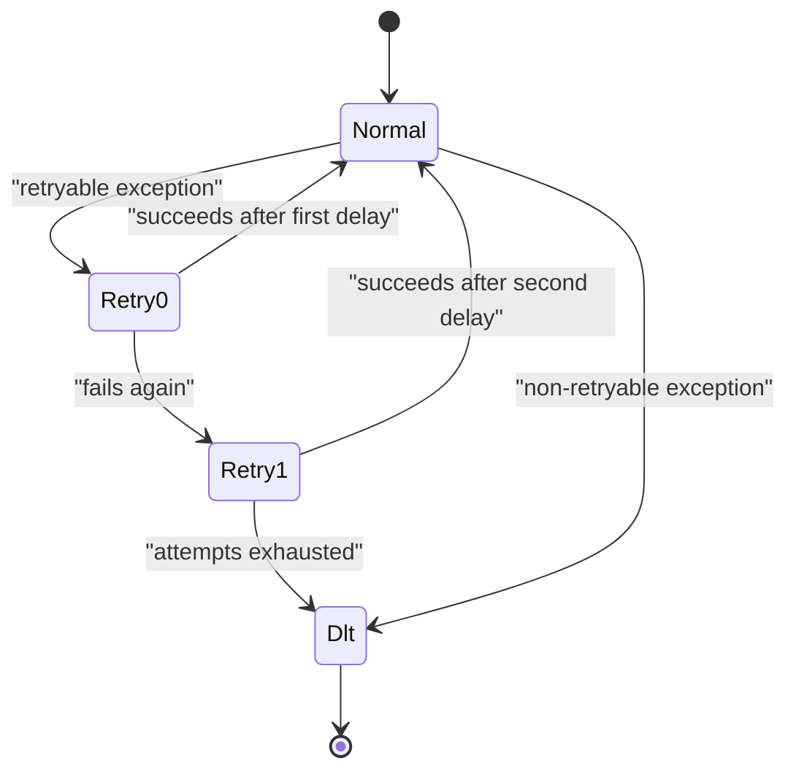

# system-explainer-input.md

Handover input for the single isometric "EC city" explorable explainer (one dependency-free static site:
HTML + canvas 2D + plain JavaScript, no build step). Scope: the 15 Smarsh Enterprise Conduct (EC)
repositories analysed together as one system. Every topic name, endpoint path, class name, collection name
and numeric constant below was read out of the repositories themselves; values that could not be resolved
from source are flagged `[ESTIMATED]`, and relationships that are not explicit in code are flagged
`[INFERRED]`.

Topic names are written with a `{tenant}` placeholder where the source uses a `%s` template or a runtime
tenant substitution (e.g. source `ec.surveillance-filter.%s.evaluations` is written
`ec.surveillance-filter.{tenant}.evaluations`). Every EC topic is per-tenant unless stated otherwise.

---

--- Section 1 — System purpose

Enterprise Conduct is regulated communications surveillance: a firm archives every email, chat, SMS and
recorded call its staff produce, and EC decides which of those communications a human compliance reviewer
must read, proves that the decision was made for every single one of them, and hands the survivors to
reviewers with search and highlighted evidence. The primary data entity is a **communication** — one
archived message identified by a global communication id (`gcid`), carried between services as a Kafka
record whose headers hold the tenant, the `gcid`, the storage pointer to its JSON in S3, the surveillance
`pipelineIds` it belongs to and the `windowToken` (the frozen configuration snapshot / quota window it is
being accounted for in). The entry point is `ec-gateway`, which is told by the archive that a
communication exists (`supBulkIndexingTopic_k8s`), fetches its `indexable.json` from the archive S3
bucket, strips the body out, and writes one countable outbox row; the terminal states are an alert sitting
in a reviewer's queue (`ec-alerting-service` → MongoDB supervised item, searchable via `ec-indexer` in
Elasticsearch), a "nobody is watching this" or "policy ignored this" verdict recorded in the audit ledger
(`ec-centralised-audit`, `ec-conduct-audit-service`), or a dead-letter topic when processing failed
repeatedly. The one takeaway after a full trip: **every service in this city is a decision plus a receipt
— the communication itself is barely modified, but at each stop it collects one more verdict and one more
audit event, and the platform is designed so that the receipts can be counted back against the number of
communications ingested.**

---

--- Section 2 — Full topology map

Roads are Kafka topics. Service roads (dashed) are synchronous REST calls. Warehouses are data stores.
Debezium change-data-capture (a connector that turns MongoDB inserts into Kafka events) is drawn as an
outbox road leaving the store, because in this platform many "producers" never call Kafka directly: they
insert an outbox row and Debezium publishes it.

```mermaid
flowchart LR
  subgraph CONTROL["Control plane district"]
    cc["ec-config-curator"]
  end

  subgraph INGEST["Ingestion district"]
    gw["ec-gateway"]
    mrs["ec-manual-runs-service"]
  end

  subgraph ROUTE["Qualification district"]
    qq["ec-queue-qualifier"]
  end

  subgraph EVAL["Evaluation district"]
    sf["ec-surveillance-filter"]
    spe["ec-surveillance-policy-evaluator"]
  end

  subgraph GATE["Sampling and alerting district"]
    qm["ec-surveillance-quota-manager"]
    als["ec-alerting-service"]
    ee["ec-echo-engine"]
  end

  subgraph SEARCH["Search and review district"]
    idx["ec-indexer"]
    rvs["ec-review-service"]
    hh["ec-conduct-hithighlight-service"]
  end

  subgraph LEDGER["Audit and reporting district"]
    ca["ec-centralised-audit"]
    rep["ec-reporting"]
    cas["ec-conduct-audit-service"]
  end

  subgraph STORES["Warehouse district"]
    mongo[("MongoDB")]
    es[("Elasticsearch")]
    s3[("S3")]
    redis[("Redis")]
    athena[("AWS Athena")]
  end

  subgraph OUTSIDE["Outside the walls"]
    arch["Archive and ea-storage"]
    cog["Cognition analytics"]
    igw["ea-indexing-gateway"]
    iss["ISS identity service"]
    elog["eventloggingpublisher_k8s"]
  end

  arch -- "kafka: supBulkIndexingTopic_k8s" --> gw
  gw -- "kafka: ec.surveillance-gateway.outbox.{tenant}.ingestedCommunication" --> qq
  gw -- "kafka: ec.surveillance-gateway.outbox.{tenant}.ingestedCommunication" --> idx
  gw -- "kafka: ec.surveillance-gateway.outbox.{tenant}.ingestedCommunication" --> ca
  gw -- "kafka: ec.surveillance-gateway.outbox.{tenant}.ingestedCommunication" --> rep
  gw -- "kafka: ec.surveillance-gateway.outbox.{tenant}.qualifiedCommunication" --> idx
  gw -- "kafka: ec.surveillance-gateway.outbox.{tenant}.qualifiedCommunication" --> sf
  gw -- "kafka: ec.surveillance-gateway.outbox.{tenant}.qualifiedCommunication" --> ca
  gw -- "kafka: ec.surveillance-gateway.{tenant}.remediation" --> gw
  qq -- "kafka: ec.surveillance-qualifier.{tenant}.qualifications" --> sf
  qq -- "kafka: ec.centralized.{tenant}.audit" --> ca
  sf -- "kafka: ec.surveillance-filter.{tenant}.evaluations" --> spe
  sf -- "kafka: ec.surveillance-filter.{tenant}.not-qualified" --> qm
  sf -- "kafka: ec.centralized.{tenant}.audit" --> ca
  sf -- "kafka: ec.surveillance-filter.{tenant}.kpi-events" --> sf
  spe -- "kafka: cognition CIMS topic" --> cog
  cog -- "kafka: cognition COMS topic" --> spe
  spe -- "kafka: ec.surveillance-policy-evaluator.{tenant}.surveilled" --> qm
  spe -- "kafka: ec.surveillance-policy-evaluator.{tenant}.surveilled" --> idx
  spe -- "kafka: ec.centralized.{tenant}.audit" --> ca
  qm -- "kafka: ec.surveillance-quota-manager.{tenant}.surveilled-communication-outbox" --> als
  qm -- "kafka: ec.surveillance-quota-manager.{tenant}.metadata-outbox" --> rep
  qm -- "kafka: ec.surveillance-quota-manager.{tenant}.quota-windows" --> ca
  qm -- "kafka: ec.surveillance-quota-manager.{tenant}.quota-windows" --> rep
  qm -- "kafka: ec.surveillance-quota-manager.{tenant}.quota-windows" --> mrs
  qm -- "kafka: ec.centralized.{tenant}.audit" --> ca
  als -- "kafka: ec.alerting-service.{tenant}.alertedCommunication" --> ee
  als -- "kafka: ec.alerting-service.{tenant}.alertedCommunication" --> idx
  als -- "kafka: ec.alerting-service.{tenant}.echoCommunication" --> idx
  ee -- "kafka: ec.echo-engine.{tenant}.echoAction" --> als
  ee -- "kafka: ec.centralized.{tenant}.audit" --> ca
  idx -- "kafka: ec.centralized.{tenant}.audit.indexer.event" --> rep
  rep -- "kafka: conduct_audit_topic" --> cas
  rep -- "kafka: eventloggingpublisher_k8s" --> elog
  rep -- "kafka: ec.surveillance-outcome.{tenant}.job_request_config" --> mrs
  ca -- "kafka: ec.centralised-audit.outbox.{tenant}.windowReconciliation" --> rep
  ca -- "kafka: ec.centralised-audit.outbox.{tenant}.windowReconciliation" --> qm
  ca -- "kafka: ec.centralised-audit.{tenant}.cognitionReconciliation" --> ca
  cc -- "kafka: ec.config-curator.{tenant}.surveillance-pipelines" --> qq
  cc -- "kafka: ec.config-curator.{tenant}.surveillance-pipelines" --> sf
  cc -- "kafka: ec.config-curator.{tenant}.surveillance-pipelines" --> rep
  cc -- "kafka: ec.config-curator.{tenant}.surveillance-pipelines" --> rvs
  cc -- "kafka: ec.config-curator.{tenant}.surveillance-pipelines" --> ca
  cc -- "kafka: ec.config-curator.{tenant}.surveillance-pipelines" --> qm
  cc -- "kafka: ec.config-curator.{tenant}.surveillance-policies" --> sf
  cc -- "kafka: ec.config-curator.{tenant}.surveillance-policies" --> ee
  cc -- "kafka: ec.config-curator.{tenant}.surveillance-libraries" --> sf
  cc -- "kafka: ec.config-curator.{tenant}.surveillance-sampling" --> qm
  cc -- "kafka: ec.config-curator.{tenant}.configuration" --> ee
  cc -- "kafka: ec.config-curator.{tenant}.configuration" --> qm
  cc -- "kafka: ec.config-curator.{tenant}.freeze-window" --> spe
  cc -- "kafka: ec.config-curator.{tenant}.freeze-window" --> qq
  cc -- "kafka: ec.config-curator.{tenant}.freeze-window" --> qm
  cc -- "kafka: ec.config-curator.{tenant}.freeze-window" --> ca
  cc -- "kafka: ec.config-curator.{tenant}.retention-policies" --> als
  cc -- "kafka: ec.config-curator.{tenant}.alert-generation-config" --> als
  cc -- "kafka: ec.config-curator.{tenant}.surveillance-pipelines-migration-config" --> qq
  cc -- "kafka: ec.config-curator.{tenant}.outbox" --> ca
  mrs -- "kafka: ec.surveillance-manual-run.{tenant}.ec-manual-run-service-request" --> qm
  mrs -- "kafka: ec.surveillance-manual-run.{tenant}.ingestion" --> gw
  mrs -- "kafka: ec.on-demand.{tenant}.remediation-monitored-corpus-snapshots" --> mrs
  mrs -- "kafka: ec.on-demand.remediation-dlt" --> mrs
  cas -- "kafka: conduct_audit_topic retry and dlt republish" --> cas

  spe -. "REST GET /v1/tenants/{tenantName}/window-tokens/{windowToken}/pipelines" .-> qq
  spe -. "REST GET /v1/tenants/{tenantName}/window-token/{windowToken}/pipelines/{pipelineId}/policies" .-> sf
  rep -. "REST GET /v1/tenants/{tenantId}/windows/{windowToken}/pipeline-surveilled-populations" .-> qq
  rep -. "REST GET /v1/{tenant}/watermark/{source}/{sourceId}" .-> gw
  ca -. "REST GET /v1/{tenant}/watermark/{source}/{sourceId}" .-> gw
  rvs -. "REST GET /v1/tenant/{tenantName}/windowToken" .-> cc
  rvs -. "REST GET /v1/tenants/{tenant}/window-token/{windowToken}/surveilled-population" .-> qq
  rvs -. "REST GET /v1/supervision/documents/searchById" .-> arch
  gw -. "REST GET /v1/tenant/{tenant}/uuid" .-> cc
  idx -. "REST GET parent index name from supervision recon API" .-> arch
  idx -. "REST POST indexSupArchiveDocument" .-> igw
  mrs -. "REST POST bootstrap of nine data-plane services" .-> cc
  mrs -. "REST POST processRemediationSnapshot" .-> igw
  als -. "REST GET cognition scenario hits" .-> arch
  qq -. "REST GET group expansion" .-> iss
  hh -. "REST POST /conduct/highlight/offsets served to reviewer UI" .-> rvs

  gw -- "read indexable.json, write miniIndexable.json" --> s3
  qq -- "read indexable.json" --> s3
  sf -- "read enriched communication json" --> s3
  qm -- "read participants" --> s3
  als -- "read message body" --> s3
  idx -- "read communication json" --> s3
  rep -- "read and write event-log objects" --> s3
  mrs -- "read Athena result csv" --> s3
  mrs -- "query historical corpus" --> athena
  qm -- "atomic quota counters" --> redis
  gw -- "write outbox rows" --> mongo
  cc -- "write versioned config" --> mongo
  qq -- "read pipeline-entity-mapping" --> mongo
  sf -- "read pipeline and policy config" --> mongo
  spe -- "write evaluation state" --> mongo
  qm -- "write quota windows and outboxes" --> mongo
  als -- "write supervised items and alert outbox" --> mongo
  ee -- "read and write echo state" --> mongo
  rvs -- "read and write reviewer groups and entitlements" --> mongo
  rep -- "write window-suffixed pipeline events" --> mongo
  ca -- "write audit events and pipeline summary" --> mongo
  mrs -- "write run state and remediation outbox" --> mongo
  idx -- "index parent and child documents" --> es
  cas -- "read and write conduct audit views" --> es
  hh -- "per-request in-memory Lucene index" --> es
```



Edge-mechanism notes that the diagram cannot carry:

| Mechanism | Where it appears | Note |
| --- | --- | --- |
| Debezium CDC outbox | `ec-gateway`, `ec-config-curator`, `ec-alerting-service`, `ec-surveillance-quota-manager`, `ec-centralised-audit`, `ec-surveillance-policy-evaluator`, `ec-surveillance-filter`, `ec-queue-qualifier`, `ec-manual-runs-service`, `ec-reporting` (`cd/k8s/base/debezium-topic-configs.yaml` in each) | The service writes a MongoDB outbox row inside its own transaction; a Debezium connector publishes that row to the topic. The service is the logical producer but never calls `KafkaTemplate.send` for it. |
| Retry-hop topics | every Kafka consumer in the platform | Two extra topics per source topic (`-retry-0`/`-retry-1`, or `-retry-1`/`-retry-2` in `ec-surveillance-filter`), each with its own consumer group and a fixed delay, then one `-dlt`. Not shown as edges above; see Section 4 journey "Retry ladder". |
| ShedLock cron | `ec-config-curator`, `ec-centralised-audit`, `ec-manual-runs-service`, `ec-indexer`, `ec-alerting-service` | Scheduled work guarded by a MongoDB lock so only one replica runs it. A cron edge has no upstream road: the trigger is the clock. |
| Redis atomic counters | `ec-surveillance-quota-manager` | Quota decisions must be atomic across replicas, so the counter lives outside the service. |
| In-process event bus | `ec-conduct-audit-service` (`AuditTerminationEvent`) | A Spring application event, not a network hop. |
| HTML/REST only | `ec-conduct-hithighlight-service` | No Kafka consumer or producer at all; it is a pure request/response computation service. |

---

--- Section 3 — Per-service building spec

## ec-gateway

**Role in one sentence:** Turns an archived communication into one small, safe object plus one exactly
countable ledger row, and is the entry point of the whole city.
**District:** Ingestion district.
**Building metaphor:** A dockside customs house with a shredding floor — every container is opened, the
sensitive bulk is removed, a stamped manifest is filed, and only the manifest travels on, which is
literally what minification plus an outbox row is.

**Consumes from:**
- Kafka topic `supBulkIndexingTopic_k8s` — the archive announcing that a communication exists.
- Kafka topic `ec.surveillance-gateway.{tenant}.remediation` — policy-reindex requests it forwards to itself.
- Kafka topic `ec.surveillance-manual-run.{tenant}.ingestion` — on-demand re-ingestion from manual runs.
- Kafka topic `ec.surveillance-quota-manager.{tenant}.quota-windows` — CDC stream that creates the
  reconciliation windows it stamps onto rows.
- REST `GET /v1/tenant/{tenant}/uuid` from `ec-config-curator` — resolves the tenant UUID to a tenant name.

**Produces to:**
- Kafka topic `ec.surveillance-gateway.outbox.{tenant}.ingestedCommunication` — via Debezium on the outbox
  insert; the main road out of the district.
- Kafka topic `ec.surveillance-gateway.outbox.{tenant}.qualifiedCommunication` — for communications that
  arrive already qualified (manual-run path).
- Kafka topic `ec.surveillance-gateway.{tenant}.remediation` — reindex requests.

**Reads from:** S3 archive bucket — the full `indexable.json` for the communication, fetched as parallel
ranged GETs. MongoDB reconciliation-window collection — the window token for the current run.

**Writes to:** S3 Conduct bucket — `miniIndexable.json` under `tn=/wt=/{reconToken}/` with a TTL tag.
MongoDB `ec-surveillance-gateway-ingested-communications-outbox_{windowToken}` — one row per
communication, keyed by an idempotency token. MongoDB
`ec-surveillance-gateway-perf-ingested-events` and S3 `{tenant}/perfTest/{sourceKey}` on the performance
path only.

**Key transformation:**

```
indexable = parallelRangedGet(archiveBucket, storageKey)
mini = removeBodyAndAttachments(indexable)
put(conductBucket, "tn=" + tenant + "/wt=" + windowToken + "/" + reconToken + "/" + gcid, mini)
insertIfAbsent(outbox_{windowToken}, {gcid, idempotencyToken, storagePointer, reconToken})
```

**Failure modes:** If the gateway is down, nothing downstream receives new work: `supBulkIndexingTopic_k8s`
accumulates consumer lag and the whole city idles, but no data is lost because the archive keeps producing
into Kafka. Its own failures walk retry-0 → retry-1 → DLT per record, so one unreadable S3 object does not
stall the partition.

## ec-queue-qualifier

**Role in one sentence:** Decides which surveillance pipelines (named review queues) a communication
belongs to, by intersecting its participants with a frozen snapshot of every monitored population.
**District:** Qualification district.
**Building metaphor:** A mail sorting office with pigeonholes labelled per queue — the address on the
envelope is compared against a printed, dated list of residents, not against today's live list.

**Consumes from:**
- Kafka topic `ec.surveillance-gateway.outbox.{tenant}.ingestedCommunication` — the communication to route.
- Kafka topic `ec.config-curator.{tenant}.surveillance-pipelines` — pipeline configuration changes.
- Kafka topic `ec.config-curator.{tenant}.surveillance-pipelines-migration-config` — migration settings.
- Kafka topic `ec.config-curator.{tenant}.freeze-window` — the signal to snapshot the population.
- REST `GET` group expansion from the ISS identity service — expands groups into user ids.

**Produces to:**
- Kafka topic `ec.surveillance-qualifier.{tenant}.qualifications` — one or more pipelines matched.
- Kafka topic `ec.centralized.{tenant}.audit` — zero pipelines matched, or an audit mirror of the verdict.
- Kafka topic `ec.surveillance-config.outbox.{tenant}.surveillancePipeline` — via Debezium, its snapshot of
  pipeline config.
- Kafka topic `ec.queue-qualifier.{tenant}.kpi-events` — internal KPI stream.

**Reads from:** S3 — the indexable JSON, streamed to extract `iusers`/`eusers`. MongoDB
`pipeline-entity-mapping_{windowToken}` — one indexed lookup per communication.

**Writes to:** MongoDB `pipeline-surveilled-population-outbox` and versioned pipeline/entity-mapping
collections named with the window token.

**Key transformation:**

```
participants = streamExtract(s3Object, ["iusers", "eusers"])
matches = mongo.find("pipeline-entity-mapping_" + windowToken, {entityId: {$in: participants}})
pipelineIds = distinct(matches.pipelineId)
if pipelineIds.isEmpty(): publish(auditTopic, verdict="NOT_QUALIFIED")
else: publish(qualificationsTopic, headers + pipelineIds)
```

**Failure modes:** If it is unavailable, `ingestedCommunication` queues in Kafka and no communication gets
routed; nothing is dropped. A missing population snapshot for a window token is a non-retryable error and
goes to the DLT, because retrying cannot invent a snapshot.

## ec-surveillance-filter

**Role in one sentence:** Applies each pipeline's ignore-then-flag policies to decide, per (communication,
pipeline) pair, whether the communication is worth a reviewer's time.
**District:** Evaluation district.
**Building metaphor:** A filtration plant with two stages of screens in series — the coarse screen removes
noise (ignore policies) before the fine screen selects anything reviewable (flag policies), and suppression
always wins because it happens first.

**Consumes from:**
- Kafka topic `ec.surveillance-qualifier.{tenant}.qualifications` — shortlisted communications.
- Kafka topic `ec.surveillance-gateway.outbox.{tenant}.qualifiedCommunication` — manual-run qualifications.
- Kafka topics `ec.config-curator.{tenant}.surveillance-pipelines`, `…surveillance-policies`,
  `…surveillance-libraries` — configuration.
- REST `GET /v1/tenants/{tenantName}/window-token/{windowToken}/pipelines/{pipelineId}/policies` is served
  by this service (inbound from `ec-surveillance-policy-evaluator`).

**Produces to:**
- Kafka topic `ec.surveillance-filter.{tenant}.evaluations` — qualified per pipeline.
- Kafka topic `ec.surveillance-filter.{tenant}.not-qualified` — suppressed or not selected.
- Kafka topic `ec.centralized.{tenant}.audit` — audit mirror.
- Kafka topics `ec.surveillance-filter.{tenant}.evaluations-audit-adapter`,
  `…not-qualified-audit-adapter`, `…kpi-events` — adapter and KPI streams.

**Reads from:** S3 — the enriched communication JSON in parallel byte-range chunks. MongoDB — window-token
versioned pipeline, policy and library collections.

**Writes to:** MongoDB pipeline/policy/library outbox collections (published by Debezium as
`ec.surveillance-config.outbox.{tenant}.surveillancePipeline` / `…surveillancePolicy` /
`…surveillanceLibraryList`).

**Key transformation:**

```
config = mongo.load(pipelines_{windowToken}, policies_{windowToken}, libraries_{windowToken})
doc    = parallelChunkedGet(s3Bucket, storageKey)
for each pipelineId in headers.pipelineIds:
  if anyMatch(config.ignorePolicies[pipelineId], doc): verdict = "FILTERED"
  else if anyMatch(config.flagPolicies[pipelineId], doc): verdict = "QUALIFIED"
  else: verdict = "NOT_QUALIFIED"
  publish(topicFor(verdict), headers + pipelineId + verdict)
```

**Failure modes:** Unavailability queues qualifications in Kafka. Because it publishes one verdict per
pipeline, a partial failure mid-fan-out is retried per record, which can re-publish a verdict for a
pipeline that already got one; downstream consumers are idempotent on `(gcid, pipelineId)`.

## ec-surveillance-policy-evaluator

**Role in one sentence:** Splits policy evaluation into what can be answered from metadata locally and what
must be shipped to the external Cognition analytics platform, then routes the verdicts back.
**District:** Evaluation district.
**Building metaphor:** A dispatch and assay office with an outbound freight bay — samples that need a
laboratory are crated up and sent away, and the office keeps the paperwork open until the lab report
returns, which is exactly the CIMS-out / COMS-back asynchronous pattern.

**Consumes from:**
- Kafka topic `ec.surveillance-filter.{tenant}.evaluations` — qualified communications.
- Kafka topic `ec.config-curator.{tenant}.freeze-window` — creates the Cognition workflow and ingestion token.
- Kafka COMS topic from Cognition — the asynchronous content verdicts.
- REST `GET /v1/tenants/{tenantName}/window-tokens/{windowToken}/pipelines` from `ec-queue-qualifier` and
  `GET …/pipelines/{pipelineId}/policies` from `ec-surveillance-filter`.

**Produces to:**
- Kafka CIMS topic to Cognition — the byte payload for content evaluation.
- Kafka topic `ec.surveillance-policy-evaluator.{tenant}.surveilled` — the verdict for downstream sampling.
- Kafka topic `ec.centralized.{tenant}.audit` — audit mirror, including timeout outcomes.
- Kafka topic `ec.surveillance-policy-evaluator.outbox.{tenant}.surveillancePolicyScenario` — via Debezium.

**Reads from:** Elasticsearch — the configured index/alias resolved by its alias resolver. EA Storage over
REST — oversized supervision artifacts that do not fit in the COMS event.

**Writes to:** MongoDB — policy-evaluator outbox and configuration collections.

**Key transformation:**

```
triage = split(policies, byNeedsContent)
if triage.metadataOnly.nonEmpty:
  publish(surveilledTopic, synthesiseCognitionResponse(triage.metadataOnly))
if triage.needsContent.nonEmpty:
  publish(cimsTopic, buildCimsPayload(doc, triage.needsContent))
// later, asynchronously:
onComs(event):
  if event.runMode != "V3": drop
  eventName = nameFrom(event.status, elapsed > comsTimeoutMs)
  publish(eventName == "succeeded" ? surveilledTopic : auditTopic, event)
```

**Failure modes:** If Cognition is slow or down, content-policy verdicts simply do not come back; the
service ages them out with an explicit timeout event name (`no-coms-timedout`, `late-coms-timedout`) rather
than losing them. If the evaluator itself is down, `evaluations` queues in Kafka and COMS responses queue
on the Cognition topic.

## ec-surveillance-quota-manager

**Role in one sentence:** Decides whether anyone will actually look at a surveilled communication, holding
each queue to its required review percentage across a rolling quota window.
**District:** Sampling and alerting district.
**Building metaphor:** A weighbridge with turnstile counters — every item is weighed against a quota
counter that many gates share, and the turnstile is atomic so thirty-two lanes cannot together overshoot.

**Consumes from:**
- Kafka topic `ec.surveillance-policy-evaluator.{tenant}.surveilled` (plus its `-retry` and `-dlt`).
- Kafka topic `ec.surveillance-filter.{tenant}.not-qualified`.
- Kafka topics `ec.config-curator.{tenant}.surveillance-pipelines`, `…surveillance-sampling`,
  `…configuration`, `…freeze-window`.
- Kafka topic `ec.centralised-audit.outbox.{tenant}.windowReconciliation`.
- Kafka topic `ec.surveillance-manual-run.{tenant}.ec-manual-run-service-request`.

**Produces to:**
- Kafka topic `ec.surveillance-quota-manager.{tenant}.surveilled-communication-outbox` — via Debezium, to alerting.
- Kafka topic `ec.surveillance-quota-manager.{tenant}.metadata-outbox` — via Debezium, to reporting.
- Kafka topic `ec.surveillance-quota-manager.{tenant}.quota-windows` — via Debezium; this is what creates
  window tokens for gateway, reporting, manual runs and central audit.
- Kafka topics `ec.centralized.{tenant}.audit` and `ec.surveillance-quota-manager.{tenant}.kpi-events`.

**Reads from:** S3 — the communication document, for participant extraction. Redis — atomic quota counters.
MongoDB — quota-window, sampling-profile and surveilled-communication collections.

**Writes to:** MongoDB quota-window and outbox collections; Redis counters.

**Key transformation:**

```
bucket   = bucketKey(pipelineId, population, direction, hourOf(sentTime))
used     = redis.incr(bucket)                        // atomic across replicas
quota    = profile.percentage * expectedVolume(bucket)
sampled  = used <= quota AND hash(gcid) % 100 < profile.percentage
if sampled: insert(surveilledCommunicationOutbox); insert(metadataOutbox)
else:       insert(auditOnlyOutbox, reason = "not-sampled")
```

**Failure modes:** If it is down, surveilled events queue in Kafka and no new alerts are created; quota
counters in Redis are unaffected, so the quota is not double-spent when it recovers. If Redis is
unavailable, the sampling decision cannot be made safely and records go down the retry ladder.

## ec-alerting-service

**Role in one sentence:** Turns each sampled communication into one or more durable, reviewable alerts
(`SupervisedItem` documents) with everything a reviewer needs already attached.
**District:** Sampling and alerting district.
**Building metaphor:** An assembly hall with parallel parts feeders — the alert is assembled from four
suppliers fetched at once (body, populations, policy info, scenario hits) and then boxed once.

**Consumes from:**
- Kafka topic `ec.surveillance-quota-manager.{tenant}.surveilled-communication-outbox`.
- Kafka topic `ec.echo-engine.{tenant}.echoAction` — reviewer-decision echoes to apply.
- Kafka topic `ec.alerting-service.{tenant}.alert-outbox` — its own CDC outbox, re-read to publish.
- Kafka topics `ec.config-curator.{tenant}.retention-policies`, `…alert-generation-config`.
- REST `GET` cognition scenario hits from ea-storage; `GET` monitored populations from `ec-queue-qualifier`;
  `GET` policy info from `ec-surveillance-filter`.

**Produces to:**
- Kafka topic `ec.alerting-service.{tenant}.alertedCommunication` — the fully formed alert.
- Kafka topic `ec.alerting-service.{tenant}.echoCommunication` — echo-updated alerts.
- Kafka topics `ec.alerting-service.{tenant}.alert-outbox`, `…echo-outbox` — via Debezium.

**Reads from:** S3 — the message body. MongoDB — alert-generation, retention and supervised-item collections.

**Writes to:** MongoDB supervised-item documents plus an alert-outbox row, written in parallel.

**Key transformation:**

```
parts = parallel(fetchBody(s3), fetchPopulations(queueQualifier),
                 fetchPolicyInfo(filter), fetchScenarioHits(eaStorage))
for each pipelineId in event.pipelineIds:
  item = buildSupervisedItem(event, parts, reviewState = initialStateFor(pipelineId))
  parallel(mongo.upsert(supervisedItems, item), mongo.insert(alertOutbox, item.key))
```

**Failure modes:** Down means no new alerts appear in reviewer queues while the surveilled-communication
outbox topic accumulates lag. Its surveilled path uses two hand-built delayed retry topics (500 ms then
1500 ms) so a slow enrichment dependency does not spin the CPU.

## ec-echo-engine

**Role in one sentence:** Suppresses duplicate alerts by recognising that the same policy violation on the
same thread was already raised on an earlier snapshot.
**District:** Sampling and alerting district.
**Building metaphor:** A quality-control station with a fingerprint file — every arriving alert is
fingerprinted, filed, and compared against the last 14 days of fingerprints, never against the goods
themselves.

**Consumes from:**
- Kafka topic `ec.alerting-service.{tenant}.alertedCommunication`, plus `…-retry-0`/`-retry-1`.
- Kafka topics `ec.config-curator.{tenant}.surveillance-policies`, `…configuration`.
- Kafka topic `ec.echo-engine.{tenant}.echoAction` — its own audit adapter re-reads it.

**Produces to:**
- Kafka topic `ec.echo-engine.{tenant}.echoAction` — the instruction back to alerting.
- Kafka topic `ec.centralized.{tenant}.audit`.

**Reads from / writes to:** MongoDB `ec-echo-engine-state` — one document per
`pipelineId|alertThreadId|fingerprint`, TTL 14 days.

**Key transformation:**

```
fingerprint = md5(sortedPolicyHitIds(alert))
upsert(echoState, {pipelineId, alertThreadId, fingerprint, snapshotTime})
if not eligible(alert): return          // create-only, all policies echo-enabled
candidates = find(echoState, {pipelineId, alertThreadId, fingerprint,
                              snapshotTime within 14 days})
if candidates.earlierThan(alert).nonEmpty: publish(echoActionTopic, CLOSE_AS_ECHO)
else if candidates.laterThan(alert).nonEmpty: publish(echoActionTopic, RECLASSIFY_EARLIER)
```

**Failure modes:** If it is down, alerts are not suppressed — reviewers see duplicates, but nothing is lost
and the backlog is processed on recovery. Late arrivals are handled explicitly rather than being wrong.

## ec-indexer

**Role in one sentence:** Writes communications into per-tenant Elasticsearch indices in large bulk
batches so reviewers can search them.
**District:** Search and review district.
**Building metaphor:** A freight rail yard beside an archive tower — loose records are marshalled into one
long train and shunted into the stacks in a single move, because the expensive part is the trip, not the
record.

**Consumes from:**
- Kafka topics `ec.surveillance-gateway.outbox.{tenant}.ingestedCommunication`, `…qualifiedCommunication`.
- Kafka topic `ec.surveillance-policy-evaluator.{tenant}.surveilled` — audio enrichment path.
- Kafka topics `ec.alerting-service.{tenant}.alertedCommunication`, `…echoCommunication`,
  `ec.config-curator.{tenant}.configuration` — alert and config state.
- Kafka topic `supActionIndexTopic_k8s` — parent re-indexing requests.
- REST `GET` parent index name from the supervision recon API.

**Produces to:**
- Kafka topic `ec.centralized.{tenant}.audit.indexer.event` — success audit events.
- REST `POST indexSupArchiveDocument` to `ea-indexing-gateway` — for empty S3 objects.

**Reads from:** S3 — the communication JSON in parallel ranged chunks.

**Writes to:** Elasticsearch — parent documents plus audio-transcript child documents, one bulk request per
batch.

**Key transformation:**

```
collector = new BulkIndexCollector()
for each record in batch (up to maxPollRecords, concurrently):
  data = parallelChunkedDownload(s3, storage)      // see Section 4a chunk sizing
  if data.isEmpty: postToIndexingGateway(record); continue
  collector.addParentDocument(injectPtime(data))
  if record.isAudio: collector.addChildDocument(transcriptEnrichment(record))
flushBulk(collector); publishAuditEvents(collector.pendingAuditEvents)
```

**Failure modes:** If it is down, ingested communications queue and search results go stale; alerts still
get created because alerting does not depend on the index. One poison record inside a batch is retried
alone, so 49 healthy records are not blocked by it.

## ec-review-service

**Role in one sentence:** Decides who is allowed to review what, by mirroring pipeline structure and
intersecting it with stored reviewer entitlements.
**District:** Search and review district.
**Building metaphor:** A permits office with a wall of keys — it does not inspect the goods, it decides
which door each reviewer's key opens.

**Consumes from:**
- Kafka topic `ec.config-curator.{tenant}.surveillance-pipelines`, plus `-review-service-retry-0`/`-retry-1`/`-dlt`.
- REST `GET /v1/tenant/{tenantName}/windowToken` from `ec-config-curator`.
- REST `GET /v1/tenants/{tenant}/window-token/{windowToken}/surveilled-population` and
  `GET /v1/tenants/{tenant}/window-tokens/{windowToken}/pipelines/{pipelineId}` from `ec-queue-qualifier`.
- REST `GET /v1/supervision/documents/searchById` from the archive conduct-search service.

**Produces to:** No Kafka producer of its own; its outputs are HTTP responses consumed by the reviewer UI.

**Reads from / writes to:** MongoDB `alcatraz` database — reviewer-group, pipeline-review and audit-event
collections, written transactionally.

**Key transformation:**

```
onPipelineCdcEvent(e):
  payload = getAfterPayload(e)
  replaceWholesale(pipelineReviewers[payload.pipelineId], payload.reviewers)

onEntitlementUpload(rows):
  validateAgainst(configCurator.windowToken, queueQualifier.population)
  transactional { replaceEntitlements(reviewerId, rows) }

visibleAlerts(reviewer) = pipelineReviewers ∩ entitlements(reviewer)
                                            ∩ alert.participantsAndAttributes
```

**Failure modes:** If it is down, reviewers cannot be re-scoped and new pipeline structure is not mirrored;
existing entitlements keep working because they are already stored. A `NonRetryableEventException` parks the
CDC event in the DLT immediately rather than retrying a malformed payload.

## ec-conduct-hithighlight-service

**Role in one sentence:** Reports exactly where each surveillance lexicon expression matched inside one
message, as UTF-16 character offsets.
**District:** Search and review district.
**Building metaphor:** A forensics lab bench — for each single exhibit it builds a complete, disposable
apparatus, takes the measurement, and throws the apparatus away.

**Consumes from:** REST `POST /conduct/highlight/offsets` (and the deprecated marker-tag endpoint) from the
reviewer UI. No Kafka.

**Produces to:** Its HTTP response only (`OffsetHighlightResponse`).

**Reads from / writes to:** No durable store. It builds a `ByteBuffersDirectory` in-memory Lucene index per
request over the single document; Elasticsearch/Lucene here is a library, not a cluster.

**Key transformation:**

```
queries = dedupe(normalise(request.expressions))       // up to 20
index   = buildInMemoryLuceneIndex(request.text)       // one document
for q in queries:
  ast   = parseExpression(q)                            // recursive descent
  spans = index.search(compileToSpanQuery(ast))         // slop computed from FOLLOWEDBY,n
  offsets += mergeAdjacent(formatPassages(spans))
return sort(fixHtmlTagLeakage(offsets))
```

**Failure modes:** If it is down, reviewers still see alerts but without highlighted evidence. By design a
failure returns `hitCount: 0` rather than an error, so the reviewer UI degrades instead of breaking.

## ec-config-curator

**Role in one sentence:** The configuration control plane — it distributes every administrator
configuration change to the data plane, and holds changes back across a tenant's daily window boundary.
**District:** Control plane district.
**Building metaphor:** A canal lock — its entire purpose is to hold traffic in a chamber while levels change
so that everything downstream sees one consistent level.

**Consumes from:**
- Kafka topic tenant-configuration CDC (`TenantConfigConsumer`) — timezone, bootstrap window, cron schedule.
- Kafka topics `ec.surveillance-config.{tenant}.supervision_*` — legacy v2 configuration changes.
- REST `GET /v1/tenant/{tenant}/uuid` and `GET /v1/tenant/{tenantName}/windowToken` are served by it.

**Produces to:**
- Kafka topics `ec.config-curator.{tenant}.surveillance-pipelines`, `…surveillance-policies`,
  `…surveillance-libraries`, `…surveillance-sampling`, `…configuration`, `…retention-policies`,
  `…alert-generation-config`, `…surveillance-pipelines-migration-config`, `…freeze-window`, `…outbox`.

**Reads from / writes to:** MongoDB — versioned configuration collections suffixed with the window token,
plus a stage store holding changes parked during a freeze.

**Key transformation:**

```
onLegacyConfigChange(record):
  destination = mapToConfigCuratorTopic(record.topic)
  if freezeWindowService.isFrozen(tenant): stageStore.park(record)
  else: publish(destination, stamp(record, nextWindowToken))

onDailyBoundaryCron(tenant):            // ShedLock guarded
  freeze(tenant); rotateWindowToken(quotaManager)
  parallel(bootstrapNineDataPlaneServices())
  replayParked(pageSize); reschedule(nextBoundary); unfreeze(tenant)
```

**Failure modes:** If it is down, the data plane keeps surveilling with the configuration it already has,
but window tokens stop rotating and new configuration never lands — the single most consequential
unavailability in the city, because a missed rotation makes a day's numbers irreconcilable.

## ec-centralised-audit

**Role in one sentence:** The audit ledger and reconciliation authority — it stitches every service's
announcements into one record per communication and counts them back against what was ingested.
**District:** Audit and reporting district.
**Building metaphor:** A records hall with a tally room — evidence is filed per communication, then the
tally room compares two independent counts and only then declares the window closed.

**Consumes from:**
- Kafka topic `ec.centralized.{tenant}.audit` plus ~25 audit and DLT topic patterns from gateway,
  qualifier, filter, policy evaluator, quota manager and echo engine.
- Kafka topics `ec.config-curator.{tenant}.surveillance-pipelines`, `…freeze-window`, `…outbox`.
- Kafka topic `ec.surveillance-quota-manager.{tenant}.quota-windows` — creates reconciliation buckets.
- Kafka topic `ec.centralised-audit.{tenant}.cognitionReconciliation` — its own CDC outbox.
- REST `GET /v1/{tenant}/watermark/{source}/{sourceId}` from `ec-gateway` — the ingested count to compare against.

**Produces to:**
- Kafka topic `ec.centralised-audit.outbox.{tenant}.windowReconciliation` — via Debezium, to reporting and
  quota manager.
- Kafka topic `ec.centralised-audit.{tenant}.cognitionReconciliation` — via Debezium.

**Reads from / writes to:** MongoDB `ec-audit-events` and `ec-audit-events_{windowToken}`,
`ec-audit-pipeline-summary`, `ec-audit-ingestion-failed-events`.

**Key transformation:**

```
event = validateHeaders(record)
ledger = mongo.findAndVersion(auditEvents, event.gcid)
ledger.pipelines[event.pipelineId].history += event
ledger.complete = all(p.terminal for p in ledger.pipelines)
mongo.saveWithOptimisticVersion(ledger)
bulkUpsert(pipelineSummary, unordered = true)

onReconciliationCron(token):            // ShedLock guarded
  completed = count(auditEvents, {reconToken: token, complete: true})
  ingested  = gateway.watermark(token)
  reconciled = (completed == ingested)
```

**Failure modes:** If it is down, surveillance continues but nothing can be proven complete: audit topics
accumulate lag and reconciliation crons do not run. Optimistic versioning means concurrent writers retry
rather than overwrite.

## ec-reporting

**Role in one sentence:** Counts audit events per pipeline and per window into the pipeline execution
reports compliance officers read.
**District:** Audit and reporting district.
**Building metaphor:** A counting house with a ledger wall per window — each window has its own bound
volume, which is literally the window-suffixed collection name.

**Consumes from:**
- Kafka topic `ec.centralized.{tenant}.audit` plus the audit-adapter DLT families of filter, qualifier,
  quota manager and policy evaluator.
- Kafka topics `ec.surveillance-gateway.outbox.{tenant}.ingestedCommunication`, `…qualifiedCommunication`.
- Kafka topics `ec.surveillance-quota-manager.{tenant}.metadata-outbox`, `…quota-windows`.
- Kafka topic `ec.centralised-audit.outbox.{tenant}.windowReconciliation`.
- Kafka topic `ec.config-curator.{tenant}.surveillance-pipelines`.
- Kafka topic `ec.centralized.{tenant}.audit.indexer.events`.
- REST `GET /v1/tenants/{tenantId}/windows/{windowToken}/pipeline-surveilled-populations` and
  `GET /v1/tenants/{tenantName}/window-tokens/{windowToken}/pipelines` from `ec-queue-qualifier`;
  `GET /v1/{tenant}/watermark/{source}/{sourceId}` (and its reconciliation-token variant) from `ec-gateway`.

**Produces to:**
- Kafka topic `conduct_audit_topic` — protobuf messages for terminating events.
- Kafka topic `eventloggingpublisher_k8s` — projected event-log messages.
- Kafka topic `ec.surveillance-outcome.{tenant}.job_request_config` — via Debezium, to manual runs.

**Reads from / writes to:** MongoDB `ec-reporting-pipeline-events_{windowToken}`,
`ec-reporting-pipeline-execution-reports`, `ec-reporting-pipelines`, plus DLT collections; S3 event-log
objects.

**Key transformation:**

```
for each record in poll batch:
  if record.eventName not in EVENT_LOG_ENABLED_EVENTS: gatedOut += 1; continue
  for pipelineId in record.pipelineIds:                        // fan-out
    bulkUpsert("ec-reporting-pipeline-events_" + windowToken,
               key = (gcid, pipelineId), inc = counters[record.eventName])
  if terminating(record): publish(conductAuditTopic, toProtobuf(record))
onWindowReconciliation(token): initialiseReportRows(paginate(qualifierApi))
```

**Failure modes:** If it is down, reports lag but surveillance is unaffected; audit topics retain the
events. Duplicate delivery is safe because writes are keyed upserts (`11000` duplicate errors are counted,
not fatal).

## ec-conduct-audit-service

**Role in one sentence:** Stitches protobuf conduct-audit events into one row per communication so a
compliance officer can ask why an item never reached a reviewer.
**District:** Audit and reporting district.
**Building metaphor:** A fate registry with an expiring shelf — each stage writes only its own line, and a
completed row moves to a shelf with a TTL.

**Consumes from:** Kafka topic `conduct_audit_topic` (configured, not tenant-templated), plus its retry
ladder which ends by republishing dead-lettered events back onto the original topic. REST
`POST /conduct/recon/query` and `GET /conduct/recon/{searchAfterId}` are served by it.

**Produces to:** Its retry/DLT republish onto `conduct_audit_topic`; an in-process `AuditTerminationEvent`.

**Reads from / writes to:** Elasticsearch `conduct_audit_view`, `conduct_audit_report`,
`conduct_audit_report_daily_summary`.

**Key transformation:**

```
msg = parseProtobuf(record)
docId = sha256(tenant + msg.documentKey)
upsert(conduct_audit_view, docId,
       setOnInsert = identityFields, set = {statusFor(msg.stage): msg.status})
if msg.status in TERMINAL_STATUSES:                  // seven declared statuses
  publishInProcess(AuditTerminationEvent(docId))
  asyncInsert(conduct_audit_report, ttl = ttlFor(tenant, msg.status),
              reason = customerFacingReason(msg.status))
  increment(conduct_audit_report_daily_summary, day, status)
```

**Failure modes:** If it is down, `conduct_audit_topic` accumulates lag and reconciliation queries return
stale counts; no surveillance decision depends on it.

## ec-manual-runs-service

**Role in one sentence:** Re-processes history — it plans a manual run or remediation, queries the archive,
and feeds the results back into the live surveillance flow.
**District:** Re-processing district (an annex of Ingestion).
**Building metaphor:** A dredging works with a barge lane — it lifts material out of the historical
riverbed, cuts it into barge-sized loads, and stitches the loads back together at the seams.

**Consumes from:**
- REST `POST /v1/tenants/{tenantName}/manual-runs` from operators.
- Kafka topic `ec.surveillance-quota-manager.{tenant}.quota-windows` — window token and compaction gate.
- Kafka topic `ec.surveillance-outcome.{tenant}.job_request_config` — run configuration from reporting.
- Kafka topic `ec.on-demand.{tenant}.remediation-monitored-corpus-snapshots` — its own Debezium CDC stream.
- Kafka topic `ec.on-demand.remediation-dlt` — its own dead letters, re-read for inspection.

**Produces to:**
- Kafka topic `ec.surveillance-manual-run.{tenant}.ec-manual-run-service-request` — via Debezium, to quota manager.
- Kafka topic `ec.surveillance-manual-run.{tenant}.ingestion` — re-ingestion requests to gateway.
- Kafka chunk-event topics consumed by its own `ResultChunkEventConsumer`.
- REST `POST processRemediationSnapshot` to `ea-indexing-gateway`; bootstrap `POST`s to nine data-plane services.

**Reads from:** AWS Athena — the historical query. S3 — the Athena result CSV, read as byte ranges.
Elasticsearch — remediation scroll search.

**Writes to:** MongoDB `ec-on-demand-remediation-corpus-outbox`, `ec-on-demand-remediation-events`, and
per-run tenant collections.

**Key transformation:**

```
queryId = athena.execute(buildSql(request.dateRange, request.pipelineIds))
poll until athena.status == "SUCCEEDED"
chunks = splitByByteRange(resultCsvSize, chunkSize)
for chunk in chunks: publish(chunkTopic, {start, end})
onChunk(c): rows = parseCsv(streamRange(s3, c.start, c.end))
            publishIngestionEvents(batches of 250 rows)
aggregate: stitchRowsCutAtSeams(chunks)
           assert totalAthenaRowCount == rowsInChunks + rowsRebuiltAtSeams
```

**Failure modes:** If it is down, only re-processing stops; live surveillance is unaffected. A failed chunk
is retried independently, and the seam assertion is what prevents silent loss or double counting.

---

--- Section 4 — Vehicle journeys

## Journey: Live communication surveillance (primary)

**Trigger:** The archive publishes one record per newly archived communication onto
`supBulkIndexingTopic_k8s`.
**Vehicle payload:** at the start the vehicle carries only headers and a pointer, not content:

| Field | Type / meaning |
| --- | --- |
| `tenantName` | string — which customer's data plane this belongs to |
| `gcid` | string — global communication id, the vehicle's identity for its whole life |
| `storage` / `originalStorage` | string — S3 bucket and key of `indexable.json` |
| `sentTime` | timestamp — used later for quota bucketing |
| `channel` | string — email, chat, sms, audio |
| `windowToken` | string — the frozen configuration snapshot and quota window it is accounted for in |
| `reconciliationToken` | string — the ingest run it will be counted in |

**Station sequence:**
1. `ec-gateway` — downloads `indexable.json`, minifies it to `miniIndexable.json`, uploads it, inserts one
   outbox row. Vehicle gains `miniStorage`, `bytesDownloaded`, `bytesAfterMinify`, `idempotencyToken`.
2. `kafka:ec.surveillance-gateway.outbox.{tenant}.ingestedCommunication` — in transit via Debezium CDC;
   ordering is per-partition by key, so two snapshots of the same communication stay in order.
3. `ec-queue-qualifier` — streams participants from S3, one indexed Mongo lookup against
   `pipeline-entity-mapping_{windowToken}`. Vehicle gains `participants`, `pipelineIds` (may be empty).
4. `kafka:ec.surveillance-qualifier.{tenant}.qualifications` — in transit; if `pipelineIds` was empty the
   vehicle instead takes the audit-only road to station 10 and the journey ends there.
5. `ec-surveillance-filter` — loads pipeline/policy/library config and the document, applies ignore then
   flag policies per pipeline. Vehicle gains one `verdict` per pipeline (`FILTERED`, `QUALIFIED`,
   `NOT_QUALIFIED`) — the vehicle now carries a *set* of verdicts, not one.
6. `kafka:ec.surveillance-filter.{tenant}.evaluations` — in transit (qualified pipelines only);
   `…not-qualified` carries the rest straight to station 7.
7. `ec-surveillance-policy-evaluator` — triages metadata-only versus content policies; content policies are
   shipped to Cognition and answered asynchronously. Vehicle gains `metadataDecided`, `sentToCognition`,
   and later `comsWaitMs`.
8. `kafka:ec.surveillance-policy-evaluator.{tenant}.surveilled` — in transit; may be delayed by the whole
   Cognition round trip, up to the COMS timeout.
9. `ec-surveillance-quota-manager` — atomic Redis quota counter plus hash sampling decision. Vehicle gains
   `quotaUsed`, `quotaLimit`, `sampled` (true/false). If not sampled, the vehicle takes the audit-only road
   to station 10 and stops.
10. `ec-centralised-audit` / `ec-reporting` — every verdict above is mirrored here as an audit event,
    stitched into the per-communication ledger and counted into
    `ec-reporting-pipeline-events_{windowToken}`. Vehicle gains `auditEventsEmitted`, `pipelinesComplete`.
11. `ec-alerting-service` — assembles the `SupervisedItem` alert from four parallel fetches and writes it
    with an outbox row. Vehicle gains `alertsCreated` (one per sampled pipeline).
12. `ec-echo-engine` — fingerprints the policy hits and suppresses the alert if the same violation was
    already raised on this thread within 14 days. Vehicle gains `fingerprint`, `isEcho`.
13. `ec-indexer` — batches the communication into an Elasticsearch bulk request (plus a child document for
    audio transcripts). Vehicle gains `batchPosition`, `bulkBytes`.
14. `es` / `mongo` — final state: the alert document in MongoDB, the searchable document in Elasticsearch,
    the ledger row in `ec-audit-events`, the counted row in the window's reporting collection.

**Vehicle state at end:** one communication that is searchable, one alert per sampled pipeline (or an
explicit, audited reason why there is none), and a complete audit trail whose count reconciles against the
gateway's ingest watermark for the same reconciliation token.



## Journey: Configuration freeze-window rotation

**Trigger:** The tenant's daily boundary cron inside `ec-config-curator` (ShedLock guarded).
**Vehicle payload:** `tenantName`, `currentWindowToken`, `nextWindowToken`, `timezone`, `parkedChangeCount`.
**Station sequence:**
1. `ec-config-curator` — closes the freeze gate; every arriving legacy config change is parked in the Mongo
   stage store instead of published.
2. `ec-surveillance-quota-manager` — window token rotated; new quota window created and published on
   `ec.surveillance-quota-manager.{tenant}.quota-windows`.
3. Nine data-plane services — bootstrapped in parallel over REST so each has the new window's config before
   traffic arrives.
4. `kafka:ec.config-curator.{tenant}.freeze-window` — the `freeze-window-ended` event releases
   `ec-surveillance-policy-evaluator`, `ec-queue-qualifier`, `ec-surveillance-quota-manager` and
   `ec-centralised-audit`.
5. `ec-config-curator` — replays parked changes page by page onto the `ec.config-curator.{tenant}.*` topics,
   reschedules itself, reopens the gate.
**Vehicle state at end:** every service in the city agrees on one `windowToken`, and no configuration change
straddles the boundary.



## Journey: Manual run and remediation re-processing

**Trigger:** `POST /v1/tenants/{tenantName}/manual-runs`.
**Vehicle payload:** `runId`, `dateRange`, `pipelineIds`, `runMode`, `windowToken`.
**Station sequence:**
1. `ec-manual-runs-service` — saves the request `SUBMITTED`; a task picks one request per tenant per tick.
2. `athena` — the historical SQL runs; the vehicle waits on `getQueryExecution` until `SUCCEEDED`.
3. `s3` — the result CSV is split into byte-range chunks; one Kafka event per chunk.
4. `ec-manual-runs-service` chunk consumers — each streams its range, parses CSV rows, publishes
   `IngestionEvent` batches of 250. Vehicle gains `rowsParsed`, `chunkIndex`.
5. `ec-manual-runs-service` aggregator — stitches rows cut at chunk seams and asserts
   `totalAthenaRowCount == rowsInChunks + rowsRebuiltAtSeams`. Vehicle gains `seamRowsRebuilt`.
6. `ec-gateway` / `ec-surveillance-filter` — re-ingestion and manual-run qualification rejoin the primary
   journey at stations 1 and 5.
**Vehicle state at end:** historical communications are back in the live flow with a proven row count.

## Journey: Retry ladder and dead letter (error path)

**Trigger:** any consumer throwing a retryable exception.
**Vehicle payload:** the original record plus `attempt`, `lastError`.
**Station sequence:**
1. Source topic consumer — throws; the single record (not the batch) is republished.
2. `kafka:{topic}-retry-0` — a delayed listener holds the record for the first delay, then reprocesses.
3. `kafka:{topic}-retry-1` — the second, longer delay.
4. `kafka:{topic}-dlt` — parked for replay, with the failure headers preserved.
**Vehicle state at end:** either rejoined at the station that threw, or parked in the DLT with a visible,
replayable failure. Non-retryable exceptions skip stations 2 and 3 entirely.



## Journey: Reconciliation (proof path)

**Trigger:** the reconciliation cron in `ec-centralised-audit` for a reconciliation token.
**Vehicle payload:** `reconciliationToken`, `windowToken`, `completedCount`, `ingestedCount`.
**Station sequence:**
1. `ec-centralised-audit` — counts communications whose every pipeline reached a terminal event.
2. `ec-gateway` — `GET /v1/{tenant}/watermark/{source}/{sourceId}` returns the ingested count.
3. `ec-centralised-audit` — compares the two counts, writes the reconciliation outcome, and publishes
   `ec.centralised-audit.outbox.{tenant}.windowReconciliation`.
4. `ec-reporting` — initialises and enriches the pipeline execution report rows for that window.
**Vehicle state at end:** a window is either reconciled (two independent counts agree) or flagged.

---

--- Section 5 — Real simulation spec (model.js)

5a. What to simulate

Simulate **end-to-end latency of one communication through the city, together with per-topic Kafka consumer
lag and KEDA replica counts, under a user-chosen ingest rate**. This is the right property because it is
the one number this architecture is actually built around: every service is a batch consumer behind a topic,
so the interesting behaviour is not "does it work" but "where does the backlog form, and does autoscaling
clear it". It is also genuinely emergent — lag at station N depends on the service rate at station N, which
depends on batch size, per-record work (S3 chunk downloads, Mongo lookups, bulk flushes) and replica count,
so nothing can be pre-baked. A visitor who drags the ingest slider up should see a specific road turn red
first, and that road should be the one whose `lagThreshold` is lowest relative to its throughput.

5b. Inputs (sliders the user controls)

| Input | Unit | Range | Default | Affects |
| --- | --- | --- | --- | --- |
| `ingestRate` | communications per second | 1–2000 | 50 | arrival rate into `ec-gateway`; the driver of all lag |
| `avgDocSizeKb` | KB | 8–20480 | 512 | S3 chunk count and download time at gateway, qualifier, filter, quota manager, indexer |
| `contentPolicyShare` | percent of qualified pipelines needing content evaluation | 0–100 | 40 | how much traffic waits on the Cognition round trip at station 7 |
| `samplingPercent` | percent | 1–100 | 10 | quota decision at station 9, and therefore alert and echo volume |
| `failureRate` | percent of records throwing a retryable error | 0–20 | 2 | how much traffic enters the retry ladder |
| `autoscaling` | toggle | on/off | on | whether KEDA replica counts respond to lag |

5c. Per-station computation

```
CONSTANTS (see 5e for values and provenance)
  BATCH[s]        // max-poll-records per service s
  RECORD_MS[s]    // per-record CPU/IO cost at s, excluding S3 download
  CONC[s]         // consumer concurrency per replica
  MINREP[s], MAXREP[s], LAGTHRESH[s]
  S3_CHUNK_KB = 5120, S3_MAXCONC = 25, S3_INFLIGHT = 150
  RETRY0_MS[s], RETRY1_MS[s], MAXATTEMPTS = 2
  COMS_TIMEOUT_MS = 9000000
  ECHO_TTL_DAYS = 14, QUOTA_WINDOW_H = 24

STATE carried by the vehicle
  gcid, tenant, windowToken, reconToken
  bytesDownloaded, bytesAfterMinify
  pipelineIds[], verdict{pipelineId -> FILTERED|QUALIFIED|NOT_QUALIFIED}
  sentToCognition, comsWaitMs
  quotaUsed, quotaLimit, sampled
  alertsCreated, fingerprint, isEcho
  batchPosition, bulkBytes
  attempt, lane                       // lane = MAIN | RETRY0 | RETRY1 | DLT
  auditEventsEmitted, latencyMs

GLOBAL STATE
  queue[topic]      = 0               // one integer per road in Section 2
  replicas[service] = MINREP[service]
  redisCounter[bucket] = 0
  esBulkBuffer[service] = []

// ---- S3 download model, ported from FileChunkingStrategy.maxAllowedChunkSizeBytes
function s3DownloadMs(sizeKb):
  possibleConc = ceil(sizeKb / S3_CHUNK_KB)
  actualConc   = min(possibleConc, S3_MAXCONC)
  chunkKb      = possibleConc <= S3_MAXCONC ? S3_CHUNK_KB
                                            : ceil(sizeKb / actualConc)
  waves        = ceil(possibleConc / actualConc)
  return waves * (S3_LATENCY_MS + chunkKb / S3_THROUGHPUT_KB_PER_MS)

// ---- one service tick: drain a batch from its inbound road
function serviceTick(s, dtMs):
  capacity = replicas[s] * CONC[s] * BATCH[s]
  taken    = min(queue[inboundTopic[s]], capacity)
  queue[inboundTopic[s]] -= taken
  batchMs  = 0
  for i in 1..taken:
    v = vehicleAt(s, i)
    batchMs = max(batchMs, stationWork(s, v))     // records run concurrently
    if random() < failureRate/100 and v.lane == MAIN:
      v.lane = RETRY0; v.attempt = 1
      queue[s + "-retry-0"] += 1
    else:
      for t in outboundTopics(s, v): queue[t] += 1
  serviceBusyMs[s] += batchMs
  return batchMs

function stationWork(s, v):            // station numbers from the primary journey
  case s == "ec-gateway":                                     // station 1
    v.bytesDownloaded  = v.docSizeKb
    v.bytesAfterMinify = v.docSizeKb * MINIFY_RATIO
    return s3DownloadMs(v.docSizeKb) + S3_PUT_MS + MONGO_WRITE_MS
  case s == "ec-queue-qualifier":                             // station 3
    v.participants = round(PARTICIPANTS_PER_DOC)
    v.pipelineIds  = matchPipelines(v.participants)           // set intersection
    return s3DownloadMs(v.docSizeKb) + MONGO_INDEXED_READ_MS
  case s == "ec-surveillance-filter":                         // station 5
    for p in v.pipelineIds:
      v.verdict[p] = evaluatePolicies(p, v)                   // ignore then flag
    return s3DownloadMs(v.docSizeKb) + MONGO_INDEXED_READ_MS
                                       + POLICY_MS * countPolicies(v.pipelineIds)
  case s == "ec-surveillance-policy-evaluator":               // station 7
    v.sentToCognition = countIf(v.verdict, QUALIFIED) * contentPolicyShare/100
    if v.sentToCognition > 0:
      v.comsWaitMs = min(COGNITION_RTT_MS * (1 + queue["cognition"]/COGNITION_CAP),
                         COMS_TIMEOUT_MS)
      if v.comsWaitMs >= COMS_TIMEOUT_MS: v.eventName = "no-coms-timedout"
    return TRIAGE_MS + KAFKA_PRODUCE_MS
  case s == "ec-surveillance-quota-manager":                  // station 9
    bucket = v.pipelineIds[0] + "|" + hourOf(v.sentTime)
    redisCounter[bucket] += 1
    v.quotaUsed  = redisCounter[bucket]
    v.quotaLimit = round(samplingPercent/100 * expectedVolume(bucket))
    v.sampled    = v.quotaUsed <= v.quotaLimit
                   and hash(v.gcid) % 100 < samplingPercent
    return s3DownloadMs(v.docSizeKb) + REDIS_INCR_MS + MONGO_WRITE_MS
  case s == "ec-alerting-service":                            // station 11
    v.alertsCreated = v.sampled ? countIf(v.verdict, QUALIFIED) : 0
    return max(s3DownloadMs(v.docSizeKb), HTTP_ENRICH_MS)     // 4 parallel fetches
           + MONGO_WRITE_MS
  case s == "ec-echo-engine":                                 // station 12
    v.fingerprint = hash(v.verdict)
    v.isEcho      = echoState.has(v.fingerprint, within ECHO_TTL_DAYS)
    echoState.add(v.fingerprint, now)
    return MD5_MS + MONGO_INDEXED_READ_MS
  case s == "ec-indexer":                                     // station 13
    esBulkBuffer[s].push(v)
    v.batchPosition = esBulkBuffer[s].length
    v.bulkBytes     = sum(x.bytesAfterMinify for x in esBulkBuffer[s])
    work = s3DownloadMs(v.docSizeKb)
    if esBulkBuffer[s].length >= BATCH[s]:
      work += ES_BULK_MS_BASE + v.bulkBytes / ES_BULK_KB_PER_MS
      esBulkBuffer[s] = []
    return work
  case s in ["ec-centralised-audit", "ec-reporting"]:         // station 10
    v.auditEventsEmitted += 1
    return MONGO_BULK_UPSERT_MS

// ---- retry ladder (Journey "Retry ladder and dead letter")
function retryTick(s, v, dtMs):
  delay = v.lane == RETRY0 ? RETRY0_MS[s] : RETRY1_MS[s]
  v.waited += dtMs
  if v.waited < delay: return
  v.waited = 0
  if random() < failureRate/100:
    if v.attempt >= MAXATTEMPTS: v.lane = DLT; queue[s + "-dlt"] += 1
    else: v.attempt += 1; v.lane = RETRY1; queue[s + "-retry-1"] += 1
  else:
    v.lane = MAIN                                 // rejoins the station that threw

// ---- KEDA autoscaling, one evaluation per simulated 30 s
function scaleTick(s):
  if not autoscaling: return
  lag    = queue[inboundTopic[s]]
  wanted = clamp(ceil(lag / LAGTHRESH[s]), MINREP[s], MAXREP[s])
  replicas[s] = wanted

// ---- main loop
function step(dtMs):
  arrivals = poisson(ingestRate * dtMs / 1000)
  queue["supBulkIndexingTopic_k8s"] += arrivals
  for s in servicesInTopologyOrder:
    serviceTick(s, dtMs)
    for v in retryLane(s): retryTick(s, v, dtMs)
    if simClock % 30000 == 0: scaleTick(s)
  for v in inFlightVehicles: v.latencyMs += dtMs

OUTPUTS driving the visuals
  per road   : queue[topic]            -> road congestion width and colour ramp
  per road   : queue[topic]/LAGTHRESH  -> "over threshold" marker
  per building: replicas[service]      -> number of lit windows / stacked floors
  per vehicle: latencyMs, attempt, lane, sampled, isEcho, batchPosition,
               bytesDownloaded, quotaUsed/quotaLimit, alertsCreated
  city-wide  : throughput = completedVehicles / elapsedSimSeconds
  city-wide  : reconciliation = auditEventsComplete / ingestedCount
```

5d. Vehicle state schema

```
┌──────────────────────┬─────────┬──────────────────────────────────────────────┬───────────────────────────────┐
│ Field                │ Type    │ Meaning                                      │ Updated at station            │
├──────────────────────┼─────────┼──────────────────────────────────────────────┼───────────────────────────────┤
│ gcid                 │ string  │ Global communication id, the identity        │ 1 (gateway), never changes    │
│ windowToken          │ string  │ Frozen config snapshot and quota window      │ 1, rotated by config journey  │
│ bytesDownloaded      │ number  │ KB pulled from S3 in ranged chunks           │ 1, 3, 5, 9, 11, 13            │
│ bytesAfterMinify     │ number  │ KB after body strip (minification)           │ 1 (gateway)                   │
│ participants         │ number  │ iusers + eusers extracted from the document   │ 3 (queue-qualifier)           │
│ pipelineIds          │ list    │ Review queues this communication belongs to   │ 3 (queue-qualifier)           │
│ verdict              │ map     │ One verdict per pipeline                      │ 5 (filter), 7 (evaluator)     │
│ sentToCognition      │ number  │ Pipelines shipped for content evaluation      │ 7 (policy evaluator)          │
│ comsWaitMs           │ number  │ Time waited for the Cognition verdict         │ 7 (policy evaluator)          │
│ quotaUsed            │ number  │ Atomic Redis counter value for its bucket     │ 9 (quota manager)             │
│ quotaLimit           │ number  │ Sampling percent × expected bucket volume     │ 9 (quota manager)             │
│ sampled              │ boolean │ Whether a human will ever see it              │ 9 (quota manager)             │
│ alertsCreated        │ number  │ SupervisedItem documents written              │ 11 (alerting)                 │
│ fingerprint          │ string  │ MD5 of the policy hits                        │ 12 (echo engine)              │
│ isEcho               │ boolean │ Duplicate violation on the same thread        │ 12 (echo engine)              │
│ batchPosition        │ number  │ Position inside the Elasticsearch bulk batch  │ 13 (indexer)                  │
│ bulkBytes            │ number  │ Accumulated size of the pending bulk request  │ 13 (indexer)                  │
│ attempt              │ number  │ Retry attempt, 0 to MAXATTEMPTS               │ retry ladder                  │
│ lane                 │ enum    │ MAIN, RETRY0, RETRY1 or DLT                   │ retry ladder                  │
│ auditEventsEmitted   │ number  │ Receipts filed for this communication         │ 3, 5, 7, 9, 10, 12, 13        │
│ latencyMs            │ number  │ Simulated end-to-end age of the vehicle       │ every tick                    │
└──────────────────────┴─────────┴──────────────────────────────────────────────┴───────────────────────────────┘
```

5e. Constants

| Constant | Value | Unit | Source |
| --- | --- | --- | --- |
| `BATCH[ec-indexer]` | 50 | records per poll | measured — `ec-indexer` `application.yaml` `max-poll-records` |
| `BATCH[ec-echo-engine]` | 10 | records per poll | measured — `ec-echo-engine` `application.yaml` `KAFKA_ALERT_EVENT_MAX_POLL_RECORDS` |
| `BATCH` for other services | 50 | records per poll | assumed — same default as `ec-indexer`; the other repos take the Spring default unless overridden `[ESTIMATED]` |
| `CONC[ec-indexer]` | 1 | consumer threads per replica | measured — `application.yaml` `concurrency` for ingestion, surveilled and parent-reindexing |
| `CONC[ec-echo-engine]` | 1 | consumer threads per replica | measured — `KAFKA_ALERT_EVENT_CONCURRENCY:1` |
| `RETRY0_MS` default | 1000 | ms | measured — `first-retry-delay` in `ec-indexer`, `ec-echo-engine` |
| `RETRY1_MS` default | 2000 | ms | measured — `second-retry-delay` in `ec-indexer`, `ec-echo-engine` |
| `RETRY0_MS[ec-reporting]` | 500 | ms | measured — `ec-reporting` delayed listener default delay |
| `RETRY1_MS[ec-reporting]` | 2000 | ms | measured — `ec-reporting` second delayed listener |
| `RETRY0_MS[ec-alerting-service]` | 500 | ms | measured — hand-built delayed retry topic |
| `RETRY1_MS[ec-alerting-service]` | 1500 | ms | measured — hand-built second delayed retry topic |
| `RETRY0_MS[parent-reindexing]` | 5000 | ms | measured — `ec-indexer` `PARENT_REINDEXING_FIRST_RETRY_DELAY_MS` |
| `RETRY1_MS[parent-reindexing]` | 30000 | ms | measured — `ec-indexer` `PARENT_REINDEXING_SECOND_RETRY_DELAY_MS` |
| `MAXATTEMPTS` | 2 | retry hops before DLT | measured — `kafka.topics.retry.attempts:2` (`ec-indexer`); every repo has exactly two retry topics |
| `KAFKA_WRITE_BACKOFF` | 100 initial, ×2.0 | ms, multiplier | measured — `kafka-write-failure-initial-backoff` / `-multiplier` (`ec-indexer`) |
| `KAFKA_WRITE_BACKOFF[ec-echo-engine]` | 500 initial, ×2, cap 300000 | ms | measured — `ec-echo-engine` `application.yaml` |
| `S3_CHUNK_KB` | 5120 | KB (5 MB) | measured — `s3.parallel.download.chunk-size-in-mb: 5` |
| `S3_MAXCONC` | 25 | concurrent chunk downloads | measured — `max-allowed-concurrency: 25` |
| `S3_INFLIGHT` | 150 | permits | measured — `S3_PARALLEL_DOWNLOAD_MAX_IN_FLIGHT_REQUESTS:150` |
| `S3_HTTP_MAX_CONNECTIONS` | 150 | connections | measured — `s3.http.max-connections` |
| `S3_LATENCY_MS` | 25 | ms per ranged GET | industry-standard — typical same-region S3 first-byte latency `[ESTIMATED]` |
| `S3_THROUGHPUT_KB_PER_MS` | 60 | KB/ms per connection | industry-standard — ≈60 MB/s per stream `[ESTIMATED]` |
| `MINIFY_RATIO` | 0.12 | fraction of original size | assumed — body-and-attachment strip typically leaves a small metadata document `[ESTIMATED]` |
| `LAGTHRESH[ec-indexer]` | 150 | records | measured — `cd/k8s` ScaledObject `lagThreshold` |
| `LAGTHRESH[ec-indexer perflab]` | 500 | records | measured — `ep-perflab-uat` overlay |
| `LAGTHRESH[ec-alerting-service]` | 1000 | records | measured — `cd/k8s` ScaledObject |
| `MINREP` / `MAXREP` typical | 3 / 5 | replicas | measured — `ec-indexer` overlays |
| `MINREP` / `MAXREP` burst | 3 / 32 | replicas | measured — `ec-indexer` `ep-perflab-uat`, `ec-alerting-service` |
| `KEDA_COOLDOWN` | 300 | s | measured — `ec-alerting-service` ScaledObject cooldown |
| `AUDIT_PARTITIONS` | 32 | partitions | measured — `kafka.topics.audit.partitions:32` |
| `RETRY_DLT_PARTITIONS` | 3 | partitions | measured — `kafka.topics.retry-dlt.partitions:3` |
| `DLT_RETENTION_MS` | 259200000 | ms (3 days) | measured — `ec-indexer` `retry-dlt.retention-ms` |
| `TOPIC_RETENTION_MS` | 604800000 | ms (7 days) | measured — `ec-echo-engine` `KAFKA_TOPICS_RETENTION_MS` |
| `COMS_TIMEOUT_MS` | 9000000 | ms (2.5 h) | measured — `ec-surveillance-policy-evaluator` COMS timeout window |
| `ECHO_TTL_DAYS` | 14 | days | measured — `ec-echo-engine-state` TTL |
| `QUOTA_WINDOW_H` | 24 | hours | measured — rolling quota window in `ec-surveillance-quota-manager` |
| `AUDIO_CACHE_TTL_S` | 86400 | s | measured — `ec-indexer` `AUDIO_CONFIG_CACHE_TTL_IN_SECONDS` |
| `ALERT_PARKED_TTL_S` | 604800 | s (7 days) | measured — `ec-indexer` alert parked TTL |
| `ALERT_PARKED_BATCH` | 1000 | documents | measured — `ec-indexer` alert parked fetch batch size |
| `CHUNK_ROW_BATCH` | 250 | rows per `IngestionEvent` batch | measured — `ec-manual-runs-service` |
| `HIGHLIGHT_MAX_EXPRESSIONS` | 20 | expressions per request | measured — `ec-conduct-hithighlight-service` |
| `HTTP_CONNECT_TIMEOUT_S` | 30 | s | measured — `http.defaults.connection-timeout-seconds` |
| `HTTP_READ_TIMEOUT_S` | 60 | s | measured — `http.defaults.read-timeout-seconds` |
| `HTTP_MAX_CONN_TOTAL` | 100 | connections | measured — `http.defaults.max-conn-total` |
| `ES_TIMEOUT_MS` | 60000 | ms | measured — `ec-indexer` Elasticsearch socket/connect/indexing timeouts |
| `SHEDLOCK_MAX_LOCK` | PT14M | ISO-8601 duration | measured — `ec-indexer` ShedLock default |
| `MONGO_INDEXED_READ_MS` | 4 | ms | industry-standard — single indexed lookup `[ESTIMATED]` |
| `MONGO_WRITE_MS` | 8 | ms | industry-standard — acknowledged write `[ESTIMATED]` |
| `MONGO_BULK_UPSERT_MS` | 15 | ms per unordered bulk | industry-standard `[ESTIMATED]` |
| `REDIS_INCR_MS` | 1 | ms | industry-standard — single atomic increment `[ESTIMATED]` |
| `ES_BULK_MS_BASE` | 40 | ms per bulk request | industry-standard `[ESTIMATED]` |
| `ES_BULK_KB_PER_MS` | 200 | KB/ms | industry-standard `[ESTIMATED]` |
| `POLICY_MS` | 0.5 | ms per policy evaluated | assumed — regex/lexicon match over one document `[ESTIMATED]` |
| `COGNITION_RTT_MS` | 45000 | ms | assumed — external analytics round trip, bounded by `COMS_TIMEOUT_MS` `[ESTIMATED]` |
| `HTTP_ENRICH_MS` | 60 | ms for four parallel fetches | assumed — slowest of the four `[ESTIMATED]` |
| `MD5_MS` | 0.2 | ms | industry-standard `[ESTIMATED]` |
| `PARTICIPANTS_PER_DOC` | 6 | participants | assumed — typical email/chat participant count `[ESTIMATED]` |
| `KAFKA_PRODUCE_MS` | 2 | ms | industry-standard `[ESTIMATED]` |
| `TRIAGE_MS` | 1 | ms | assumed — in-process policy split `[ESTIMATED]` |

---

--- Section 6 — Fidelity ledger

```
┌───────────────────────────────────────────────────┬──────────┬────────────────────────────────────────────────────────────────────┐
│ Item                                              │ Category │ Notes                                                              │
├───────────────────────────────────────────────────┼──────────┼────────────────────────────────────────────────────────────────────┤
│ S3 chunk sizing and concurrency                   │ Computed │ Port of FileChunkingStrategy.maxAllowedChunkSizeBytes arithmetic   │
│ Number of parallel S3 chunk waves                 │ Computed │ ceil(possibleConcurrency / min(possibleConcurrency, 25))            │
│ Kafka queue depth per topic                       │ Computed │ arrivals minus drained batches, per simulated tick                 │
│ Batch drain per tick                              │ Computed │ replicas × concurrency × max-poll-records, all real config values  │
│ KEDA replica count                                │ Computed │ clamp(ceil(lag / lagThreshold), minReplicas, maxReplicas)           │
│ Retry ladder timing                               │ Computed │ real first/second delays per service; two hops then DLT            │
│ Retry attempt counter                             │ Computed │ incremented per real failure draw, capped at 2                      │
│ Quota decision                                    │ Computed │ atomic counter versus samplingPercent × expected volume + hash      │
│ Pipeline verdict fan-out                          │ Computed │ one verdict per pipelineId, ignore policies before flag policies    │
│ Elasticsearch bulk flush point                    │ Computed │ flushes when buffered records reach max-poll-records                │
│ Bulk request size                                 │ Computed │ sum of per-document minified sizes in the buffer                    │
│ Echo duplicate detection                          │ Computed │ fingerprint equality within the real 14-day TTL window             │
│ End-to-end latency                                │ Computed │ accumulated per-station work plus queueing delay                    │
│ Throughput and reconciliation ratio               │ Computed │ completed vehicles ÷ elapsed sim time; receipts ÷ ingested          │
│ Chunk seam row reconciliation (manual runs)       │ Computed │ rowsInChunks + rowsRebuiltAtSeams compared to total row count      │
│ Cognition wait time                               │ Scaled   │ real 9 000 000 ms timeout ceiling, compressed for screen time      │
│ Simulated clock                                   │ Scaled   │ 1 animation frame = 250 simulated ms (see reduced-scale rules)      │
│ Ingest rate range                                 │ Scaled   │ real platform runs far higher; capped at 2000/s for legibility      │
│ Queue depth drawn on a road                       │ Scaled   │ capped at 20 crates per road; label shows the true integer         │
│ Replica count drawn as building floors            │ Scaled   │ 1 floor = 1 replica, capped at the real maxReplicas of 32          │
│ Quota window                                      │ Scaled   │ real 24 h window shown as 24 ticks of the district clock            │
│ Echo TTL                                          │ Scaled   │ real 14 days shown as 14 marks on the fingerprint wall             │
│ DLT retention                                     │ Scaled   │ real 3-day retention shown as a 3-mark placard; nothing ages out   │
│ Document size slider                              │ Scaled   │ real range spans KB to GB; capped at 20 MB so chunking is visible  │
│ S3 first-byte latency 25 ms                       │ Assumed  │ industry-typical same-region latency; not in the repos [ESTIMATED] │
│ S3 per-stream throughput 60 KB/ms                 │ Assumed  │ industry-typical; not in the repos [ESTIMATED]                     │
│ Minification ratio 0.12                           │ Assumed  │ body-strip leaves a small metadata document [ESTIMATED]            │
│ Mongo read 4 ms, write 8 ms, bulk 15 ms           │ Assumed  │ typical indexed-operation latencies [ESTIMATED]                    │
│ Redis increment 1 ms                              │ Assumed  │ single atomic op [ESTIMATED]                                       │
│ Elasticsearch bulk 40 ms + 200 KB/ms              │ Assumed  │ typical bulk indexing profile [ESTIMATED]                          │
│ Policy evaluation 0.5 ms per policy               │ Assumed  │ lexicon/regex match over one document [ESTIMATED]                  │
│ Cognition round trip 45 000 ms                    │ Assumed  │ external platform, bounded by the real COMS timeout [ESTIMATED]    │
│ Participants per document 6                       │ Assumed  │ typical thread size [ESTIMATED]                                    │
│ Enrichment fan-out 60 ms                          │ Assumed  │ slowest of four parallel fetches [ESTIMATED]                       │
│ max-poll-records for services other than indexer  │ Assumed  │ taken as 50 where the repo does not override it [ESTIMATED]        │
│ Failure rate slider                               │ Assumed  │ no error-rate metric exists in the repos; user-controlled          │
│ Building shapes, rooflines, chimneys, cranes      │ Faked    │ purely visual; no numeric meaning whatsoever                       │
│ District ground textures, roads, kerbs, water     │ Faked    │ purely visual; no numeric meaning whatsoever                       │
│ Vehicle model, wheels, livery, headlights         │ Faked    │ purely visual; no numeric meaning whatsoever                       │
│ Warehouse tower heights                           │ Faked    │ visual variety only; proportional to nothing                       │
│ Smoke, sparks, weather, day-night tint            │ Faked    │ ambience only; no numeric meaning whatsoever                       │
│ Pedestrians and forklifts in districts            │ Faked    │ ambience only; no numeric meaning whatsoever                       │
│ Cognition building beyond the city wall           │ Faked    │ represents an external platform not in these repos; no numbers     │
└───────────────────────────────────────────────────┴──────────┴────────────────────────────────────────────────────────────────────┘
```

Reduced-scale rules (applies to every `Scaled` row above): 1 animation frame = 250 simulated ms, so a
30-second visit covers roughly 7.5 simulated minutes and a full vehicle trip completes in under 25 seconds
at default settings; queue depth is drawn as at most 20 crates per road with the true integer printed on the
road label; a batch of 50 records is drawn as 5 crates of 10; replica counts are drawn as floors on the
building, one floor per replica up to the real maximum of 32; the Cognition round trip is drawn as a
fixed 3-second freight-bay wait with the true `comsWaitMs` printed on the vehicle; the 24-hour quota window
and the 14-day echo TTL are drawn as tick marks rather than elapsed time.

---

--- Section 7 — Narration for each station

**Station: ec-gateway**
A communication has just been announced by the archive, and the gateway is doing the only thing that makes
the rest of the city possible: it pulls the full `indexable.json` out of S3 in parallel byte ranges, strips
the message body out, and writes a small `miniIndexable.json` plus one ledger row. The vehicle is carrying
{bytesDownloaded} KB in and leaving with {bytesAfterMinify} KB — the body never travels further, because it
is both too large to fan out and too sensitive. That ledger row is stamped with a reconciliation token, a
label for the ingest run, so that hours later somebody can ask "how many did you take in?" and get an exact
integer rather than an estimate.

**Station: ec-queue-qualifier**
The qualifier is answering "who is being watched, as of when": it streams the participant list out of the
document and intersects it with a frozen snapshot — a `windowToken`, a dated copy of the monitored
population — held in MongoDB. Right now it found {participants} participants and matched
{pipelineIds.length} surveillance pipelines, where a pipeline is one named review queue a compliance team
works from. If that number were zero the vehicle would leave on the audit road instead: "nobody is watching
this message" is a recorded answer here, not a silence.

**Station: ec-surveillance-filter**
The filter runs each pipeline's screens in a deliberate order: ignore policies first, to suppress
newsletters and machine noise, then flag policies, to select anything genuinely reviewable. The vehicle now
carries one verdict per pipeline rather than one verdict overall, which is why {pipelineIds.length}
pipelines can disagree about the same message. Suppression always wins because it is evaluated first — an
ignored communication is never even offered to the flag policies.

**Station: ec-surveillance-policy-evaluator**
Some policies can be answered from metadata alone, and this station decides them on the spot; the rest need
the message content and are crated up and shipped to Cognition, an external analytics platform, then
answered asynchronously. {sentToCognition} pipelines have just been sent away, and the vehicle's
{comsWaitMs} counter is now running against a hard ceiling of 9 000 000 ms — about two and a half hours —
after which the outcome is recorded as a timeout rather than lost. This station is a router and a
timekeeper: it never judges content itself.

**Station: ec-surveillance-quota-manager**
Here the platform decides whether a human will ever look at this communication. The counter on the
weighbridge is a single atomic Redis increment shared by every replica, so the reading {quotaUsed} of
{quotaLimit} is the true number of items already admitted to this queue's bucket for the window — thirty-two
replicas cannot together overshoot it. The verdict is {sampled}: regulated review is a defined percentage of
traffic, not everything, and being unsampled is itself an audited outcome.

**Station: ec-centralised-audit and ec-reporting**
Every verdict the vehicle has collected so far is mirrored here as an audit event — a receipt — and the
ledger stitches them into one record per communication, marking it complete only when every one of its
pipelines has reached a terminal state. The vehicle has emitted {auditEventsEmitted} receipts, and reporting
has counted each of them into a collection whose very name carries the window it belongs to. Later a cron
job compares the number of completed communications against the gateway's ingest watermark for the same
reconciliation token; agreement between two independently produced counts is what "we can prove it" means
here.

**Station: ec-alerting-service**
An alert is being assembled, not merely recorded: four suppliers are fetched at once — the message body from
S3, monitored populations from the qualifier, policy details from the filter, and scenario hits from
storage — and the result is written as a durable `SupervisedItem` document plus an outbox row in the same
breath. {alertsCreated} alerts have just been created, one per sampled pipeline, because the same
communication can be reviewable in two different queues for two different reasons. The outbox row is what
gets republished onto Kafka, so the alert cannot exist in a reviewer's queue without also existing on the
road out.

**Station: ec-echo-engine**
Before a reviewer ever sees the alert, this station asks whether it is genuinely new. It never compares
message text; it compares {fingerprint}, a 32-character MD5 digest of the policy hits, against every
fingerprint seen on this conversation thread in the last 14 days, which turns "is this the same violation?"
into one indexed lookup. This alert is {isEcho}: on a long email thread re-scanned after every reply, this
is the difference between a reviewer reading one alert and reading thirty.

**Station: ec-indexer**
The indexer is the reason a reviewer can search at all, and it deliberately does not write one document at a
time: the vehicle is record {batchPosition} in a batch that flushes as a single Elasticsearch bulk request
of {bulkBytes} KB. Audio calls get a second, child document holding the transcript, attached to the same
parent. Batching is an efficiency choice with a safety cost, so per-record fate is kept independent — one
poison record is retried alone instead of poisoning the other forty-nine.

**Station: retry ladder and dead-letter siding**
This vehicle threw a retryable error, so it has been lifted off the main line on its own — not the whole
batch — and parked on the first retry road, where a delayed listener holds it for {retryDelayMs} ms before
trying again. The attempt counter reads {attempt} of 2; after the second hop it is parked in the
dead-letter topic, a siding where failures stay visible and replayable rather than being dropped. Errors
the platform knows are hopeless, like a malformed payload, skip the ladder entirely and go straight to the
siding.

**Station: ec-config-curator (control plane)**
Once a day, per tenant, this station closes a gate across the whole city: configuration changes stop being
published and are parked in a stage store while the window token rotates and nine data-plane services are
bootstrapped in parallel. It is a canal lock, not a pipe — if a change landed half-way through a window,
some services would count the day's communications under the old rules and some under the new, and the
day's numbers could never be reconciled. The vehicles on the roads keep moving throughout; what pauses is
the arrival of new rules.

Vehicle-state numbers to call out by name in the copy:
- "The vehicle arrived with {bytesDownloaded} KB and left with {bytesAfterMinify} KB."
- "{pipelineIds.length} review queues claim this communication."
- "{sentToCognition} pipelines are waiting on the external analyser, {comsWaitMs} ms so far."
- "The quota counter reads {quotaUsed} of {quotaLimit}."
- "Sampled: {sampled} — this decides whether a human ever reads it."
- "{alertsCreated} alerts created; echo: {isEcho}."
- "Record {batchPosition} of {batchSize} in a bulk request of {bulkBytes} KB."
- "Retry attempt {attempt} of 2, currently on lane {lane}."
- "{auditEventsEmitted} receipts filed; road backlog {queueDepth} against a KEDA threshold of
  {lagThreshold}, currently {replicas} replicas."
- "End-to-end age {latencyMs} ms."

---

--- Section 8 — Unknown or ambiguous edges

1. **`ec.centralized.{tenant}.audit.indexer.event` versus `…indexer.events`.** `ec-indexer` publishes the
   singular form (`AuditEventPublisher`), while `ec-reporting` configures the plural form
   (`application.yaml`). These are two different Kafka topics if both strings are used verbatim at runtime.
   Repos involved: `ec-indexer`, `ec-reporting`. To confirm: check the deployed topic list, or the
   environment variables in each repo's `cd/k8s` overlays that may override one of the two, before drawing
   this as a connected road. Drawn as connected but marked `[INFERRED]`.
2. **`ec-review-service` → `GET /v1/supervision/documents/searchById`.** The caller is
   `ConductSearchClient`, but the base URL comes from `HTTP_SERVICES_CONDUCT_SEARCH_BASE_URL`, which is not
   resolved in any of the 15 repos. Repos involved: `ec-review-service` plus an unknown owner. To confirm:
   resolve that environment variable in the deployment overlays, or find the controller that serves this
   path. Drawn as leaving the city walls.
3. **`ec-conduct-audit-service` `POST /conduct/recon/query`.** The controller exists, but no caller was
   found inside the 15 repos, so the reviewer UI or another Smarsh service is presumed to call it. To
   confirm: search the UI or gateway repositories for that path. Drawn as an inbound road from outside.
4. **`conduct_audit_topic` ownership.** `ec-reporting` publishes to it and `ec-conduct-audit-service`
   consumes it, and unlike every other EC topic it is not tenant-templated, so multiple producers may share
   it. To confirm: check whether services outside these 15 also produce to it. Drawn as a single road
   `ec-reporting` → `ec-conduct-audit-service`.
5. **`ec-indexer`'s alert and echo inputs.** `ec-indexer`'s `application.yaml` references
   `ec.alerting-service.{tenant}.alertedCommunication`, `…echoCommunication` and
   `ec.config-curator.{tenant}.configuration`, but the corresponding listeners were not traced to a
   handler in this pass. To confirm: locate the `@KafkaListener` bound to each of those properties. Drawn
   as roads into `ec-indexer` and marked `[INFERRED]`.
6. **Cognition CIMS/COMS topic names.** `ec-surveillance-policy-evaluator` resolves them per tenant from
   configuration that points at the external Cognition platform, so the literal names are not in the repo.
   Drawn as unlabelled roads to the Cognition building outside the wall `[ESTIMATED]`.
7. **`ec-alerting-service` delivery-state store.** The alerting inventory shows an S3/Redis-backed delivery
   state that is only present "where configured", with no default in `application.yaml`. To confirm: check
   the per-environment overlays. Drawn as a dotted warehouse link `[INFERRED]`.
8. **KPI event consumers.** `ec.surveillance-filter.{tenant}.kpi-events`,
   `ec.surveillance-quota-manager.{tenant}.kpi-events` and `ec.queue-qualifier.{tenant}.kpi-events` are
   produced inside these repos but no consumer for them exists in the 15. To confirm: find the metrics or
   KPI service that reads them. Drawn as short roads ending at the city wall.
