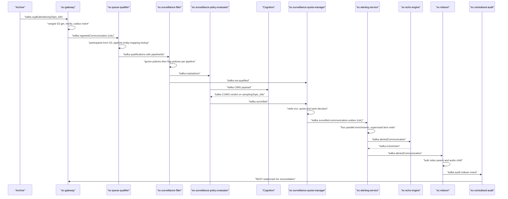
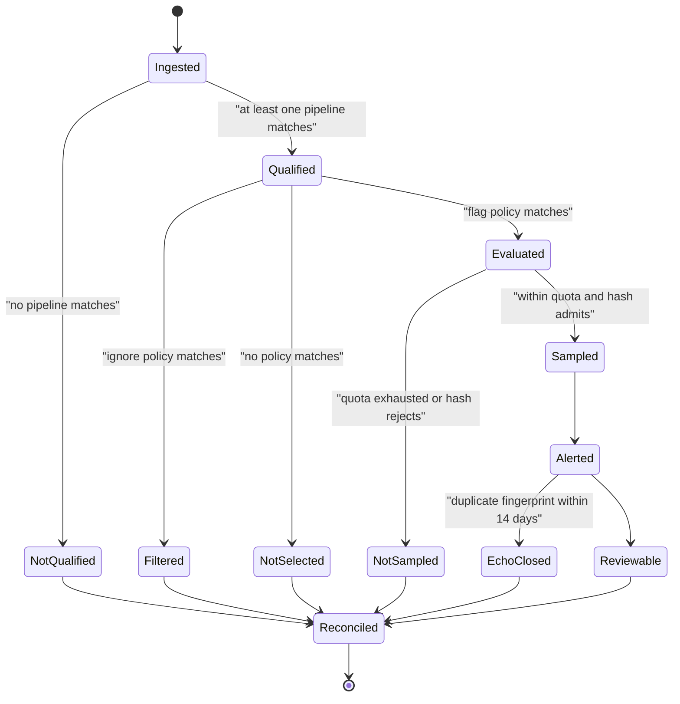
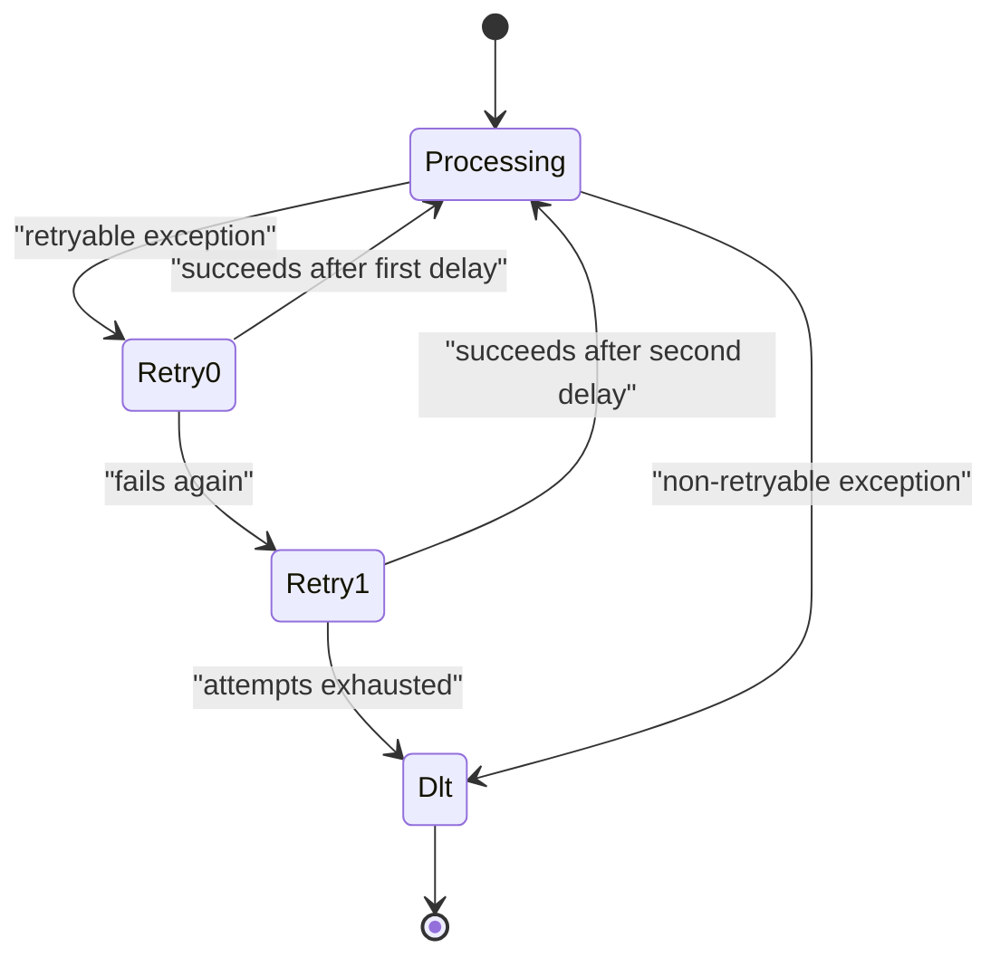
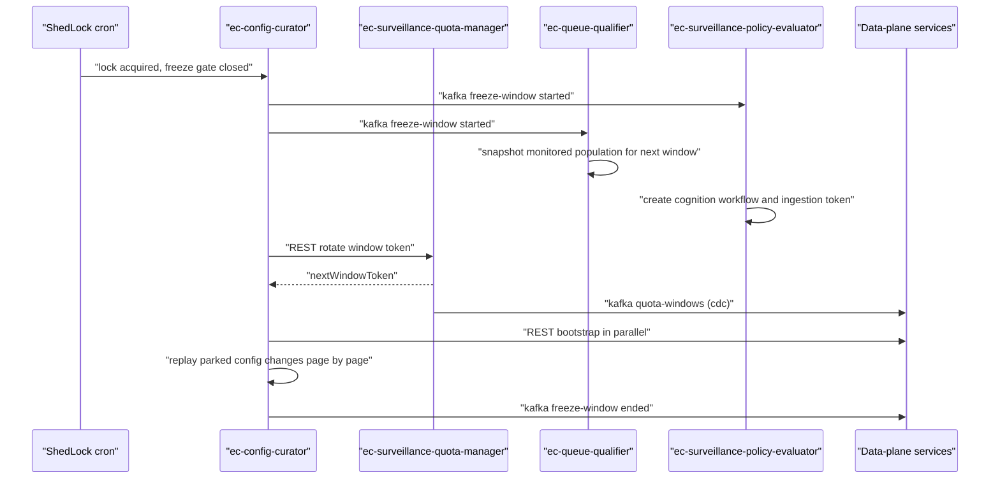
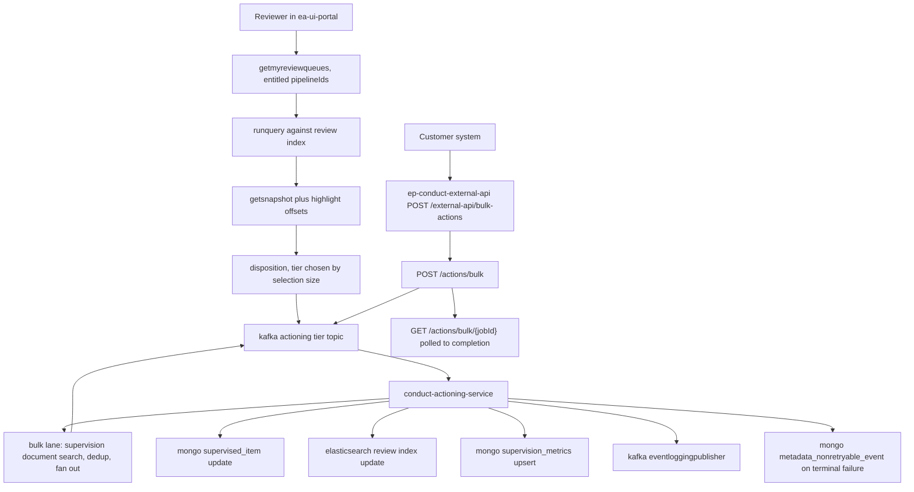
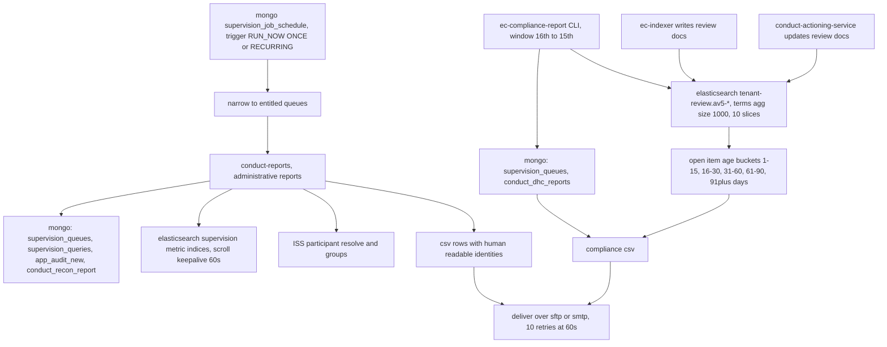

# system-explainer-input.md

Technical handover input for one interactive explainer covering the Smarsh Enterprise Conduct (EC)
surveillance platform as a single system: 21 repositories, their Kafka and REST channels, their data stores, the
end-to-end flows a record takes, and a runnable simulation model. Target implementation is one
dependency-free static site (HTML + canvas 2D + plain JavaScript, no build step), but this document contains
no visual metaphor, no scene design and no naming scheme — only the system, the numbers and the model. All
presentation decisions are left to the builder.

Every topic name, endpoint path, class name, consumer group, collection name and numeric constant below was
read out of 21 repositories, which fall into four planes:

| Plane | Repositories | Unit of work |
| --- | --- | --- |
| Surveillance data path | `ec-gateway`, `ec-queue-qualifier`, `ec-surveillance-filter`, `ec-surveillance-policy-evaluator`, `ec-surveillance-quota-manager`, `ec-alerting-service`, `ec-echo-engine`, `ec-indexer` | one communication |
| Configuration, audit and control | `ec-config-curator`, `ec-centralised-audit`, `ec-reporting`, `ec-conduct-audit-service`, `ec-manual-runs-service`, `ec-review-service`, `ec-conduct-hithighlight-service` | a window, a run, a policy set, an audit event |
| Review interface and actioning | `ea-ui-portal`, `ep-conduct-external-api`, `conduct-actioning-service`, `conduct-actioning` (library) | a reviewer decision or an administrative change |
| Reporting and export | `conduct-reports`, `ec-compliance-report` | a scheduled report over a time window |

Three of the 21 are libraries or command-line tools rather than deployable services — `conduct-actioning`
(Kotlin business-logic library the portal publishes through), `conduct-reports` (Guice reporting JAR) and
`ec-compliance-report` (Python and Java CLI). They matter because the literals missing from the service
repositories live in them: `conduct-actioning` holds the actioning producer and the tier-selection rule, and
the two reporting repositories show which collections and indices the surveillance plane is actually read
from afterwards.

Values not resolvable from source are flagged `[ESTIMATED]`; relationships not explicit in source are flagged
`[INFERRED]`.

Notation: topics are written with `{tenant}` where source uses a `%s` template or runtime substitution (for
example source `ec.surveillance-filter.%s.evaluations` appears here as
`ec.surveillance-filter.{tenant}.evaluations`). Every EC topic is per-tenant unless stated otherwise.
Collections suffixed `_{windowToken}` are physically separate MongoDB collections, one per quota window.

---

--- Section 1 — System purpose and primary entity

**Business purpose.** Regulated firms must archive every business communication their staff produce (email,
chat, SMS, recorded calls) and demonstrate to a regulator that those communications were supervised: that
each one was assessed against the firm's policies, that a defensible sample reached a human reviewer, and
that nothing was silently dropped. EC performs that supervision. It decides which communications a
compliance reviewer must read, generates the alerts they work from, makes the underlying communications
searchable, and produces the audit trail and per-window reports that prove the work happened.

**Primary data entity.** One **communication**, identified by a global communication id (`gcid`). It is
carried between services as a Kafka record whose *headers* hold the routing and accounting context while the
*content* stays in S3 and is fetched on demand. The header set that survives the whole journey:

| Header / field | Meaning | Set by |
| --- | --- | --- |
| `tenantName` | Which customer's data plane and topic set applies | `ec-gateway` |
| `gcid` | Global communication id; stable identity for the whole journey | archive, preserved by `ec-gateway` |
| `snapshotId` | Which snapshot of a mutable conversation this is (threads are re-scanned) | archive |
| `storage` / `originalStorage` | S3 bucket and key of the communication JSON | archive / `ec-gateway` |
| `sentTime` | Original send timestamp; drives quota bucketing | archive |
| `channel` | email, chat, sms, audio | archive |
| `windowToken` | Frozen configuration snapshot and quota window this is accounted for in | `ec-config-curator` via quota manager |
| `reconciliationToken` | The ingest run this is counted in | `ec-gateway` |
| `pipelineIds` | Surveillance pipelines (named review queues) claiming this communication | `ec-queue-qualifier` |
| `eventName` | Per-stage outcome name, mirrored to the audit topic | every service |

**Entry point.** `ec-gateway`, triggered by the archive publishing onto `supBulkIndexingTopic_k8s`. Two
secondary entry points exist: `POST /v1/tenants/{tenantName}/manual-runs` on `ec-manual-runs-service`
(re-processing history, called by `ea-ui-portal`) and configuration changes arriving at `ec-config-curator`
from the legacy v2 configuration store. Two further *control* entry points do not create communications but
act on them and on the configuration around them: `ea-ui-portal` (reviewer sessions, queue queries,
dispositions, manual-run submission) and `ep-conduct-external-api` (customer automation: reviewer groups,
review entitlements, add-to-queue, bulk actions).

**Terminal states.** Exactly one of:
1. **Alerted and reviewable** — a `SupervisedItem` document in MongoDB (`ec-alerting-service`), searchable
   in Elasticsearch (`ec-indexer`), visible to the reviewers `ec-review-service` entitles, rendered by
   `ea-ui-portal` with match offsets from `ec-conduct-hithighlight-service`, and finally *dispositioned* by a
   reviewer — the decision is executed asynchronously by `conduct-actioning-service`, which updates the
   `supervised_item` document and the tenant's Elasticsearch review index. A disposition is therefore the
   real end of the record's life; everything before it is preparation for it.
2. **Suppressed with a recorded reason** — not qualified for any pipeline (`ec-queue-qualifier`), ignored or
   not selected by policy (`ec-surveillance-filter`), not sampled (`ec-surveillance-quota-manager`), or
   closed as a duplicate (`ec-echo-engine`). Each is an audited outcome, not an absence.
3. **Reconciled** — counted in `ec-centralised-audit` and in
   `ec-reporting-pipeline-events_{windowToken}`, with the window's completed count matched against
   `ec-gateway`'s ingest watermark.
4. **Dead-lettered** — parked on a `-dlt` topic after the retry ladder was exhausted, with failure headers
   preserved for replay.

**The one thing to understand after one full pass.** Every service performs one decision and emits one
receipt. The communication itself is barely mutated after ingestion — what accumulates is a set of
per-pipeline verdicts plus an audit event per stage — and the platform is built so those receipts can be
counted back against the number of communications ingested. That is why configuration is frozen into
`windowToken` snapshots, why MongoDB collections carry the window token in their names, and why "nobody was
watching this" is stored as an explicit outcome.

---

--- Section 2 — Full topology

Solid edges are Kafka topics. Dashed edges are synchronous REST calls. Cylinders are data stores. Where a
service is labelled as producing a topic via CDC, it does not call Kafka directly: it inserts a row into a
MongoDB outbox collection inside its own transaction and a Debezium connector publishes that row.

```mermaid
flowchart LR
  subgraph CONFIGPLANE["Configuration plane"]
    cc["ec-config-curator"]
  end

  subgraph INGESTION["Ingestion"]
    gw["ec-gateway"]
    mrs["ec-manual-runs-service"]
  end

  subgraph QUALIFICATION["Qualification"]
    qq["ec-queue-qualifier"]
  end

  subgraph EVALUATION["Policy evaluation"]
    sf["ec-surveillance-filter"]
    spe["ec-surveillance-policy-evaluator"]
  end

  subgraph SAMPLING["Sampling and alert generation"]
    qm["ec-surveillance-quota-manager"]
    als["ec-alerting-service"]
    ee["ec-echo-engine"]
  end

  subgraph REVIEW["Indexing and review"]
    idx["ec-indexer"]
    rvs["ec-review-service"]
    hh["ec-conduct-hithighlight-service"]
  end

  subgraph AUDIT["Audit and reporting"]
    ca["ec-centralised-audit"]
    rep["ec-reporting"]
    cas["ec-conduct-audit-service"]
  end

  subgraph STORES["Data stores"]
    mongo[("MongoDB")]
    es[("Elasticsearch")]
    s3[("S3")]
    redis[("Redis")]
    athena[("AWS Athena")]
  end

  subgraph HUMAN["Review interface and actioning"]
    pui["ea-ui-portal"]
    eapi["ep-conduct-external-api"]
    act["conduct-actioning-service"]
    alib["conduct-actioning library, in-process in the portal"]
  end

  subgraph REPORTS["Reporting and export, scheduled readers"]
    crep["conduct-reports"]
    ccli["ec-compliance-report"]
  end

  subgraph EXTERNAL["External to these 21 repositories"]
    arch["Archive and ea-storage"]
    cog["Cognition analytics"]
    igw["ea-indexing-gateway"]
    iss["ISS identity service"]
    elog["eventloggingpublisher_k8s consumer"]
    auth["auth-service, Keycloak"]
    supsearch["supervision document search api"]
  end

  arch -- "kafka: supBulkIndexingTopic_k8s" --> gw
  gw -- "kafka cdc: ec.surveillance-gateway.outbox.{tenant}.ingestedCommunication" --> qq
  gw -- "kafka cdc: ec.surveillance-gateway.outbox.{tenant}.ingestedCommunication" --> idx
  gw -- "kafka cdc: ec.surveillance-gateway.outbox.{tenant}.ingestedCommunication" --> ca
  gw -- "kafka cdc: ec.surveillance-gateway.outbox.{tenant}.ingestedCommunication" --> rep
  gw -- "kafka cdc: ec.surveillance-gateway.outbox.{tenant}.qualifiedCommunication" --> idx
  gw -- "kafka cdc: ec.surveillance-gateway.outbox.{tenant}.qualifiedCommunication" --> sf
  gw -- "kafka cdc: ec.surveillance-gateway.outbox.{tenant}.qualifiedCommunication" --> ca
  gw -- "kafka: ec.surveillance-gateway.{tenant}.remediation" --> gw
  qq -- "kafka: ec.surveillance-qualifier.{tenant}.qualifications" --> sf
  qq -- "kafka: ec.centralized.{tenant}.audit" --> ca
  qq -- "kafka: ec.queue-qualifier.{tenant}.kpi-events" --> qq
  sf -- "kafka: ec.surveillance-filter.{tenant}.evaluations" --> spe
  sf -- "kafka: ec.surveillance-filter.{tenant}.not-qualified" --> qm
  sf -- "kafka: ec.centralized.{tenant}.audit" --> ca
  spe -- "kafka: cognition CIMS topic" --> cog
  cog -- "kafka: samplingTopic_k8s COMS responses" --> spe
  spe -- "kafka: ec.surveillance-policy-evaluator.{tenant}.surveilled" --> qm
  spe -- "kafka: ec.surveillance-policy-evaluator.{tenant}.surveilled" --> idx
  spe -- "kafka: ec.centralized.{tenant}.audit" --> ca
  qm -- "kafka cdc: ec.surveillance-quota-manager.{tenant}.surveilled-communication-outbox" --> als
  qm -- "kafka cdc: ec.surveillance-quota-manager.{tenant}.metadata-outbox" --> rep
  qm -- "kafka cdc: ec.surveillance-quota-manager.{tenant}.quota-windows" --> ca
  qm -- "kafka cdc: ec.surveillance-quota-manager.{tenant}.quota-windows" --> rep
  qm -- "kafka cdc: ec.surveillance-quota-manager.{tenant}.quota-windows" --> mrs
  qm -- "kafka cdc: ec.surveillance-quota-manager.{tenant}.quota-windows" --> gw
  qm -- "kafka: ec.centralized.{tenant}.audit" --> ca
  als -- "kafka: ec.alerting-service.{tenant}.alertedCommunication" --> ee
  als -- "kafka: ec.alerting-service.{tenant}.alertedCommunication" --> idx
  als -- "kafka: ec.alerting-service.{tenant}.echoCommunication" --> idx
  als -- "kafka cdc: ec.alerting-service.{tenant}.alert-outbox" --> als
  als -- "kafka cdc: ec.alerting-service.{tenant}.echo-outbox" --> als
  ee -- "kafka: ec.echo-engine.{tenant}.echoAction" --> als
  ee -- "kafka: ec.centralized.{tenant}.audit" --> ca
  idx -- "kafka: ec.centralized.{tenant}.audit.indexer.event" --> rep
  arch -- "kafka: supActionIndexTopic_k8s parent reindex" --> idx
  rep -- "kafka: conduct_audit_topic" --> cas
  rep -- "kafka: eventloggingpublisher_k8s" --> elog
  rep -- "kafka cdc: ec.surveillance-outcome.{tenant}.job_request_config" --> mrs
  ca -- "kafka cdc: ec.centralised-audit.outbox.{tenant}.windowReconciliation" --> rep
  ca -- "kafka cdc: ec.centralised-audit.outbox.{tenant}.windowReconciliation" --> qm
  ca -- "kafka cdc: ec.centralised-audit.{tenant}.cognitionReconciliation" --> ca
  cc -- "kafka: ec.config-curator.{tenant}.surveillance-pipelines" --> qq
  cc -- "kafka: ec.config-curator.{tenant}.surveillance-pipelines" --> sf
  cc -- "kafka: ec.config-curator.{tenant}.surveillance-pipelines" --> rep
  cc -- "kafka: ec.config-curator.{tenant}.surveillance-pipelines" --> rvs
  cc -- "kafka: ec.config-curator.{tenant}.surveillance-pipelines" --> ca
  cc -- "kafka: ec.config-curator.{tenant}.surveillance-pipelines" --> qm
  cc -- "kafka: ec.config-curator.{tenant}.surveillance-policies" --> sf
  cc -- "kafka: ec.config-curator.{tenant}.surveillance-policies" --> ee
  cc -- "kafka: ec.config-curator.{tenant}.surveillance-libraries" --> sf
  cc -- "kafka: ec.config-curator.{tenant}.surveillance-sampling" --> qm
  cc -- "kafka: ec.config-curator.{tenant}.configuration" --> ee
  cc -- "kafka: ec.config-curator.{tenant}.configuration" --> qm
  cc -- "kafka: ec.config-curator.{tenant}.configuration" --> idx
  cc -- "kafka: ec.config-curator.{tenant}.freeze-window" --> spe
  cc -- "kafka: ec.config-curator.{tenant}.freeze-window" --> qq
  cc -- "kafka: ec.config-curator.{tenant}.freeze-window" --> qm
  cc -- "kafka: ec.config-curator.{tenant}.freeze-window" --> ca
  cc -- "kafka: ec.config-curator.{tenant}.retention-policies" --> als
  cc -- "kafka: ec.config-curator.{tenant}.alert-generation-config" --> als
  cc -- "kafka: ec.config-curator.{tenant}.surveillance-pipelines-migration-config" --> qq
  cc -- "kafka cdc: ec.config-curator.{tenant}.outbox" --> ca
  mrs -- "kafka cdc: ec.surveillance-manual-run.{tenant}.ec-manual-run-service-request" --> qm
  mrs -- "kafka: ec.surveillance-manual-run.{tenant}.ingestion" --> gw
  mrs -- "kafka cdc: ec.on-demand.{tenant}.remediation-monitored-corpus-snapshots" --> mrs
  cas -- "kafka: conduct_audit_topic dlt republish" --> cas

  spe -. "GET /v1/tenants/{tenantName}/window-tokens/{windowToken}/pipelines" .-> qq
  spe -. "GET /v1/tenants/{tenantName}/window-token/{windowToken}/pipelines/{pipelineId}/policies" .-> sf
  rep -. "GET /v1/tenants/{tenantId}/windows/{windowToken}/pipeline-surveilled-populations" .-> qq
  rep -. "GET /v1/{tenant}/watermark/{source}/{sourceId}" .-> gw
  ca -. "GET /v1/{tenant}/watermark/{source}/{sourceId}" .-> gw
  rvs -. "GET /v1/tenant/{tenantName}/windowToken" .-> cc
  rvs -. "GET /v1/tenants/{tenant}/window-token/{windowToken}/surveilled-population" .-> qq
  rvs -. "GET /v1/supervision/documents/searchById" .-> arch
  gw -. "GET /v1/tenant/{tenant}/uuid" .-> cc
  mrs -. "POST bootstrap of data-plane services" .-> cc
  mrs -. "POST processRemediationSnapshot" .-> igw
  idx -. "GET parent index name, supervision recon api" .-> arch
  idx -. "POST indexSupArchiveDocument" .-> igw
  als -. "GET cognition scenario hits" .-> arch
  qq -. "GET group membership expansion" .-> iss
  pui -. "POST /v1/tenants/{tenantName}/manual-runs" .-> mrs
  pui -. "GET /v1/tenants/{tenantName}/manual-runs?pipelineId" .-> mrs
  pui -. "ReviewServiceRestClient.getReviewerPipelineIds" .-> rvs
  pui -. "conduct_hit_highlight_api_url configured, caller not in source [INFERRED]" .-> hh
  pui --> alib
  alib -- "kafka: conductActioning{Small,Medium,Large,Bulk}_k8s" --> act
  crep -- "read supervision_queues, app_audit_new, conduct_recon_report" --> mongo
  crep -- "read supervision metric indices" --> es
  crep -. "GET /v2/tenants/{t}/participants/resolve" .-> iss
  ccli -- "read supervision_queues, conduct_dhc_reports" --> mongo
  ccli -- "read {tenant}-review.av5-*" --> es
  ccli -. "CSV over SFTP or SMTP" .-> sftp["customer SFTP or mail server"]
  eapi -. "POST/DELETE /v1/tenants/{t}/pipelines/{p}/review-entitlements" .-> rvs
  eapi -. "POST/GET/PATCH/DELETE /v1/tenants/{t}/reviewer-groups" .-> rvs
  eapi -. "PUT/DELETE/GET /v1/tenants/{t}/pipelines/reviewer-group" .-> rvs
  eapi -. "POST /actions/bulk, GET /actions/bulk/{jobId}" .-> act
  eapi -. "jwt validation" .-> auth
  act -. "POST supervision document search" .-> supsearch
  act -- "kafka: eventloggingpublisher" --> elog
  act -- "update review index {tenant}-review.av5" --> es
  act -- "supervised_item, supervision_metrics, supervision_email_items, metadata_nonretryable_event" --> mongo
  eapi -- "app_audit_new, config_store, add_to_queue_requests, hold_request_config, tenancy, supervision_queues" --> mongo
  idx -- "parent and child documents" --> es

  gw -- "read indexable.json, write miniIndexable.json" --> s3
  qq -- "read indexable.json" --> s3
  sf -- "read enriched communication json" --> s3
  qm -- "read participants" --> s3
  als -- "read message body" --> s3
  idx -- "read communication json" --> s3
  rep -- "read and write event-log objects" --> s3
  mrs -- "read athena result csv" --> s3
  mrs -- "query historical corpus" --> athena
  qm -- "atomic quota counters" --> redis
  gw -- "write ingest outbox rows" --> mongo
  cc -- "write versioned config and stage store" --> mongo
  qq -- "read pipeline-entity-mapping" --> mongo
  sf -- "read pipeline, policy and library config" --> mongo
  spe -- "write evaluation state and outbox" --> mongo
  qm -- "write quota windows and outboxes" --> mongo
  als -- "write supervised items and alert outbox" --> mongo
  ee -- "read and write echo state" --> mongo
  rvs -- "read and write reviewer groups and entitlements" --> mongo
  rep -- "write window-suffixed pipeline events and reports" --> mongo
  ca -- "write audit events and pipeline summary" --> mongo
  mrs -- "write run state and remediation outbox" --> mongo
  idx -- "index parent and child documents" --> es
  cas -- "read and write conduct audit views" --> es
  hh -- "per-request in-memory lucene index" --> es
```



### 2a. Kafka channel table (main data path)

| Topic | Producer | Consumers | Consumer group(s) | Payload |
| --- | --- | --- | --- | --- |
| `supBulkIndexingTopic_k8s` | archive (external) | `ec-gateway` | `ec.bulk-indexing.consumer-group` | ingest announcement headers |
| `ec.surveillance-gateway.outbox.{tenant}.ingestedCommunication` | `ec-gateway` (CDC) | `ec-queue-qualifier`, `ec-indexer`, `ec-centralised-audit`, `ec-reporting` | `ec.surveillance-qualifier.ingestion.consumer-group`, `ec.surveillance-indexer.ingestion.consumer-group`, `ec-centralised-audit.ingested-communication.consumer-group` | outbox row: gcid, storage pointer, recon token |
| `ec.surveillance-gateway.outbox.{tenant}.qualifiedCommunication` | `ec-gateway` (CDC) | `ec-indexer`, `ec-surveillance-filter`, `ec-centralised-audit` | `ec.surveillance-filter.manual-run-qualifications.consumer-group` | pre-qualified communication (manual run path) |
| `ec.surveillance-qualifier.{tenant}.qualifications` | `ec-queue-qualifier` | `ec-surveillance-filter` | `ec.surveillance-filter.qualifications.consumer-group` | headers + matched `pipelineIds` |
| `ec.surveillance-filter.{tenant}.evaluations` | `ec-surveillance-filter` | `ec-surveillance-policy-evaluator` | `ec.surveillance-policy-evaluator.qualified-comm.consumer-group` | one qualified (comm, pipeline) verdict |
| `ec.surveillance-filter.{tenant}.not-qualified` | `ec-surveillance-filter` | `ec-surveillance-quota-manager` | `ec.surveillance-quota-manager.surveilled-notqualified.consumer-group` | suppressed verdict, still accounted |
| cognition CIMS topic (per tenant, external) | `ec-surveillance-policy-evaluator` | Cognition | n/a | CIMS byte payload for content evaluation |
| `samplingTopic_k8s` (COMS responses) | Cognition | `ec-surveillance-policy-evaluator` | `ec.surveillance-policy-evaluator.coms.consumer-group` | `CognitionResponseEvent` |
| `ec.surveillance-policy-evaluator.{tenant}.surveilled` | `ec-surveillance-policy-evaluator` | `ec-surveillance-quota-manager`, `ec-indexer` | `ec.surveillance-quota-manager.surveilled.consumer-group`, `ec.surveillance-indexer.surveilled.consumer-group` | policy verdict per pipeline |
| `ec.surveillance-quota-manager.{tenant}.surveilled-communication-outbox` | `ec-surveillance-quota-manager` (CDC) | `ec-alerting-service` | `ec.alerting-service.surveilled-communication.consumer-group`, `…surveilled-communication-retention.consumer-group` | sampled communication for alerting |
| `ec.surveillance-quota-manager.{tenant}.metadata-outbox` | `ec-surveillance-quota-manager` (CDC) | `ec-reporting`, self (`MetadataCommsConsumer`) | `ec.surveillance-quota-manager.metadata-comms.consumer-group` | `MetadataEvent` per pipeline |
| `ec.surveillance-quota-manager.{tenant}.quota-windows` | `ec-surveillance-quota-manager` (CDC) | `ec-gateway`, `ec-centralised-audit`, `ec-reporting`, `ec-manual-runs-service` | `ec.gateway.quota-window.consumer-group` | window token creation and rotation |
| `ec.alerting-service.{tenant}.alertedCommunication` | `ec-alerting-service` | `ec-echo-engine`, `ec-indexer` | `ec.echo-engine.alert-event.consumer-group`, `ec.surveillance-indexer.alerted.consumer-group` | fully formed alert |
| `ec.echo-engine.{tenant}.echoAction` | `ec-echo-engine` | `ec-alerting-service` | `ec.alerting-service.echo-actioning.consumer-group` | `EchoActionEvent` (close / reclassify) |
| `ec.alerting-service.{tenant}.echoCommunication` | `ec-alerting-service` | `ec-indexer` | `ec.surveillance-indexer.echo.consumer-group` | echo-updated alert |
| `ec.centralized.{tenant}.audit` | `ec-queue-qualifier`, `ec-surveillance-filter`, `ec-surveillance-policy-evaluator`, `ec-surveillance-quota-manager`, `ec-echo-engine` | `ec-centralised-audit`, `ec-reporting` | `ec-centralised-audit.audit.consumer-group`, `ec.reporting.event-log.consumer-group` | per-stage audit event |
| `ec.centralized.{tenant}.audit.indexer.event` | `ec-indexer` | `ec-reporting` (configured as `…indexer.events`; the two literals differ and one must be overridden at deploy time) | `ec.reporting.event-log.consumer-group` `[INFERRED]` | indexing success audit event |
| `ec.centralised-audit.outbox.{tenant}.windowReconciliation` | `ec-centralised-audit` (CDC) | `ec-reporting`, `ec-surveillance-quota-manager` | `ec.surveillance-quota-manager.reconciliation.consumer-group` | window reconciliation outcome |
| `conduct_audit_topic` (not tenant-templated) | `ec-reporting` | `ec-conduct-audit-service` | configured group | protobuf `ConductAuditMessage` |
| `eventloggingpublisher_k8s` | `ec-reporting` | external event-log consumer | n/a | projected event-log message |
| `supActionIndexTopic_k8s` | archive / supervision (external) | `ec-indexer` | `ec.parent-reindexing.consumer-group` | parent re-index request |

### 2b. Kafka channel table (configuration plane)

All produced by `ec-config-curator`. Each is the tenant-scoped republication of a legacy
`ec.surveillance-config.{tenant}.supervision_*` change, stamped with the target `windowToken`.

| Topic | Consumers |
| --- | --- |
| `ec.config-curator.{tenant}.surveillance-pipelines` | `ec-queue-qualifier`, `ec-surveillance-filter`, `ec-reporting`, `ec-review-service`, `ec-centralised-audit`, `ec-surveillance-quota-manager` |
| `ec.config-curator.{tenant}.surveillance-policies` | `ec-surveillance-filter`, `ec-echo-engine` |
| `ec.config-curator.{tenant}.surveillance-libraries` | `ec-surveillance-filter` |
| `ec.config-curator.{tenant}.surveillance-sampling` | `ec-surveillance-quota-manager` |
| `ec.config-curator.{tenant}.configuration` | `ec-echo-engine`, `ec-surveillance-quota-manager`, `ec-indexer` `[INFERRED]` |
| `ec.config-curator.{tenant}.freeze-window` | `ec-surveillance-policy-evaluator`, `ec-queue-qualifier`, `ec-surveillance-quota-manager`, `ec-centralised-audit` |
| `ec.config-curator.{tenant}.retention-policies` | `ec-alerting-service` |
| `ec.config-curator.{tenant}.alert-generation-config` | `ec-alerting-service` |
| `ec.config-curator.{tenant}.surveillance-pipelines-migration-config` | `ec-queue-qualifier` |
| `ec.config-curator.{tenant}.outbox` (CDC) | `ec-centralised-audit` |

### 2c. Retry and dead-letter topic naming, per service

Every consumer has two delayed retry hops then one dead-letter topic. Suffixes are appended to the source
topic name, so `ec.surveillance-qualifier.acme.qualifications` becomes
`ec.surveillance-qualifier.acme.qualifications-surveillance-filter-retry-1` and so on.

| Service | Retry suffix | DLT suffix | Notes |
| --- | --- | --- | --- |
| `ec-indexer` | `-ec-indexer-retry` (`-0`, `-1`) | `-ec-indexer-dlt` | `kafka.topics.retry.attempts: 2` |
| `ec-echo-engine` | `-ec-echo-engine-retry` | `-ec-echo-engine-dlt` | retry groups `…alert-event.retry-1/-2.consumer-group` |
| `ec-reporting` | `-ec-reporting-retry` | `-ec-reporting-dlt` | plus per-flow `event-logger-publishing-retry` / `-dlt` |
| `ec-review-service` | `-review-service-retry` | `-review-service-dlt` | exponential jittered backoff |
| `ec-centralised-audit` | `-centralised-audit-retry` | `-centralised-audit-dlt` | plus `audit-events-retry` / `-dlt` families |
| `ec-surveillance-filter` | `-surveillance-filter-retry` (`-1`, `-2`) | `-surveillance-filter-dlt` | uses `-retry-1` / `-retry-2`, not `-0`/`-1` |
| `ec-queue-qualifier` | `-queue-qualifier-retry`, `-queue-qualifier-freeze-window-retry`, `-audit-adapter-retry` | matching `-dlt` suffixes | separate ladder per flow |
| `ec-surveillance-policy-evaluator` | `-ec-surveillance-policy-evaluator-retry`, `-audit-adapter-policy-evaluator-retry` | matching `-dlt` | env-overridable suffixes |
| `ec-gateway` | `-retry`, `-conduct-ingestion-retry` | `-dlt`, `-conduct-ingestion-dlt` | groups `…bulk-indexing-retry-0/-1` |
| `ec-surveillance-quota-manager` | `-retry` | `-dlt` | groups `…surveilled.retry-0/-1.consumer-group` |
| `ec-alerting-service` | hand-built delayed topics (500 ms, 1500 ms) | per-flow `-dlt` | not `@RetryableTopic` on the surveilled path |
| `ec-manual-runs-service` | `remediation-snapshot.retry-first/-second` groups | `ec.on-demand.remediation-dlt` | DLT is re-consumed for inspection |
| `ec-config-curator` | `-retry` | `-dlt` | suffixed `-ec-config-curator-*` per topic |
| `ec-conduct-audit-service` | retry ladder republishes to source topic | terminal republish | no separate DLT family |
| `ec-conduct-hithighlight-service` | none | none | no Kafka consumer |

### 2d. REST channel table

| Method and path | Served by | Called by | Purpose |
| --- | --- | --- | --- |
| `GET /v1/tenant/{tenant}/uuid` | `ec-config-curator` | `ec-gateway` | resolve tenant UUID to tenant name |
| `GET /v1/tenant/{tenantName}/windowToken` | `ec-config-curator` | `ec-review-service` | current window token |
| `GET /v1/tenants/{tenantName}/window-tokens/{windowToken}/pipelines` | `ec-queue-qualifier` | `ec-surveillance-policy-evaluator`, `ec-reporting` | pipelines active in a window |
| `GET /v1/tenants/{tenant}/window-token/{windowToken}/surveilled-population` | `ec-queue-qualifier` | `ec-review-service` | monitored population for entitlement validation |
| `GET /v1/tenants/{tenantId}/windows/{windowToken}/pipeline-surveilled-populations` | `ec-queue-qualifier` | `ec-reporting` | paginated populations for report initialisation |
| `GET /v1/tenants/{tenantName}/window-token/{windowToken}/pipelines/{pipelineId}/policies` | `ec-surveillance-filter` | `ec-surveillance-policy-evaluator` | policy set for a pipeline |
| `GET /v1/{tenant}/watermark/{source}/{sourceId}` | `ec-gateway` | `ec-centralised-audit`, `ec-reporting` | ingested count for reconciliation |
| `POST /v1/tenants/{tenantName}/manual-runs` | `ec-manual-runs-service` | operators / UI | submit a manual run |
| `GET /v1/tenants/{tenantName}/pipeline-execution-reports` | `ec-reporting` | UI | per-window execution reports |
| `POST /conduct/recon/query`, `GET /conduct/recon/{searchAfterId}` | `ec-conduct-audit-service` | external caller, not present in these repositories | fate-tracking queries |
| `POST /conduct/highlight/offsets` | `ec-conduct-hithighlight-service` | `ea-ui-portal` `[INFERRED]` — host configured, path literal in no repository in scope | match offsets for one document |
| `GET /v1/supervision/documents/searchById` | archive conduct-search (external) | `ec-review-service` | fetch document for entitlement checks |
| `POST indexSupArchiveDocument`, `POST processRemediationSnapshot` | `ea-indexing-gateway` (external) | `ec-indexer`, `ec-manual-runs-service` | index documents with no S3 body |

### 2e. Other mechanisms present in source

| Mechanism | Where | Detail |
| --- | --- | --- |
| Debezium CDC outbox | `ec-gateway`, `ec-config-curator`, `ec-alerting-service`, `ec-surveillance-quota-manager`, `ec-centralised-audit`, `ec-surveillance-policy-evaluator`, `ec-surveillance-filter`, `ec-queue-qualifier`, `ec-manual-runs-service`, `ec-reporting` (`cd/k8s/base/debezium-topic-configs.yaml`) | transactional outbox row → connector → topic; the service never calls `KafkaTemplate.send` for these |
| ShedLock cron | `ec-config-curator` (`SHEDLOCK_FREEZE_CRON 0 */15 * * * *`, `SHEDLOCK_BOOTSTRAP_CRON 0 */15 * * * *`), `ec-centralised-audit` (`SHEDLOCK_RECON_CRON`, `SHEDLOCK_SOURCE_WINDOW_RECON_CRON`, `SHEDLOCK_PIPELINESUMMARY_CRON`, all `0 */15 * * * *`), `ec-manual-runs-service` (`SHEDLOCK_REMEDIATION_CRON 0 */15 * * * *`, `SHEDLOCK_REMEDIATION_SEARCH_CRON 0 */5 * * * *`, `SHEDLOCK_COMPACTION_CRON 0 0 * * * *`, `SHEDLOCK_COMPACTION_STATUS_CRON 0 30 * * * *`), `ec-surveillance-quota-manager` (`QUOTA_WINDOW_CLEANUP_CRON 0 0 2 * * *`), `SHEDLOCK_CLEANUP_CRON 0 0 3 * * *` | MongoDB-backed lock so only one replica runs the job; `ec-indexer` ShedLock lock-at-most-for `PT14M` |
| Virtual threads | `ec-echo-engine` (`Executors.newVirtualThreadPerTaskExecutor` per grouped batch), `ec-queue-qualifier`, `ec-alerting-service` | per-record concurrency inside one Kafka batch |
| Redis atomic counters | `ec-surveillance-quota-manager` | quota decisions must be atomic across replicas |
| In-process Spring events | `ec-conduct-audit-service` (`AuditTerminationEvent`) | not a network hop |
| KEDA Kafka-lag autoscaling | all consumer services (`cd/k8s/.../scaledObject.yaml`) | see per-service table in Section 3 |
| TTL expiry | `ec-echo-engine` state (14 days), `ec-conduct-audit-service` `conduct_audit_report` (tenant/status specific), `ec-gateway` S3 object TTL tags, `ec-indexer` alert-parked TTL (604800 s) | data ages out without a delete job |

### 2f. Connectivity audit

One confirmed link per service, where "confirmed" means both ends were read in source: a producer in one
repository and a matching consumer or client in another. No service is isolated, but one is connected only by
an inbound call whose caller is not in these 21 repositories.

| Service | Confirmed link to another of the 21 | Evidence |
| --- | --- | --- |
| `ec-gateway` | → `ec-queue-qualifier`, `ec-indexer`, `ec-centralised-audit`, `ec-reporting` | produces `…outbox.{tenant}.ingestedCommunication`, which all four subscribe to |
| `ec-queue-qualifier` | → `ec-surveillance-filter` | produces `…qualifications`, consumed by `ec.surveillance-filter.qualifications.consumer-group` |
| `ec-surveillance-filter` | → `ec-surveillance-policy-evaluator`, `ec-surveillance-quota-manager` | produces `…evaluations` and `…not-qualified`; both consumers named in source |
| `ec-surveillance-policy-evaluator` | → `ec-surveillance-quota-manager`, `ec-indexer` | produces `…surveilled`; also calls `ec-queue-qualifier` and `ec-surveillance-filter` over REST |
| `ec-surveillance-quota-manager` | → `ec-alerting-service` | produces `…surveilled-communication-outbox` via CDC; alerting has two consumer groups on it |
| `ec-alerting-service` | → `ec-echo-engine`, `ec-indexer` | produces `…alertedCommunication`; both consume it |
| `ec-echo-engine` | → `ec-alerting-service` | produces `…echoAction`, consumed by `ec.alerting-service.echo-actioning.consumer-group` |
| `ec-indexer` | ← `ec-gateway`, `ec-surveillance-policy-evaluator`, `ec-alerting-service`; → `ec-reporting` | four inbound topics; outbound audit indexer event (singular/plural topic-name difference between producer and consumer) |
| `ec-centralised-audit` | ← every surveillance stage; → `ec-reporting`, `ec-surveillance-quota-manager` | consumes `ec.centralized.{tenant}.audit`; produces `…windowReconciliation`; calls the gateway watermark |
| `ec-reporting` | ← `ec-centralised-audit`, `ec-surveillance-quota-manager`; → `ec-conduct-audit-service`, `ec-manual-runs-service` | produces `conduct_audit_topic` and CDC `…job_request_config` |
| `ec-conduct-audit-service` | ← `ec-reporting` | consumes `conduct_audit_topic`, which `ec-reporting` produces; both ends in source |
| `ec-config-curator` | → nine data-plane services | produces the ten `ec.config-curator.{tenant}.*` topics; every consumer is named in its repository |
| `ec-manual-runs-service` | → `ec-gateway`; ← `ec-surveillance-quota-manager`, `ec-reporting` | produces `…manual-run.{tenant}.ingestion`, consumed by `ec.surveillance-manual-run.ingestion.consumer-group` in the gateway |
| `ec-review-service` | ← `ec-config-curator`; → `ec-config-curator`, `ec-queue-qualifier` | consumes `…surveillance-pipelines`; calls the window-token and surveilled-population endpoints |
| `ec-conduct-hithighlight-service` | ← `ea-ui-portal` (host configured, caller method not in source) `[INFERRED]` | `conduct_hit_highlight_api_url=http://ec-conduct-hithighlight-service.$(K8s_NATIVE_DOMAIN):8080` in `ea-ui-portal/cd/k8s/base/env-variables.yaml:424-425`; no `POST /conduct/highlight/offsets` literal in any of the 21; the call is made from a shared front-end module |
| `ea-ui-portal` | → `ec-manual-runs-service`, `ec-review-service`, `ec-conduct-hithighlight-service` `[INFERRED]` | `ManualRunServiceRestClient.java:22-47,55-66`; `QueueMgmtWebService.java:520-534` |
| `ep-conduct-external-api` | → `ec-review-service`, `conduct-actioning-service` | eleven REST paths via `ReviewEntitlementsClient`, `ReviewerGroupClient`, `PipelineReviewerGroupClient`, `BulkActioningClient` |
| `conduct-actioning-service` | ← `ep-conduct-external-api` (REST), ← `ea-ui-portal` via `conduct-actioning` (Kafka tier topics) | `POST /actions/bulk` confirmed both ends; tier topics resolved through property `actioning.{tier}.topic` — see Section 2g |
| `conduct-actioning` (library) | → `conduct-actioning-service` | `ConductActioningTopologyClientImpl.sendToActioningTopology` reads `actioning.small/medium/large/dedup/bulk/extra.large.topic` (`:22-34`) and publishes via `MessagingService.sendMessageAsync` (`:108-110`); the portal supplies those property values |
| `conduct-reports` | reads stores the EC plane writes; → ISS identity service | reads `supervision_queues`, `app_audit_new`, `conduct_recon_report` and the supervision metric indices (`ReportCreator.java:246-279`); no Kafka, no EC REST client |
| `ec-compliance-report` | reads stores the EC plane writes | reads `supervision_queues`, `conduct_dhc_reports` and Elasticsearch `{tenant}-review.av5-*` (`ec_compliance_report.py:46-52,538-639`, `ElasticsearchClient.java:158-170,248-255`); output is CSV over SFTP or SMTP |

### 2g. Review-interface and actioning plane

Four repositories form the human-facing half. Two properties distinguish them from the surveillance plane:
they are *request*-shaped rather than *record*-shaped (their unit of work is a reviewer action or an
administrative change, not a communication), and they scale on CPU and memory rather than Kafka lag — except
`conduct-actioning-service`, which scales on the lag of its own large-tier topic.

**`conduct-actioning-service` inbound Kafka tiers.** Work is sharded by *document volume of the action*, not
by tenant: a reviewer marking one alert lands on the small tier, a "select all 40 000 alerts" lands on the
large or bulk tier, and each tier is a separate topic with its own consumer group and poll settings, so one
tenant's bulk action cannot stall everyone's single-item actions.

The tier decision is made by the *producer*, in the `conduct-actioning` library, and it is a two-threshold
rule over the number of documents in one action — not a size in bytes:

```
getTopicProperty(itemCount, isDedupBulkAction):          # ConductActioningTopologyClientImpl.kt:247-262
  small  = property("actioning.doc.count.small.topic",  "0")     # 20 in ea-ui-portal deployment
  medium = property("actioning.doc.count.medium.topic", "0")     # 50 in ea-ui-portal deployment
  if isDedupBulkAction: return "actioning.dedup.topic"
  topic = "actioning.small.topic"
  if itemCount > small:  topic = "actioning.medium.topic"
  if itemCount > medium: topic = "actioning.large.topic"
  return topic                                            # value resolved by spi.getProperty at :108-110
```

So with the deployed values: 1–20 documents → small, 21–50 → medium, more than 50 → large, and a dedup bulk
action bypasses the ladder entirely. `actioning.doc.count.large.topic` is also set (50) but is not read by
this rule.

**The tier topic names resolve, and the earlier apparent mismatch was a property-versus-value confusion.**
The library reads *property keys* (`actioning.small.topic`); `ea-ui-portal` supplies the *values* for those
keys as deployment environment variables `actioning_small_topic=conductActioningSmall_k8s`,
`actioning_medium_topic=conductActioningMedium_k8s`, `actioning_large_topic=conductActioningLarge_k8s`,
`actioning_bulk_topic=conductActioningBulk_k8s`, alongside the two document-count thresholds
(`cd/k8s/base/env-variables.yaml:96-109`). `conduct-actioning-service` carries a different set of *defaults*
for the same keys in its own `application.properties` (`conductActioningTopology-actioning-small` and
siblings, lines 7-11) which are overridden in deployment. The reviewer-to-actioning edge is therefore a real
Kafka edge whose topic names come from the portal's deployment configuration:
`conductActioning{Small,Medium,Large,Bulk}_k8s`.

| Tier | Topic (runtime `application.properties`) | Alternate default (`properties/default.yml`) | Consumer group | Listener |
| --- | --- | --- | --- | --- |
| Small | `conduct-actioning-small` (`kafka.topics.small`) | `conductActioningSmall` | `conduct-actioning-consumer` | `MetadataMessageInfoListener.processMetadataMessageInfo` |
| Medium | `conduct-actioning-medium` (`kafka.topics.medium`) | `conductActioningMedium` | `conduct-actioning-consumer` | same listener |
| Large | `conduct-actioning-large` (`kafka.topics.large`) | `conductActioningLarge` | `conduct-actioning-consumer` | same listener |
| Extra large | `conductActioningExtraLarge_k8s` (`kafka.topics.extra.large`) | — | `extra-large-actioning-consumer` | `BulkActioningListener`, disabled unless both bulk feature flags are true (defaults `false`) |
| Bulk search | `actioning.bulk.topic` (`kafka.topics.bulk`) | — | `bulk-actioning-consumer` | `BulkActionSearchRequestListener.processDocumentSearch` |
| Dedup | `conductActioningBulkDedup` (`kafka.topics.dedup.action`) | `conductActioningBulk` | `conduct-actioning-consumer` | `MetadataMessageInfoBulkListener` |

The consumer side names its topics through a second, independent property family (`kafka.topics.small` and
siblings) whose in-repository defaults are `conduct-actioning-small/-medium/-large`; these are the values a
local or default run uses, and deployment overrides them to the `_k8s` names above. Two property families for
one topic set is the single most confusing thing in this plane and worth showing explicitly in an explainer:
the *same* topic is called four different things across producer defaults, consumer defaults, deployment
values, and the alternate `properties/default.yml`.

**Disposition state machine.** The states a reviewer moves an alert through are defined in
`conduct-actioning`'s `ConductWorkflowProvider.buildBaseWorkflow` (`:39-72`): `new`, `opened`, `assigned`,
`escalated`, `re-opened`, `closed`. Transitions, exactly as coded: `close` (new→closed, assigned→closed,
escalated→closed, re-opened→closed, closed→closed), `claim` and `assign` (new→assigned, escalated→assigned,
re-opened→assigned), `escalate` (new→escalated, assigned→escalated), `release` (assigned→opened), `re-open`
(closed→re-opened and closed→assigned), plus a self-targeting `update` on every state. There is no `approve`
action in source — approval is expressed as `close`. `closed→closed` being legal is what makes repeated
bulk closes idempotent.

`conduct-actioning-service` also produces `eventloggingpublisher` (unsuffixed;
`EventLoggerService.kt:48,70`), where `ec-reporting` produces `eventloggingpublisher_k8s`; as with the tier
topics, one of the two is expected to be overridden at deploy time.

**REST channels added by this plane.**

| Method and path | Served by | Called by | Purpose |
| --- | --- | --- | --- |
| `POST /external-api/bulk-actions`, `GET /external-api/bulk-actions/{jobId}` | `ep-conduct-external-api` | customer systems | submit and poll a bulk disposition job |
| `POST /v1/conduct/queues/{queueId}/alerts` | `ep-conduct-external-api` | customer systems | add communications to a review queue; circuit-breaker on queue capacity |
| `GET /v1/conduct/requests/{trackerId}/status` | `ep-conduct-external-api` | customer systems | poll an asynchronous add-to-queue tracker |
| `POST`/`GET`/`PATCH`/`DELETE /external-api/reviewer-groups[/{groupId}]` | `ep-conduct-external-api` | customer systems | reviewer-group administration |
| `POST`/`DELETE`/`GET /external-api/queues/{queueId}/review-entitlements[/export]` | `ep-conduct-external-api` | customer systems | entitlement administration and CSV export |
| `PUT`/`DELETE`/`GET /external-api/queues/reviewer-group[/pipelines]` | `ep-conduct-external-api` | customer systems | bind reviewer groups to pipelines |
| `POST /actions/bulk`, `GET /actions/bulk/{jobId}` | `conduct-actioning-service` | `ep-conduct-external-api` (`BulkActioningClient`) | enqueue and poll a bulk action job |
| `POST /action` | `conduct-actioning-service` | `ea-ui-portal` `[INFERRED]` | single synchronous action |
| `POST /v1/tenants/{t}/pipelines/{p}/review-entitlements`, `DELETE` same, `GET …/export` | `ec-review-service` | `ep-conduct-external-api` (`ReviewEntitlementsClient`) | entitlement writes behind the external API |
| `POST /v1/tenants/{t}/reviewer-groups`, `GET …?status&page&size`, `GET`/`PATCH`/`DELETE …/{groupId}` | `ec-review-service` | `ep-conduct-external-api` (`ReviewerGroupClient`) | reviewer-group CRUD |
| `GET /v1/tenants/{t}/pipelines/reviewer-group/pipelines`, `PUT`/`DELETE /v1/tenants/{t}/pipelines/reviewer-group` | `ec-review-service` | `ep-conduct-external-api` (`PipelineReviewerGroupClient`) | pipeline↔group binding |
| `POST /v1/tenants/{tenantName}/manual-runs`, `GET …/manual-runs?pipelineId={pipelineId}` | `ec-manual-runs-service` | `ea-ui-portal` (`ManualRunServiceRestClient`) | submit and poll a manual run |
| `POST /queue/getmyreviewqueues`, `POST /queue/runquery` | `ea-ui-portal` | reviewer browser | queue list and query execution (V3 delegates to `ManualRunService`) |
| `POST /conduct/snapshot/getsnapshot`, `…/getSnapshotViews`, `…/getlatestsnapshot` | `ea-ui-portal` | reviewer browser | render one alerted communication |
| `POST /supervision/v2/queue/reviewer/entitlements/import`, `GET …/export` | `ea-ui-portal` | administrator browser | bulk entitlement import/export |

**Data stores added by this plane.**

| Store | Owner | Contents |
| --- | --- | --- |
| MongoDB `supervised_item` | `conduct-actioning-service` (updates and deletes) | the alert document `ec-alerting-service` created; dispositions mutate it in place (`SupervisedItemDAO.kt:26-55`) |
| MongoDB `supervision_metrics` | `conduct-actioning-service` (upsert) | per-action metric rollups (`SupervisionMetricsDAO.kt:31-76`) |
| MongoDB `supervision_email_items` | `conduct-actioning-service` | email item updates (`UpdateEmailItemsService.kt:97-100`) |
| MongoDB `metadata_nonretryable_event` | `conduct-actioning-service` | terminal, non-retryable action failures (`ActioningNonRetryableEventDAO.kt:20-25`) |
| Elasticsearch `{tenantName}-review.av5` | `conduct-actioning-service` | the review index whose documents `ec-indexer` writes and actioning updates (`IndexService.getIndexName:39-66`, update at `:69-77`) |
| MongoDB `app_audit_new` | `ep-conduct-external-api` | every external API interaction, written by a high-priority servlet filter |
| MongoDB `config_store`, `add_to_queue_requests`, `hold_request_config`, `tenancy`, `supervision_queues` | `ep-conduct-external-api` | tracker state for asynchronous add-to-queue and batch hold requests |

Note the shared-write pattern worth showing explicitly: `ec-alerting-service` **creates** `supervised_item`,
`ec-indexer` **creates** the Elasticsearch review document, and `conduct-actioning-service` **mutates both**
afterwards. Those are the only two places in the platform where a record is written by one service and later
rewritten by another.

---

--- Section 3 — Per-service specification

Each entry: role, layer, inbound channels, outbound channels, store reads, store writes, key transformation
pseudocode, failure modes, and observed scaling configuration.

## ec-gateway

**Role.** Entry point. Converts an archived communication into a minified S3 object plus one countable
outbox row, and serves the ingest watermark used for reconciliation.
**Layer.** Ingestion.

**Inbound.** Kafka `supBulkIndexingTopic_k8s` (`ec.bulk-indexing.consumer-group`);
`ec.surveillance-gateway.{tenant}.remediation` (`ec.remediation.consumer-group`);
`ec.surveillance-manual-run.{tenant}.ingestion` (`ec.surveillance-manual-run.ingestion.consumer-group`);
`ec.surveillance-quota-manager.{tenant}.quota-windows` (`ec.gateway.quota-window.consumer-group`);
performance path `ec.perf-bulk-indexing.consumer-group`. REST out: `GET /v1/tenant/{tenant}/uuid`.
**Outbound.** Kafka CDC `ec.surveillance-gateway.outbox.{tenant}.ingestedCommunication`,
`…qualifiedCommunication`; Kafka `ec.surveillance-gateway.{tenant}.remediation`. REST in:
`GET /v1/{tenant}/watermark/{source}/{sourceId}`.
**Reads.** S3 archive bucket (`indexable.json`, parallel ranged GETs); MongoDB reconciliation-window
collection.
**Writes.** S3 Conduct bucket `miniIndexable.json` under `tn=/wt=/{reconToken}/` with a TTL tag; MongoDB
`ec-surveillance-gateway-ingested-communications-outbox_{windowToken}` keyed by idempotency token; on the
perf path `ec-surveillance-gateway-perf-ingested-events` and S3 `{tenant}/perfTest/{sourceKey}`.

```
tenantName = configCurator.resolveUuid(header.tenantUuid)
window     = mongo.findReconciliationWindow(tenantName, header.reconciliationToken)
indexable  = parallelRangedGet(archiveBucket, header.storage)     // 5 MB chunks, max 25 concurrent
mini       = stripBodyAndAttachments(indexable)
s3.put(conductBucket, "tn=" + tenantName + "/wt=" + window.token + "/"
                      + header.reconciliationToken + "/" + gcid, mini, ttlTag)
mongo.insertIfAbsent("ec-surveillance-gateway-ingested-communications-outbox_" + window.token,
                     {gcid, idempotencyToken, miniStorage, reconToken})   // Debezium publishes
```

**Failure modes.** Unavailable: `supBulkIndexingTopic_k8s` lag grows and the whole platform idles; nothing
is lost because the archive keeps producing. Duplicate delivery is absorbed by the idempotency-token insert.
A permanently unreadable S3 object walks retry-0 → retry-1 → DLT per record without stalling the partition.
**Scaling.** `minReplicaCount 3`, `maxReplicaCount 32`; `lagThreshold 150` on `supBulkIndexingTopic_k8s`,
`100` on `ec.surveillance-manual-run.{tenant}.ingestion`; `pollingInterval 30`, `cooldownPeriod 300`.

## ec-queue-qualifier

**Role.** Determines which surveillance pipelines (named review queues) claim a communication, by
intersecting its participants with a frozen snapshot of every monitored population.
**Layer.** Qualification.

**Inbound.** Kafka `ec.surveillance-gateway.outbox.{tenant}.ingestedCommunication`
(`ec.surveillance-qualifier.ingestion.consumer-group`);
`ec.config-curator.{tenant}.surveillance-pipelines` (`…supervision_queues.consumer-group`);
`…surveillance-pipelines-migration-config` (`…supervision_queues_migration_config.consumer-group`);
`ec.config-curator.{tenant}.freeze-window` (`…freeze-window.consumer-group`); own audit adapter
(`…qualifications-audit-adapter.consumer-group`). REST out: ISS group expansion.
**Outbound.** Kafka `ec.surveillance-qualifier.{tenant}.qualifications`; `ec.centralized.{tenant}.audit`;
`ec.queue-qualifier.{tenant}.kpi-events`; CDC `ec.surveillance-config.outbox.{tenant}.surveillancePipeline`.
REST in: the three population/pipeline endpoints in Section 2d.
**Reads.** S3 indexable JSON (streamed, not fully buffered); MongoDB `pipeline-entity-mapping_{windowToken}`.
**Writes.** MongoDB `pipeline-surveilled-population-outbox` and window-suffixed pipeline/entity-mapping
collections.

```
participants = streamExtract(s3.getObject(storage), ["iusers", "eusers"])   // ids and group ids
matches      = mongo.find("pipeline-entity-mapping_" + windowToken,
                          {entityId: {$in: participants}})                 // single indexed query
pipelineIds  = distinct(matches.pipelineId)
if pipelineIds.isEmpty():
   publish(auditTopic, headers + {eventName: "not-qualified"})
else:
   publish(qualificationsTopic, headers + {pipelineIds: pipelineIds})
// freeze-window flow, separately:
onFreezeWindow(w): population = expandGroups(iss, configuredEntities)
                   snapshot("pipeline-entity-mapping_" + w.nextWindowToken, population)
```

**Failure modes.** Unavailable: ingest topic lag grows; nothing routed, nothing lost. A missing population
snapshot for a window token is non-retryable — retrying cannot create a snapshot — so it goes straight to
the DLT. Group expansion depends on ISS; an ISS outage during a freeze window delays the snapshot and
therefore the next window's qualification.
**Scaling.** `minReplicaCount 3`, `maxReplicaCount 32`; `lagThreshold 150` on both the ingest and the
audit-adapter triggers.

## ec-surveillance-filter

**Role.** Applies each pipeline's ignore-then-flag policy sets to produce one verdict per (communication,
pipeline) pair.
**Layer.** Policy evaluation.

**Inbound.** Kafka `ec.surveillance-qualifier.{tenant}.qualifications`
(`ec.surveillance-filter.qualifications.consumer-group`, retry groups `…qualifications-retry-1/-2`);
`ec.surveillance-gateway.outbox.{tenant}.qualifiedCommunication`
(`…manual-run-qualifications.consumer-group`); `ec.config-curator.{tenant}.surveillance-pipelines`
(`…pipelines.consumer-group`), `…surveillance-policies` (`…policies.consumer-group`),
`…surveillance-libraries` (`…libraries.consumer-group`); own KPI topic (`…kpi-events.consumer-group`).
**Outbound.** Kafka `ec.surveillance-filter.{tenant}.evaluations`, `…not-qualified`,
`…evaluations-audit-adapter`, `…not-qualified-audit-adapter`, `…kpi-events`,
`ec.centralized.{tenant}.audit`; CDC `ec.surveillance-config.outbox.{tenant}.surveillancePipeline`,
`…surveillancePolicy`, `…surveillanceLibraryList`. REST in: the policies endpoint.
**Reads.** S3 enriched communication JSON in parallel byte-range chunks; MongoDB window-token versioned
pipeline, policy and library collections.
**Writes.** MongoDB config mirror and outbox collections.

```
config = mongo.load("pipelines_" + windowToken, "policies_" + windowToken,
                    "libraries_" + windowToken)
doc    = parallelChunkedGet(s3Bucket, storage)          // runs concurrently with config load
for pipelineId in headers.pipelineIds:                  // independent verdict per pipeline
  if anyMatch(config.ignorePolicies[pipelineId], doc):    verdict = "FILTERED"
  else if anyMatch(config.flagPolicies[pipelineId], doc): verdict = "QUALIFIED"
  else:                                                   verdict = "NOT_QUALIFIED"
  publish(verdict == "QUALIFIED" ? evaluationsTopic : notQualifiedTopic,
          headers + {pipelineId, verdict})
  publish(auditTopic, headers + {pipelineId, eventName: verdict})
```

**Failure modes.** Unavailable: qualifications lag grows. Because verdicts are published per pipeline, a
failure part-way through the fan-out is retried for the whole record, so a pipeline can receive a duplicate
verdict; downstream writes are keyed on `(gcid, pipelineId)` and are idempotent. Ignore policies must be
evaluated before flag policies — reordering silently changes results.
**Scaling.** `minReplicaCount 3`, `maxReplicaCount 32`; `lagThreshold 150` on both the qualifications and
manual-run triggers.

## ec-surveillance-policy-evaluator

**Role.** Splits policy evaluation into metadata-only decisions made in process and content decisions
delegated to the external Cognition platform, then routes the asynchronous verdicts and times them out.
**Layer.** Policy evaluation.

**Inbound.** Kafka `ec.surveillance-filter.{tenant}.evaluations`
(`ec.surveillance-policy-evaluator.qualified-comm.consumer-group`); `samplingTopic_k8s` COMS responses
(`…coms.consumer-group`); `ec.config-curator.{tenant}.freeze-window` (`…freeze-window.consumer-group`);
CIMS/COMS audit adapters (`…cimsAudit.consumer-group`, `…comsAudit.consumer-group`). REST out: the pipelines
and policies endpoints, plus EA Storage for oversized artifacts.
**Outbound.** Kafka CIMS topic to Cognition; `ec.surveillance-policy-evaluator.{tenant}.surveilled`;
`ec.centralized.{tenant}.audit`; CDC
`ec.surveillance-policy-evaluator.outbox.{tenant}.surveillancePolicyScenario`. Event names emitted include
`initiated`, `succeeded`, `failed`, `filtered`, `coms-failed`, `no-coms-timedout`, `late-coms-timedout`.
**Reads.** Elasticsearch alias resolution; EA Storage over REST; MongoDB evaluation state.
**Writes.** MongoDB policy-evaluator outbox and configuration collections.

```
onFreezeWindow(w): workflowId = cognition.createWorkflow(tenant, w.nextWindowToken)
                   ingestionToken = cognition.createIngestionToken(workflowId)

onQualified(evt):
  policies = filterApi.policies(tenant, windowToken, evt.pipelineId)
  metadataOnly, needsContent = partition(policies, p -> p.answerableFromMetadata)
  if metadataOnly.nonEmpty:
     publish(surveilledTopic, synthesiseCognitionResponse(evt, metadataOnly))
  if needsContent.nonEmpty:
     publish(cimsTopic, buildCimsPayload(evt, needsContent, ingestionToken))
     publish(auditTopic, evt + {eventName: "initiated"})

onComsResponse(coms):                       // may arrive up to COMS_TIMEOUT_MS later
  if coms.runMode != "V3": return
  if coms.payloadTooLarge: coms.payload = eaStorage.fetch(coms.artifactRef)
  eventName = deriveEventName(coms.status, elapsedSince(initiated) > COMS_TIMEOUT_MS)
  publish(eventName == "succeeded" ? surveilledTopic : auditTopic, coms + {eventName})
```

**Failure modes.** Cognition slow or down: content verdicts do not return and are aged out as
`no-coms-timedout` / `late-coms-timedout` rather than lost — the outcome is recorded, but those
communications never reach sampling. A non-`V3` run mode is dropped by design. Evaluator down: evaluations
and COMS responses both queue.
**Scaling.** `minReplicaCount 3`, `maxReplicaCount 32`; `lagThreshold 150` on `…evaluations` and on
`samplingTopic_k8s`.

## ec-surveillance-quota-manager

**Role.** Sampling and quota gate: decides which surveilled communications reach a reviewer's queue, holding
each queue to its required review percentage across a rolling 24-hour window.
**Layer.** Sampling and alert generation.

**Inbound.** Kafka `ec.surveillance-policy-evaluator.{tenant}.surveilled`
(`…surveilled.consumer-group`, retry groups `…surveilled.retry-0/-1.consumer-group`, plus `-dlt`);
`ec.surveillance-filter.{tenant}.not-qualified` (`…surveilled-notqualified.consumer-group`);
`ec.config-curator.{tenant}.surveillance-pipelines` (`…pipelines.consumer-group`), `…surveillance-sampling`
(`…sampling-profile.consumer-group`), `…configuration` (`…tenant-configuration.consumer-group`),
`…freeze-window` (`…freeze-window.consumer-group`);
`ec.centralised-audit.outbox.{tenant}.windowReconciliation` (`…reconciliation.consumer-group`);
`ec.surveillance-manual-run.{tenant}.ec-manual-run-service-request`; own metadata outbox
(`…metadata-comms.consumer-group`); KPI (`…kpi-events.consumer-group`); source cleanup
(`…source-cleanup.consumer-group`).
**Outbound.** Kafka CDC `…surveilled-communication-outbox`, `…metadata-outbox`, `…quota-windows`; Kafka
`ec.centralized.{tenant}.audit`, `…kpi-events`. Event names include `sampled`, `not-sampled`, `ignored`,
`random.sampled`, `random.not-sampled`, `random.ignored`, `surveilled`, `processing.failed`.
**Reads.** S3 communication document (participants); Redis quota counters; MongoDB sampling profiles,
pipeline config, quota windows.
**Writes.** MongoDB quota-window, surveilled-communication and outbox collections; Redis counters.

```
profile = mongo.samplingProfile(tenant, pipelineId, windowToken)
parts   = extractParticipants(s3.get(storage))
if not includedByFilters(profile, parts, direction): record("ignored"); return
bucket  = bucketKey(pipelineId, populationOf(parts), direction, hourOf(sentTime))
used    = redis.incr(bucket)                                  // atomic across all replicas
limit   = round(profile.percentage / 100 * expectedVolume(bucket))
sampled = used <= limit and hash(gcid) % 100 < profile.percentage
if sampled:
  mongo.insert(quotaStore, row); mongo.insert(metadataOutbox, row)
  mongo.insert(surveilledCommunicationOutbox, row)            // Debezium → alerting
else:
  mongo.insert(auditOnlyOutbox, row + {eventName: "not-sampled"})
onExpiredWindowCleanupCron(): drop windows older than retention   // 0 0 2 * * *
```

**Failure modes.** Unavailable: surveilled events queue, no new alerts, quota counters untouched so quota is
not double-spent on recovery. Redis unavailable: no safe sampling decision, records take the retry ladder.
Because the counter is incremented before the decision is persisted, a crash between the two can consume
quota without producing an alert — a conservative bias (under-sampling, never over-sampling) `[INFERRED]`.
**Scaling.** `minReplicaCount 3`, `maxReplicaCount 32`; `lagThreshold 50` on
`ec.surveillance-policy-evaluator.{tenant}.surveilled` — the tightest threshold in the platform, i.e. the
most aggressive scale-out — and `150` on `…not-qualified`.

## ec-alerting-service

**Role.** Alert generation: turns each sampled communication into one or more `SupervisedItem` documents
with all reviewer-facing context attached, and applies echo decisions back onto them.
**Layer.** Sampling and alert generation.

**Inbound.** Kafka `ec.surveillance-quota-manager.{tenant}.surveilled-communication-outbox`
(`ec.alerting-service.surveilled-communication.consumer-group` and
`…surveilled-communication-retention.consumer-group`); `ec.echo-engine.{tenant}.echoAction`
(`…echo-actioning.consumer-group`); own CDC outboxes `…alert-outbox` (`…alert-outbox.consumer-group`) and
`…echo-outbox` (`…echo-outbox.consumer-group`); `ec.config-curator.{tenant}.retention-policies`
(`…retention-policies.consumer-group`), `…alert-generation-config`
(`…alert-generation-config.consumer-group`). REST out: scenario hits from ea-storage, populations from
`ec-queue-qualifier`, policy info from `ec-surveillance-filter`.
**Outbound.** Kafka `ec.alerting-service.{tenant}.alertedCommunication`, `…echoCommunication`; CDC
`…alert-outbox`, `…echo-outbox`. REST in: supervised-item APIs including
`UpdateEsIndexNameRequest` and `SupervisedItemResponse` endpoints.
**Reads.** S3 message body; MongoDB alert-generation config, retention policies, supervised items.
**Writes.** MongoDB supervised-item documents plus an alert-outbox row, written in parallel; delivery-state
store (S3 or Redis) where configured `[INFERRED]`.

```
parts = parallel(s3.getBody(storage),
                 queueQualifier.populations(tenant, windowToken, pipelineIds),
                 filterApi.policyInfo(tenant, windowToken, pipelineIds),
                 eaStorage.scenarioHits(gcid))
for pipelineId in event.pipelineIds:                       // one alert per pipeline
  item = buildSupervisedItem(event, parts, reviewState = initialStateFor(pipelineId))
  parallel(mongo.upsert(supervisedItems, item),
           mongo.insert(alertOutbox, {itemKey: item.key}))  // Debezium → alertedCommunication
onEchoAction(a): mongo.update(supervisedItems, a.itemKey,
                              {state: a.action, echoOf: a.originalItemKey})
                 mongo.insert(echoOutbox, a)                // Debezium → echoCommunication
```

**Failure modes.** Unavailable: no new alerts reach reviewers while the surveilled-communication topic lags.
Its own retry path uses two hand-built delayed topics (500 ms, then 1500 ms) so a slow enrichment dependency
does not spin the consumer. The alert document and the outbox row are written in parallel, so a partial
failure can leave a supervised item that has not yet been announced; the outbox is the source of truth for
downstream publication.
**Scaling.** `minReplicaCount 3`, `maxReplicaCount 32`; `lagThreshold 1000` on
`…surveilled-communication-outbox` — the loosest threshold in the platform, i.e. it tolerates a large
backlog before scaling out.

## ec-echo-engine

**Role.** Duplicate suppression: recognises that an alert repeats a violation already raised on the same
thread and instructs alerting to close or annotate it.
**Layer.** Sampling and alert generation.

**Inbound.** Kafka `ec.alerting-service.{tenant}.alertedCommunication`
(`ec.echo-engine.alert-event.consumer-group`; retry groups `…alert-event.retry-1/-2.consumer-group`);
`ec.config-curator.{tenant}.surveillance-policies` (policy config consumer, `@RetryableTopic`);
`ec.config-curator.{tenant}.configuration` (echo config consumer).
**Outbound.** Kafka `ec.echo-engine.{tenant}.echoAction`; `ec.centralized.{tenant}.audit`.
**Reads / writes.** MongoDB `ec-echo-engine-state`, one document per
`pipelineId|alertThreadId|fingerprint`, TTL 14 days.

```
// batch consume, then group so one thread's alerts are handled in order
groups = messages.groupBy(m -> m.pipelineId + "|" + m.alertThreadId)
for g in groups: runOnVirtualThread(() -> process(g))

process(g):
  for alert in g:
    fingerprint = md5(sortedPolicyHitIds(alert))         // 32 chars, content never compared
    mongo.upsert(echoState, key(alert.pipelineId, alert.alertThreadId, fingerprint),
                 {snapshotTime: alert.snapshotTime, itemKey: alert.itemKey})
    if not (alert.isCreate and allPoliciesEchoEnabled(alert)): continue
    candidates = mongo.find(echoState, {pipelineId, alertThreadId, fingerprint,
                                        snapshotTime: {$gte: now - 14 days}})
    earlier = candidates.filter(c -> c.snapshotTime < alert.snapshotTime)
    later   = candidates.filter(c -> c.snapshotTime > alert.snapshotTime)
    if earlier.nonEmpty: publish(echoActionTopic, close(alert, earlier.oldest()))
    else if later.nonEmpty: publish(echoActionTopic, close(later.newest(), alert))  // late arrival
    publish(auditTopic, alert + {eventName: outcome})
```

**Failure modes.** Unavailable: duplicates are not suppressed, so reviewers see repeated alerts; the backlog
is processed on recovery and late arrivals are handled explicitly (the *earlier* alert is reclassified
instead of the current one). Every alert is stored as a future candidate *before* it is judged, so a crash
after the upsert but before publication leaves a candidate with no action — the next alert on that thread
still suppresses correctly.
**Scaling.** `minReplicaCount 3`, `maxReplicaCount 32`; `lagThreshold 150`; consumer `concurrency 1`,
`max-poll-records 10`, `fetch-min-bytes 1024`, `fetch-max-bytes 1048576`.

## ec-indexer

**Role.** Writes communications into per-tenant Elasticsearch indices in bulk batches, with audio
transcripts as child documents, so reviewers can search them.
**Layer.** Indexing and review.

**Inbound.** Kafka `ec.surveillance-gateway.outbox.{tenant}.ingestedCommunication`
(`ec.surveillance-indexer.ingestion.consumer-group`); `…qualifiedCommunication`;
`ec.surveillance-policy-evaluator.{tenant}.surveilled` (`…surveilled.consumer-group`);
`ec.alerting-service.{tenant}.alertedCommunication` (`…alerted.consumer-group`), `…echoCommunication`
(`…echo.consumer-group`); `ec.config-curator.{tenant}.configuration`
(`…tenant-configuration.consumer-group`); `supActionIndexTopic_k8s`
(`ec.parent-reindexing.consumer-group`). REST out: parent index name from the supervision recon API.
**Outbound.** Kafka `ec.centralized.{tenant}.audit.indexer.event`; REST `POST indexSupArchiveDocument` to
`ea-indexing-gateway` for empty S3 objects.
**Reads.** S3 communication JSON via parallel ranged GETs.
**Writes.** Elasticsearch parent documents (index suffixes `surveil.av5`, `review.av5`) and audio child
documents, one bulk request per batch.

```
// FileChunkingStrategy.maxAllowedChunkSizeBytes, ported verbatim
chunkSize(totalBytes, configured, maxConc):
  if totalBytes == 0: return configured
  possible = ceil(totalBytes / configured)
  actual   = min(possible, maxConc)
  return possible <= maxConc ? configured : ceil(totalBytes / actual)

collector = new BulkIndexCollector()
for record in batch:                                   // up to 50, processed concurrently
  indexName = reconApi.parentIndexName(tenant, record)  // cached
  data = parallelRangedDownload(s3, record.storage, chunkSize(...))
  if isEmpty(data):
     indexingGateway.post(record); continue             // ConductAction path
  collector.addParentDocument(injectPtime(compact(data)), indexName)
  if record.channel == "audio":
     collector.addChildDocument(audioEnrichment(record), indexName)
flushBulk(collector)                                    // one Elasticsearch bulk request
for r in collector.succeeded: publish(auditIndexerTopic, successEvent(r))
for r in collector.failed:    publishRetryTopic(r)      // per-record fate, not per-batch
```

**Failure modes.** Unavailable: search results go stale, but alerting is unaffected because it does not
depend on the index. Per-record fate is kept independent so one poison record in a batch of 50 is retried
alone. Parent re-indexing uses much longer retry delays (5 s, 30 s) because it contends with live indexing.
**Scaling.** `minReplicaCount 3`, `maxReplicaCount 5` in standard overlays (`maxReplicaCount 32` in
`ep-perflab-uat`); `lagThreshold 150` (`500` in `ep-perflab-uat`); consumer `concurrency 1`,
`max-poll-records 50`.

## ec-review-service

**Role.** Reviewer authorisation: mirrors pipeline reviewer structure from configuration and intersects it
with stored per-reviewer entitlements to decide who may see which alert.
**Layer.** Indexing and review.

**Inbound.** Kafka `ec.config-curator.{tenant}.surveillance-pipelines`
(`ec.review-service.pipelines.consumer-group`; retry `-review-service-retry-0/-1`, DLT
`-review-service-dlt`). REST out: `GET /v1/tenant/{tenantName}/windowToken` (config curator),
`GET /v1/tenants/{tenant}/window-token/{windowToken}/surveilled-population` (queue qualifier),
`GET /v1/supervision/documents/searchById` (external conduct-search).
**Outbound.** No Kafka producer. HTTP responses for reviewer-group, entitlement and pipeline-reviewer
queries.
**Reads / writes.** MongoDB `alcatraz` database: reviewer groups, pipeline reviewers, review entitlements,
audit events (`AuditEventRepository`), written transactionally.

```
onPipelineCdcEvent(e):
  payload = CdcEventToPayloadMapper.getAfterPayload(e)
  PipelineReviewerSyncService.upsert(payload)               // wholesale replace, not merge

onEntitlementUpload(reviewerId, rows):
  validate(rows, against = configCurator.windowToken,
                 population = queueQualifier.surveilledPopulation)
  transactional: ReviewEntitlementPersistenceManager.replaceEntitlements(reviewerId, rows)

visibleTo(reviewer, alert) =
  reviewer in pipelineReviewers[alert.pipelineId]
  and (entitlements[reviewer].isEmpty
       or intersects(entitlements[reviewer], alert.participants, alert.customAttributes))
```

**Failure modes.** Unavailable: existing entitlements keep working (they are stored), but new pipeline
structure is not mirrored and reviewers cannot be re-scoped. A malformed CDC payload raises
`NonRetryableEventException` and is parked in the DLT immediately rather than retried. Wholesale replacement
means a truncated payload removes reviewers rather than merging them — validation before write is the only
guard.
**Scaling.** Kafka-lag scaled like its peers; the dominant load is HTTP query traffic from the reviewer UI
`[ESTIMATED]`.

## ec-conduct-hithighlight-service

**Role.** Computes where each surveillance lexicon expression matched inside one document, as UTF-16
character offsets, without altering the document.
**Layer.** Indexing and review.

**Inbound.** REST `POST /conduct/highlight/offsets` (and a deprecated marker-tag endpoint). No Kafka.
**Outbound.** `OffsetHighlightResponse` only.
**Reads / writes.** No durable store. A `ByteBuffersDirectory` in-memory Lucene index is built per request
over the single document; Lucene is used as a library, not a cluster.

```
queries = dedupe(normalise(request.expressions))          // max 20 per request
index   = PerRequestLuceneIndexer.build(request.text)     // one document, thrown away after
for q in queries:
  if isRegexOnly(q): offsets += regexScan(request.text, q)      // java.util.regex path
  else:
    ast   = recursiveDescentParse(q)                      // AND, OR, NOT, FOLLOWEDBY,n
    query = compileToSpanQuery(ast, slop = computeSlop(ast))
    spans = index.search(query)
    offsets += formatPassages(spans)
offsets = mergeAdjacent(offsets)
offsets = groupProximityMatches(offsets)                  // anchors and gap distinguished
return sort(correctHtmlTagLeakage(offsets))
```

**Failure modes.** Unavailable: reviewers still see alerts but without highlighted evidence. By design a
failure returns `hitCount: 0` rather than an error, so the UI degrades instead of breaking — which also
means a systematic failure is silent. Building an index per request makes cost linear in document size and
request rate, with no shared cache.
**Scaling.** Stateless, CPU-bound; horizontally scalable with no Kafka trigger.

## ec-config-curator

**Role.** Configuration plane: republishes every administrator configuration change to the data plane, and
holds changes back across a tenant's daily window boundary so that all services account for a window under
one configuration.
**Layer.** Configuration plane.

**Inbound.** Kafka tenant configuration CDC (`TenantConfigConsumer`) — timezone, bootstrap window, cron
schedule; legacy `ec.surveillance-config.{tenant}.supervision_*` topics (`LegacyConfigConsumer`), with
per-topic `-ec-config-curator-retry-0/-1` and `-ec-config-curator-dlt`.
**Outbound.** The ten `ec.config-curator.{tenant}.*` topics in Section 2b, plus CDC
`ec.config-curator.{tenant}.outbox`. REST in: `GET /v1/tenant/{tenant}/uuid`,
`GET /v1/tenant/{tenantName}/windowToken`.
**Reads / writes.** MongoDB versioned configuration collections and the freeze stage store.

```
onLegacyConfigChange(record):
  tenant, destination = ConfigTopicBucket.mapToConfigCuratorTopic(record.topic)
  if FreezeWindowService.isFrozen(tenant): stageStore.park(record); return
  publish(destination, stamp(record, nextWindowToken(tenant)))

onDailyBoundaryCron(tenant):                        // ShedLock, 0 */15 * * * * evaluation
  freeze(tenant)
  publish(freezeWindowTopic, "freeze-window-started")
  nextToken = quotaManager.rotateWindowToken(tenant)
  parallel(bootstrap(dataPlaneServices, nextToken))  // nine services
  for page in stageStore.pages(tenant): republish(page, nextToken)
  reschedule(nextBoundary(tenant.timezone))
  unfreeze(tenant)
  publish(freezeWindowTopic, "freeze-window-ended")
```

**Failure modes.** Unavailable: the data plane keeps working with the configuration it already holds, but
window tokens stop rotating and no new configuration lands. This is the most consequential single
unavailability in the platform: a missed rotation makes the day's counts irreconcilable, because collection
names and quota buckets are keyed on the window token. A crash mid-bootstrap can leave some services primed
for the new window and some not; the ShedLock cron re-runs every 15 minutes to converge.
**Scaling.** Low-throughput control plane; the cron is single-flight by lock, so replicas add availability,
not throughput.

## ec-centralised-audit

**Role.** Audit ledger and reconciliation authority: stitches every stage's audit events into one record per
communication and counts completed communications against the ingest watermark.
**Layer.** Audit and reporting.

**Inbound.** Kafka `ec.centralized.{tenant}.audit` (`ec-centralised-audit.audit.consumer-group`) plus
roughly 25 audit and DLT topic patterns, including
`ec.surveillance-gateway.outbox.{tenant}.ingestedCommunication`
(`ec-centralised-audit.ingested-communication.consumer-group`), `…qualifiedCommunication` and the `-dlt`
families of qualifier, filter, quota manager and policy evaluator;
`ec.surveillance-quota-manager.{tenant}.quota-windows`; `ec.config-curator.{tenant}.surveillance-pipelines`,
`…freeze-window`, `…outbox`; own CDC `ec.centralised-audit.{tenant}.cognitionReconciliation`;
`audit-events-retry`/`-dlt` (`ec-centralised-audit.dlt.consumer-group`). REST out:
`GET /v1/{tenant}/watermark/{source}/{sourceId}`.
**Outbound.** Kafka CDC `ec.centralised-audit.outbox.{tenant}.windowReconciliation`,
`ec.centralised-audit.{tenant}.cognitionReconciliation`; event names
`ec.centralised-audit.source-reconciled`, `…policy-evaluation-reconciled`.
**Reads / writes.** MongoDB `ec-audit-events` and `ec-audit-events_{windowToken}`,
`ec-audit-pipeline-summary`, `ec-audit-ingestion-failed-events`.

```
event  = validateHeaders(record)                     // missing headers are non-retryable
ledger = mongo.findWithVersion(auditEvents, event.gcid)
ledger.pipelines[event.pipelineId].history.append(event)
ledger.pipelines[event.pipelineId].terminal = isTerminal(event.eventName)
ledger.complete = all(p.terminal for p in ledger.pipelines)
mongo.saveWithOptimisticVersion(ledger)              // concurrent writers retry, never overwrite
mongo.bulkUpsert(pipelineSummary, unordered = true)
emitKpi(pipelineCatalogCache.get(event.pipelineId))  // read-through cache
if event.eventName == "initiated": mongo.insert(cognitionReconciliationLedger, event)

onTokenReconCron(token):                              // ShedLock, 0 */15 * * * *
  completed = mongo.count(auditEvents, {reconToken: token, complete: true})
  ingested  = gateway.watermark(tenant, source, token)
  mongo.insert(windowReconciliationOutbox, {token, completed, ingested,
                                            reconciled: completed == ingested})
```

**Failure modes.** Unavailable: surveillance continues but completeness cannot be proven; audit topics lag
and reconciliation crons do not run. Optimistic versioning turns concurrent updates into retries rather than
lost history. Reconciliation compares two independently produced counts, so a mismatch does not say *which*
side is wrong — it only flags the window.
**Scaling.** `minReplicaCount 3`, `maxReplicaCount 32`; `lagThreshold 40` on `ec.centralized.{tenant}.audit`
and on `…ingestedCommunication` — audit fan-in receives several events per communication, hence the tight
threshold.

## ec-reporting

**Role.** Turns audit events into per-window, per-pipeline execution reports, and forwards terminating
events to conduct audit and the event log.
**Layer.** Audit and reporting.

**Inbound.** Kafka `ec.centralized.{tenant}.audit` (`ec.reporting.event-log.consumer-group`);
`ec.centralized.{tenant}.audit.indexer.events` (the consumer-side configured name); the audit-adapter `-dlt`
families of qualifier, filter, quota manager and policy evaluator;
`ec.surveillance-gateway.outbox.{tenant}.ingestedCommunication` and `…qualifiedCommunication-dlt`;
`ec.surveillance-quota-manager.{tenant}.metadata-outbox`, `…quota-windows`;
`ec.centralised-audit.outbox.{tenant}.windowReconciliation`;
`ec.config-curator.{tenant}.surveillance-pipelines`; its own
`ec.reporting.{tenant}.event-logger-publishing-retry` / `-dlt`. REST out: the two queue-qualifier population
endpoints and the gateway watermark.
**Outbound.** Kafka `conduct_audit_topic` (protobuf), `eventloggingpublisher_k8s`, CDC
`ec.surveillance-outcome.{tenant}.job_request_config`. REST in:
`GET /v1/tenants/{tenantName}/pipeline-execution-reports`.
**Reads / writes.** MongoDB `ec-reporting-pipeline-events_{windowToken}`,
`ec-reporting-pipeline-execution-reports`, `EC_REPORTING_PIPELINES`, DLT collections; S3 event-log objects.

```
for record in batch:
  if record.eventName not in EVENT_LOG_ENABLED_EVENTS: skip(record); continue
  ops = []
  for pipelineId in record.pipelineIds:                       // fan-out per pipeline
    ops.append(upsert("ec-reporting-pipeline-events_" + windowToken,
                      key = {gcid, pipelineId},
                      inc = counterFor(record.eventName)))
  bulkWrite(ops, ordered = false)                             // 11000 duplicates counted, not fatal
  if isTerminating(record.eventName):
     publish(conductAuditTopic, toProtobuf(record))
     publish(eventLoggingTopic, projectEventLog(record))

onWindowReconciliation(token):
  for page in queueQualifier.pipelineSurveilledPopulations(tenant, token):
     initialiseReportRows(page)
onPipelineCompletionCdc(e):
  enrich(reportRow(e.pipelineId, e.windowToken),
         eventCounts, alertCount, echoCancelledCount, status = "COMPLETED")
```

**Failure modes.** Unavailable: reports lag; surveillance unaffected because audit topics retain the events.
Duplicate delivery is safe (keyed upserts). Reports are initialised at reconciliation and enriched
incrementally afterwards, so a report read mid-window is legitimately incomplete rather than wrong.
**Scaling.** `minReplicaCount 3`, `maxReplicaCount 32`; `lagThreshold 40` on `ec.centralized.{tenant}.audit`.

## ec-conduct-audit-service

**Role.** Fate tracking: stitches protobuf conduct-audit events into one row per communication and serves
reconciliation queries explaining why an item never reached a reviewer.
**Layer.** Audit and reporting.

**Inbound.** Kafka `conduct_audit_topic` (not tenant-templated) and its retry ladder, which terminates by
republishing dead-lettered events back onto the original topic. REST in: `POST /conduct/recon/query`,
`GET /conduct/recon/{searchAfterId}`.
**Outbound.** Retry/DLT republish; in-process `AuditTerminationEvent`.
**Reads / writes.** Elasticsearch `conduct_audit_view`, `conduct_audit_report`,
`conduct_audit_report_daily_summary`.

```
msg   = ConductAuditMessage.parseFrom(record.value)
docId = sha256(tenant + msg.documentKey)
upsert(conduct_audit_view, docId,
       setOnInsert = identityFields(msg),            // identity written once
       set         = {fieldFor(msg.stage): msg.status})   // each stage sets only its own field
if msg.status in TERMINAL_STATUSES:                  // seven declared statuses
  publishInProcess(AuditTerminationEvent(docId))
  asyncInsert(conduct_audit_report, {docId, reason: customerFacingReason(msg.status),
                                     ttl: ttlFor(tenant, msg.status)})
  increment(conduct_audit_report_daily_summary, dayOf(msg), msg.status)

onReconQuery(q):
  validate(q)
  counts = aggregateDailySummary(q)
  page   = keysetPage(conduct_audit_report, sortKey, q.pageSize)
  return {counts, page, searchAfterId: page.last.sortKey}
```

**Failure modes.** Unavailable: `conduct_audit_topic` lags and reconciliation queries return stale counts; no
surveillance decision depends on it. Because each stage writes only its own field, out-of-order arrival is
safe, but a stage that never emits leaves a row permanently non-terminal and therefore never reportable.
**Scaling.** Kafka-lag scaled; report writes are asynchronous relative to the view upsert.

## ec-manual-runs-service

**Role.** Re-processing: plans a manual run or remediation, executes the historical Athena query, chunks the
result safely and feeds rows back into the live flow.
**Layer.** Re-processing (secondary ingestion).

**Inbound.** REST `POST /v1/tenants/{tenantName}/manual-runs`; Kafka
`ec.surveillance-quota-manager.{tenant}.quota-windows` (`ec.surveillance-manual-run.consumer-group`);
`ec.surveillance-outcome.{tenant}.job_request_config` (`ec.manual-runs.job-request-config.consumer-group`);
own chunk topic (`ec.manual-runs.result-chunk.consumer-group`); qualified results
(`ec.manual.run.qualified.result-group`); CDC
`ec.on-demand.{tenant}.remediation-monitored-corpus-snapshots`
(`ec.surveillance-manual-run.remediation-snapshot.consumer-group`, retry groups `…retry-first/-second`);
`ec.on-demand.remediation-dlt` (`ec.manual-runs.remediation-dlt.consumer-group`).
**Outbound.** Kafka CDC `ec.surveillance-manual-run.{tenant}.ec-manual-run-service-request`; Kafka
`ec.surveillance-manual-run.{tenant}.ingestion`; chunk events. REST out: parallel bootstrap of five
data-plane services, `POST processRemediationSnapshot` to `ea-indexing-gateway`.
**Reads.** AWS Athena; S3 result CSV via byte ranges; Elasticsearch scroll search for remediation.
**Writes.** MongoDB `ec-on-demand-remediation-corpus-outbox`, `ec-on-demand-remediation-events`, per-run
collections; run state transitions `SUBMITTED` → `SUPERVISION_EXECUTION_STARTED`.

```
handleManualRun(req): mongo.insert(runs, req + {status: "SUBMITTED"})
initiateTask():                                    // one request per tenant per tick
  run = mongo.findOneAndUpdate(runs, {status: "SUBMITTED"}, {status: "INITIATING"})
  window = WindowTokenService.resolve(run)          // includes parquet compaction gate
  parallel(bootstrapDataPlaneServices(run, window))
  run.queryId = AthenaQueryExecutor.executeQuery(AthenaQueryBuilder.build(run))
statusCheckTask(): poll AthenaQueryExecutor.getQueryExecution(run.queryId) until "SUCCEEDED"
chunkStrategy(run):
  for c in splitByByteRange(s3.size(run.resultKey), chunkSizeBytes):
     publish(chunkTopic, {runId, start: c.start, end: c.end})
onChunk(c):
  rows = CsvStreamProcessor.parse(s3.getRange(run.resultKey, c.start, c.end))
  for batch in chunked(rows, 250): publish(ingestionTopic, IngestionEvent(batch))
aggregateChunks(run):
  stitched = rebuildRowsCutAtChunkBoundaries(run.chunks)
  assert run.athenaRowCount == sum(c.rowCount for c in run.chunks) + stitched.count
  centralAudit.registerSourceCount(run, run.athenaRowCount)
  run.status = "SUPERVISION_EXECUTION_STARTED"
```

**Failure modes.** Unavailable: only re-processing stops; live surveillance is unaffected. A failed chunk is
retried independently, and the seam assertion is the only thing preventing silent row loss or double
counting at chunk boundaries. Athena failure or timeout leaves the run in a non-terminal state for the
15-minute cron to pick up.
**Scaling.** `minReplicaCount 3`, `maxReplicaCount 10`; `lagThreshold 100` on the remediation-snapshot
topic; crons `0 */15 * * * *` (remediation), `0 */5 * * * *` (remediation search), `0 0 * * * *`
(compaction), `0 30 * * * *` (compaction status).

## ea-ui-portal

**Role.** The reviewer's and administrator's web application: lists a reviewer's queues, runs queue queries,
renders one alerted communication with its highlighted matches, submits manual runs, imports and exports
entitlements, and dispatches reviewer dispositions to the actioning tier. It is a Java (Spring Boot 3.5.14,
Java 21) backend serving an Angular front end, and it is part of the wider Enterprise Archive portal, so only
its Conduct and supervision surface is described here.
**Layer.** Review interface.

**Inbound.** HTTP from the reviewer browser: `POST /queue/getmyreviewqueues` (`QueueMgmtWebService:489-496`),
`POST /queue/runquery` (`:1232-1237`, V3 path delegating to `ManualRunService:1283-1288`),
`POST /conduct/snapshot/getsnapshot`, `…/getSnapshotViews`, `…/getlatestsnapshot`
(`ConductSnapshotController:30-50`), `POST /supervision/v2/queue/reviewer/entitlements/import` and
`GET …/export` (`SupervisionQueueController:41-48,86-90`). No `@KafkaListener` exists in the portal source.
**Outbound.** REST to `ec-manual-runs-service` (`ManualRunServiceRestClient`:
`POST /v1/tenants/{tenantName}/manual-runs` at `:22-47`,
`GET /v1/tenants/{tenantName}/manual-runs?pipelineId={pipelineId}` at `:55-66`; base URL property
`http.manual-run-service.base-url`); REST to `ec-review-service` via the dependency-provided
`ReviewServiceRestClient.getReviewerPipelineIds` when reviewer groups are enabled
(`QueueMgmtWebService:520-534`, base URL `review_service_base_url`); Kafka dispositions to the actioning tier
topics named in `cd/k8s/base/env-variables.yaml:102-109` — dispatched through the Conduct actioning
dependency at `DocumentSearchWebService:1352` (single item) and `:1457` (bulk), so the topic string is not a
literal in this repository `[INFERRED]`. The hit-highlight base URL is configured
(`env-variables.yaml:424-425`) but no calling method appears in portal source.
**Store reads/writes.** Uses platform storage services rather than its own collections; Mongo shared/site
connection configuration at `cd/k8s/base/env-variables.yaml:67-69`; Elasticsearch client `7.17.14`.

```
getMyReviewQueues(reviewer, tenant):
  if featureFlag.reviewerGroupsEnabled:
     pipelineIds = reviewService.getReviewerPipelineIds(tenant, reviewer)   # REST
  else:
     pipelineIds = legacyEntitlementLookup(tenant, reviewer)
  return queues(pipelineIds)

disposition(item, action, reviewer):
  tier = tierFor(selectionSize)          # small | medium | large | bulk
  publish(actioningTopic[tier], MetadataMessageInfo(item.gcid, action, reviewer, tenant))
```

**Failure modes.** Unavailable: reviewers cannot see or action alerts, and manual runs cannot be submitted;
the surveillance path keeps running and alerts accumulate. `ec-review-service` unavailable degrades queue
listing to the legacy entitlement path. Actioning-topic misconfiguration is silent from the reviewer's point
of view — the disposition appears accepted and is never applied, which is why the actioning tier writes its
own metrics and non-retryable-event collections.
**Scaling.** CPU and memory triggers, not Kafka lag: default template `minReplicaCount 3`,
`maxReplicaCount 9`, `pollingInterval 20`, CPU target 80, memory target 60
(`cd/k8s/templates/default/keda.yaml:8-22`); some overlays run 4–12
(`cd/k8s/overlays/aws/eu-central-1/ep-jpmc-prod/keda.yaml:8-22`).

## ep-conduct-external-api

**Role.** The customer-facing REST gateway for Conduct administration and bulk operations: reviewer groups,
review entitlements, pipeline↔group bindings, add-to-queue requests, and bulk actions. It owns no
surveillance logic; it validates, audits, and forwards to `ec-review-service` and
`conduct-actioning-service`. Every request is authenticated as OAuth2/JWT and must carry the
`X-Smarsh-Tenant-ID` header; API versioning is by the `x-versioning-strategy` header rather than the URI.
**Layer.** External control plane.

**Inbound.** `POST /external-api/bulk-actions` (`BulkActioningController:58`),
`GET /external-api/bulk-actions/{jobId}` (`:131`),
`PUT`/`DELETE`/`GET /external-api/queues/reviewer-group[/pipelines]`
(`PipelineReviewerGroupController:66,151,237`), `POST /v1/conduct/queues/{queueId}/alerts`
(`QueueController:80`), `GET /v1/conduct/requests/{trackerId}/status` (`RequestStatusController:54`),
`DELETE`/`POST`/`GET /external-api/queues/{queueId}/review-entitlements[/export]`
(`ReviewEntitlementsController:64,129,218`), and five `/external-api/reviewer-groups` methods
(`ReviewerGroupController:70,154,241,322,424`). No Kafka consumer or producer exists in this repository.
**Outbound.** `ec-review-service` (property `smarsh.review.service.base-url`, default
`http://ec-review-service:8080`) — eleven paths across `ReviewEntitlementsClient`, `ReviewerGroupClient` and
`PipelineReviewerGroupClient`, listed in Section 2g; `conduct-actioning-service` (property
`smarsh.actioning.service.base-url`, default `http://conduct-actioning-service:8080`) — `POST /actions/bulk`
(`BulkActioningClient:59-60`) and `GET /actions/bulk/{jobId}` (`:166-167`); `auth-service` for JWT validation
(`TenantAuthenticationManagerResolver:27`).
**Store reads/writes.** Two `MongoTemplate` beans — a shared and a site database
(`ConductMongoDbConfiguration:58-81`, properties `smarsh.data.mongodb.uri` and `…site-uri`). Writes:
`app_audit_new` (every API interaction, via `AuditService.save:53`), `config_store`,
`add_to_queue_requests`, `hold_request_config`; reads `tenancy` and `supervision_queues`.

```
addToQueue(tenant, queueId, request):
  queue = mongo.supervision_queues.find(tenant, queueId)
  if request.count + queue.currentDepth > queue.capacity:
     reject("circuit breaker: queue capacity")        # ingestion guard
  trackerId = uuid()
  mongo.add_to_queue_requests.insert({trackerId, tenant, queueId, dayBucket(nowGmt()),
                                      status: "ACCEPTED", gcids: request.gcids})
  return trackerId                                    # caller polls the status endpoint

bulkAction(tenant, request):
  audit.save(AppAudit(tenant, principal, path, body))  # servlet filter, highest precedence
  jobId = actioningClient.post("/actions/bulk", request)
  return jobId
```

**Failure modes.** Unavailable: customer automation stops; reviewers using the portal are unaffected. Its
dual-database design means a site-Mongo outage can disable tenant-scoped reads while shared reads still
succeed. Because it is a pure forwarder for bulk actions, a `conduct-actioning-service` outage surfaces as an
accepted-then-stalled job, observable only through `GET /actions/bulk/{jobId}`.
**Scaling.** CPU and memory triggers: `minReplicaCount 3`, `maxReplicaCount 6`, CPU target 50, memory target
75 (`cd/k8s/overlays/aws/eu-central-1/ep-sc-prod/scaledobject.yaml:8-23`); the inspected overlays all use
3–6.

## conduct-actioning-service

**Role.** Executes what a reviewer decided. It consumes tiered action topics, applies the disposition to the
`supervised_item` document and to the tenant's Elasticsearch review index, rolls up supervision metrics, and
publishes an event-log record. It is Kotlin 1.8.21 / Java 17 on Spring Boot 3.5.6 and is the only service in
the platform that mutates records another service created.
**Layer.** Actioning.

**Inbound.** Six Kafka topics across four listeners and three consumer groups (full table in Section 2g);
container factories in `KafkaConfig.kt:116-124` (standard), `:130-143` (extra large), `:146-174` (bulk
requests). REST: `POST /actions/bulk` (`BulkActioningController:76`), `GET /actions/bulk/{jobId}` (`:135`),
`POST /action` (`ActioningController.kt:9,13`).
**Outbound.** Kafka `eventloggingpublisher` (property `event.logger.topic.name`,
`application.properties:77`; `EventLoggerService.kt:48,70`). REST: document search on the supervision API
(`supervision.api.app.url`; `SupervisionRestClient.kt:42-44,74-82,101-103`, endpoint constant
`SupervisionServiceEndpoints.DOC_SEARCH` supplied by a shared dependency, so the path is not a literal here).
**Store reads/writes.** MongoDB `supervised_item` (update and delete, `SupervisedItemDAO.kt:26-55`),
`supervision_metrics` (upsert, `SupervisionMetricsDAO.kt:31-76`), `supervision_email_items`
(`UpdateEmailItemsService.kt:97-100`), `metadata_nonretryable_event`
(`ActioningNonRetryableEventDAO.kt:20-25`). Elasticsearch: review index resolved as `{tenantName}-review.av5`
or from the stored item/index lookup (`IndexService.getIndexName:39-66`), updated at `:69-77`.

```
onAction(msg):                              # tier decided by the producer, not here
  item = mongo.supervised_item.find(msg.gcid, msg.tenant)
  if item == null: return recordNonRetryable(msg, "item not found")
  index = indexService.getIndexName(item)    # "{tenant}-review.av5" or stored index
  applyDisposition(item, msg.action)         # status, reviewer, timestamps, notes
  mongo.supervised_item.update(item)
  es.update(index, item.docId, dispositionFields(msg))
  mongo.supervision_metrics.upsert(metricKey(item, msg.action), +1)
  eventLogger.send("eventloggingpublisher", auditPayload(item, msg))

onBulkSearch(req):                          # bulk lane, extended poll interval
  page = supervisionApi.searchDocuments(req.query)   # REST, dependency-supplied path
  for gcid in dedup(page.gcids):            # dedup topic suppresses repeat requests
     publish(tierTopic(sizeOf(page)), MetadataMessageInfo(gcid, req.action))
  if page.hasMore: republish(req.withCursor(page.next))
```

**Failure modes.** Unavailable: dispositions queue up on the tier topics and the alerts stay open — no data
loss, but the reviewer's decision is not visible in search results. There is no retry or DLT listener in
source; instead, non-retryable failures are recorded in `metadata_nonretryable_event`, which makes that
collection the authoritative record of lost actions. The two-store write (Mongo then Elasticsearch) is not
transactional, so a mid-write failure leaves an item dispositioned in Mongo but stale in the review index —
the same class of divergence the reconciliation jobs guard against on the surveillance side.
**Scaling.** Kafka lag on the large tier only: `topicFromEnv: kafka_topics_large`,
`consumerGroupFromEnv: kafka_consumer-group`, `lagThreshold "100"`
(`cd/k8s/overlays/aws/eu-central-2/ep-jpmc-prod/common/scaledobject.yaml:11-40`); replica ranges differ per
overlay — 2–8 (`aws-us-west-2-ep-smarsh-perf`), 2–4 (`…-staging`), 3–6 (`ep-jpmc-prod`), with some overlays at
max 3 or 9. The small, medium, extra-large and bulk tiers have no autoscaling trigger of their own.

## conduct-actioning (library, not a service)

**Role.** The producer side of the actioning plane, linked into the portal process. It decides which tier
topic an action goes to, builds the `MetadataMessageInfo` payload that `conduct-actioning-service` consumes,
defines the reviewer disposition state machine, and applies hold/legal-hold configuration before an action is
allowed to publish. Kotlin, Java 17, Maven, no Spring Boot, no listener, no deployment manifests.
**Layer.** Actioning (in-process).

**Inbound.** In-process calls only — `ConductActioningTopologyClient.sendToActioningTopology(...)`
(`ConductActioningTopologyClientImpl.kt:57-118`).
**Outbound.** Kafka, via the platform abstraction `MessagingService.sendMessageAsync` obtained from
`MessagingServiceProvider.getInstance()`. Topic names are *not* literals here: they are the property keys
`actioning.small.topic`, `actioning.medium.topic`, `actioning.large.topic`, `actioning.extra.large.topic`,
`actioning.dedup.topic`, `actioning.bulk.topic` (`:22-34`), resolved at publish time with
`spi.getProperty(topicProperty)` (`:108-110`). The enhanced-bulk path carries the one hard-coded fallback in
the file, `conductActioningBulk_k8s` (`:155-163`).
**Reads / writes.** MongoDB through `HoldRequestConfigService` (hold and hold-history configuration) before
publishing; no direct collection literals of its own.

```
sendToActioningTopology(items, action, isDedupBulkAction):
  topicProperty = getTopicProperty(items.size, isDedupBulkAction)   # two-threshold rule, Section 2g
  topicName     = spi.getProperty(topicProperty)                    # deployment supplies the value
  if action.isHoldRelated:
     holdConfig = holdRequestConfigService.resolve(tenant, action)  # legal hold may block or defer
  msgs = items.map { MetadataMessageInfo(gcid, action, reviewer, tenant, correlationId = uuid()) }
  writeToKafkaTopic(msgs, topicName)                                # single async send for the batch
  return response(success = true)
```

**Failure modes.** Because the topic name is a property lookup, a missing or misspelled deployment value
publishes to a topic nobody consumes and the action is silently lost — there is no local listener or DLT to
catch it. This is the platform's most fragile configuration coupling and is worth surfacing in the explainer
as a "wrong label on the chute" state.
**Scaling.** None of its own; it runs inside the calling process (the portal).

## conduct-reports

**Role.** Scheduled and on-demand *administrative* reporting: what the policies are, who is entitled to which
queue, what changed in configuration, what the reconciliation numbers were. It is a Guice JAR driven by an
external scheduler, not a service, and it reads collections other repositories own.
**Layer.** Reporting and export.

**Inbound.** In-process invocation by the host scheduler; no Kafka, no REST controller.
**Outbound.** ISS identity service only: `GET /v2/tenants/{tenantId}/participants/resolve`
(`ISSV2ClientImpl.java:50-56`) and `GET /v2/tenants/{tenantId}/participants/groups?timestamp={timestamp}`
(`:58-69`), base URL property `identity.microservice.api.base.url` (`ISSAdapterServiceImpl.java:43-48`). It
calls **no** EC service.
**Reads.** MongoDB database `alcatraz` (`MongoDbConstants.java:17`): `supervision_queues`, `app_audit_new`
(the collection `ep-conduct-external-api` writes), `supervision_library_list`, `supervision_queries`,
`identities_v1`, `role_permission`, `conduct_recon_report` (`SupervisionScheduledReportDAO.java:51,62-66`).
Elasticsearch: supervision metric indices, whose patterns come from the dependency
`MetricsIndexPatternImpl.getIndexPattern(...)` (`ReportCreator.java:246-279`) rather than local literals.
**Writes.** MongoDB `supervision_scheduled_reports` and `supervision_job_schedule`
(`DatabaseConstant.java:5-6`, DAOs at `SupervisionScheduledReportDAO.java:70-115` and
`SupervisionJobScheduleDAO.java:38-134`).

```
runReport(definition, requester):
  applyQueueLevelFilter(definition, entitlementsOf(requester))   # security: authorised queues only
  if definition.isMongoReport:
     rows = mongo[definition.collection].aggregate(definition.pipeline)
  else:
     pattern = metricsIndexPattern(definition.metricType)        # dependency-resolved index name
     rows = esScroll(pattern, definition.query, keepAlive = 60_000 ms)   # scroll, then clear scroll
  csv = flattenToCsv(rows)                                       # AppDataReportFormatter
  identities = iss.resolveParticipants(tenant, idsIn(rows))      # ids -> display names
  return substituteIdentities(csv, identities)

schedule(definition, trigger):
  frequencyMinutes = trigger == RUN_NOW or RUN_ONCE ? 0
                   : trigger.recurrence == DAILY  ? 24*60
                   : trigger.recurrence == WEEKLY ? 24*60*7 : monthlyMinutes
  stopCount = (trigger == RUN_NOW or RUN_ONCE) ? 1 : unlimited
  mongo.supervision_job_schedule.insert({frequencyMinutes, stopCount, refreshInterval: 60})
```

**Failure modes.** It is a pure reader of other services' stores, so it fails *silently correct*: if the
surveillance plane stops writing, reports still generate and simply show fewer rows, which is exactly the
class of error a compliance reviewer cannot detect by looking at the report. The queue-level filter is a
security boundary, not an optimisation — bypassing it would expose other queues' data.
**Scaling.** No deployment, KEDA, HPA or replica configuration in this repository; the scroll timeout (60 s)
and refresh interval (60) are its only throughput controls.

## ec-compliance-report

**Role.** Produces the regulator-facing monthly compliance CSV: queue run statistics, supervised-item counts
by origin (policy versus random sample) and state, and a histogram of how long open items have been open. It
is a command-line tool with two independent implementations of the same report — Python (primary) and Java
(`picocli`) — and it delivers the CSV over SFTP or SMTP.
**Layer.** Reporting and export.

**Inbound.** CLI arguments and environment variables only.
**Outbound.** Elasticsearch `GET`/`POST /{tenant_name}-review.av5-*/_search` (`ec_compliance_report.py:47`,
request build at `:697-718`, `:786-805`; Java at `ComplianceReportApp.java:187-203`); SFTP (port 22) and SMTP
(port 25) delivery. No EC service call.
**Reads.** MongoDB `supervision_queues` and `conduct_dhc_reports` (`MongoDBClient.java:134-213`,
`ec_compliance_report.py:46-52,538-639`); Elasticsearch review indices `{tenant_name}-review.av5-*` — the same
index family `ec-indexer` writes and `conduct-actioning-service` updates. **This is the edge that closes the
loop:** the review index is not only what reviewers search, it is the substrate the compliance report is
computed from, so an indexing failure and a disposition failure both change the regulator-facing numbers.
**Writes.** One local CSV, `compliance_report_{tenant}_{start}-{end}_on_{runDate}.csv`
(`ec_compliance_report.py:46`), sent and then cleaned up.

```
report(tenant, window):                       # window: 16th of month M to 15th of M+1 ("second-half report")
  queues = mongo.supervision_queues.find(tenant)
  stats  = mongo.conduct_dhc_reports.aggregate(dailyRunStats(tenant, window))
  alerts = esSearch("{tenant}-review.av5-*",
                    termsAgg(field = "origin", size = 1000),      # policy vs random
                    scroll = "5m", slices = 10, batch = 1000)
  open   = histogram(alerts.openItems, buckets = [1-15, 16-30, 31-60, 61-90, 91+])   # days open
  csv    = rows(queues, stats, alerts, open)
  deliver(csv, retries = 10, delayBetweenRetries = 60 s)          # SFTP or SMTP
```

**Failure modes.** Delivery is retried ten times at 60-second intervals and then gives up; a missed monthly
send is a compliance event rather than a data-loss event. Elasticsearch reads use scroll with 10 slices and a
5-minute keep-alive, so a slow cluster expires the scroll and truncates the report mid-way — the CSV would be
short but syntactically valid, which again is undetectable from the output alone.
**Scaling.** Not deployed as a service: connect timeout 60 s, read timeout 300 s, 5 Elasticsearch retries,
1 000-document search batches, 10 scroll slices (`es_client.py:40,61-72,113-124`); Mongo connection, socket
and server-selection timeouts 30 000 ms each (`MongoDBClient.java:100-105`).

---

--- Section 4 — End-to-end flows

Eight distinct flows. Step numbers are referenced by the simulation in Section 5 and the explanations in
Section 7.

## Flow A — Live surveillance, alerted outcome (primary)

**Trigger.** Archive publishes onto `supBulkIndexingTopic_k8s`.
**Initial payload.** As Section 1: `tenantName`, `gcid`, `snapshotId`, `storage`, `sentTime`, `channel`,
plus the `reconciliationToken` for the ingest run. No content, no pipeline, no verdict yet.

| Step | Where | Operation | State added |
| --- | --- | --- | --- |
| A1 | `ec-gateway` | ranged S3 download, minify, S3 put, outbox insert | `miniStorage`, `bytesDownloaded`, `bytesAfterMinify`, `idempotencyToken`, `windowToken` |
| A2 | Kafka `…ingestedCommunication` | CDC transit, keyed so snapshots of one thread stay ordered | queue wait time |
| A3 | `ec-queue-qualifier` | participant extraction, indexed population lookup | `participants`, `pipelineIds` |
| A4 | Kafka `…qualifications` | transit | queue wait time |
| A5 | `ec-surveillance-filter` | ignore then flag policies, per pipeline | `verdict[pipelineId]` |
| A6 | Kafka `…evaluations` | transit (qualified pipelines only) | queue wait time |
| A7 | `ec-surveillance-policy-evaluator` | metadata/content triage, CIMS out, COMS back | `sentToCognition`, `comsWaitMs`, `eventName` |
| A8 | Kafka `…surveilled` | transit | queue wait time |
| A9 | `ec-surveillance-quota-manager` | atomic Redis counter, hash sampling | `quotaUsed`, `quotaLimit`, `sampled` |
| A10 | Kafka `…surveilled-communication-outbox` | CDC transit | queue wait time |
| A11 | `ec-alerting-service` | four parallel enrichments, supervised item + outbox write | `alertsCreated` |
| A12 | Kafka `…alertedCommunication` | transit, fan-out to echo engine and indexer | queue wait time |
| A13 | `ec-echo-engine` | fingerprint, 14-day correlation query | `fingerprint`, `isEcho` |
| A14 | `ec-indexer` | bulk accumulation and one Elasticsearch bulk flush | `batchPosition`, `bulkBytes` |
| A15 | `ec-centralised-audit`, `ec-reporting` | audit stitching, per-pipeline counters | `auditEventsEmitted`, `pipelinesComplete` |

**Terminal store state.** MongoDB `SupervisedItem` (one per sampled pipeline); Elasticsearch parent document
(plus audio child); MongoDB `ec-audit-events` row marked complete; counter row in
`ec-reporting-pipeline-events_{windowToken}`.
**End payload.** Original headers plus `pipelineIds`, `verdict` map, `sampled`, `alertsCreated`, `isEcho`,
`auditEventsEmitted`, and the terminal `eventName` per pipeline.



## Flow B — Suppressed outcomes (three distinct exits)

**Trigger.** Same as Flow A.
**Exit B1 — not qualified.** At A3 `pipelineIds` is empty: `ec-queue-qualifier` publishes to
`ec.centralized.{tenant}.audit` with `eventName: not-qualified`; the record never reaches evaluation. Payload
ends with `pipelineIds: []`.
**Exit B2 — filtered or not selected.** At A5 the verdict is `FILTERED` (an ignore policy matched) or
`NOT_QUALIFIED` (no flag policy matched): published to `ec.surveillance-filter.{tenant}.not-qualified`, which
`ec-surveillance-quota-manager` consumes for accounting only. Payload ends with a per-pipeline verdict and
no alert.
**Exit B3 — not sampled.** At A9 the quota is exhausted or the hash decision fails: an audit-only outbox row
with `eventName: not-sampled` (or `ignored`, `random.not-sampled`). Payload ends with
`sampled: false`, `quotaUsed`, `quotaLimit`.
**Terminal store state.** `ec-audit-events` row marked complete with a suppression reason; counters in
`ec-reporting-pipeline-events_{windowToken}`; no `SupervisedItem`.



## Flow C — Content evaluation round trip (asynchronous, cache-like branch)

**Trigger.** At A7 a policy needs message content.
**Steps.** C1 `ec-surveillance-policy-evaluator` publishes a CIMS byte payload to the tenant's Cognition
topic and records `eventName: initiated`. C2 the record leaves the platform. C3 the COMS response arrives on
`samplingTopic_k8s`, possibly hours later. C4 `COMSEventHandler` gates on `runMode == V3`, fetches an
oversized artifact from EA Storage if the payload exceeded the event limit, and derives the event name from
status plus elapsed time. C5 the outcome goes to `…surveilled` (success) or `ec.centralized.{tenant}.audit`
(`no-coms-timedout`, `late-coms-timedout`, `coms-failed`).
**Why this is the branch that matters.** It is the only step whose latency is unbounded by EC's own code:
everything before it is milliseconds of local work, and this step can add up to `COMS_TIMEOUT_MS`
(9 000 000 ms). It behaves like a cache miss in latency terms — metadata-only policies are the "hit" path,
answered locally in one step.
**End payload.** `sentToCognition`, `comsWaitMs`, and a terminal `eventName` that encodes whether the
verdict arrived in time.

## Flow D — Retry ladder and dead letter

**Trigger.** Any consumer throwing a retryable exception.
**Steps.** D1 the failing record alone (not the batch) is republished to `{topic}{retrySuffix}-0`. D2 a
delayed listener holds it for the first delay, then reprocesses at the same step that threw. D3 on repeated
failure, `{topic}{retrySuffix}-1` with the longer delay. D4 after `MAXATTEMPTS` the record is parked on
`{topic}{dltSuffix}` with failure headers preserved. A `NonRetryableEventException` (malformed payload,
missing headers, missing snapshot) skips D1–D3 and goes straight to D4.
**End payload.** Original record plus `attempt`, `lastError`, and the originating consumer group.
**Note.** Suffixes and delays differ per service — see Section 2c and the constants table. `ec-indexer`'s
parent re-indexing flow uses 5 s / 30 s rather than 1 s / 2 s.



## Flow E — Configuration freeze and window rotation

**Trigger.** `ec-config-curator` daily-boundary cron for one tenant (ShedLock, evaluated every 15 minutes).
**Initial payload.** `tenantName`, `currentWindowToken`, `timezone`, `parkedChangeCount`.
**Steps.** E1 freeze gate closes; arriving legacy config changes are parked in the Mongo stage store. E2
`freeze-window-started` published; `ec-surveillance-policy-evaluator`, `ec-queue-qualifier`,
`ec-surveillance-quota-manager` and `ec-centralised-audit` react (the policy evaluator creates the next
Cognition workflow and ingestion token; the qualifier snapshots the monitored population). E3 window token
rotated with `ec-surveillance-quota-manager`, which publishes `…quota-windows`, creating the new window for
gateway, reporting, manual runs and central audit. E4 nine data-plane services bootstrapped in parallel over
REST. E5 parked changes replayed page by page onto the `ec.config-curator.{tenant}.*` topics. E6 cron
reschedules itself for the next tenant-local boundary; gate reopens; `freeze-window-ended` published.
**End state.** Every service agrees on one `windowToken`; new window-suffixed collections exist; no
configuration change straddles the boundary.



## Flow F — Manual run re-processing and reconciliation

**Trigger.** `POST /v1/tenants/{tenantName}/manual-runs`.
**Initial payload.** `runId`, `dateRange`, `pipelineIds`, `runMode`, `tenantName`.
**Steps.** F1 request stored `SUBMITTED`. F2 one request per tenant per tick is picked up; window token and
parquet compaction gate resolved; five data-plane services primed in parallel. F3 Athena SQL submitted; F4
status polled until `SUCCEEDED`. F5 result CSV split into byte ranges, one Kafka event per chunk. F6 each
chunk streamed and parsed; `IngestionEvent` batches of 250 published. F7 rows cut at chunk seams stitched;
row-count assertion; source count registered with `ec-centralised-audit`; run moves to
`SUPERVISION_EXECUTION_STARTED`. F8 re-ingested records rejoin Flow A at A1 (via
`ec.surveillance-manual-run.{tenant}.ingestion` → `ec-gateway`) or at A5 (via
`…qualifiedCommunication` → `ec-surveillance-filter`) when they are already qualified. F9 remediation lane
only: Elasticsearch scroll search → Mongo outbox → CDC → `processRemediationSnapshot` on
`ea-indexing-gateway`.
**End payload.** `rowsParsed`, `chunkIndex`, `seamRowsRebuilt`, `athenaRowCount`, and the run status.
**Reconciliation tail.** `ec-centralised-audit` counts completed communications for the run's
reconciliation token and compares against `ec-gateway`'s watermark; the outcome is published on
`…windowReconciliation`, and `ec-reporting` initialises and then incrementally enriches the report rows.

## Flow G — Review and disposition (the flow that ends the record's life)

Everything in Flows A–F prepares one alert for a human. Flow G is what that human does, and it is the only
flow that writes back into records another service created.

**Trigger.** A reviewer opens a queue in `ea-ui-portal`, or a customer system calls
`POST /external-api/bulk-actions` on `ep-conduct-external-api`.
**Initial payload.** `tenantName`, reviewer identity, `queueId`/`pipelineId`, and either one `gcid` or a
search query selecting many.

| Step | Where | Operation | State added |
| --- | --- | --- | --- |
| G1 | `ea-ui-portal` | `POST /queue/getmyreviewqueues`; reviewer's pipelines resolved from `ec-review-service` when reviewer groups are enabled | `pipelineIds` the reviewer may see |
| G2 | `ea-ui-portal` | `POST /queue/runquery` against the Elasticsearch review index `ec-indexer` populated | result page of alerts |
| G3 | `ea-ui-portal` | `POST /conduct/snapshot/getsnapshot`; match offsets fetched from `ec-conduct-hithighlight-service` `[INFERRED]` | rendered communication with highlighted hits |
| G4 | `ea-ui-portal` | reviewer dispositions; tier chosen by selection size; published to `conductActioning{Small,Medium,Large,Bulk}_k8s` `[INFERRED]` | `action`, `reviewer`, `tier` |
| G4' | `ep-conduct-external-api` | alternative entry: `POST /actions/bulk` on `conduct-actioning-service`, returning `jobId`; audited into `app_audit_new` first | `jobId`, `trackerId` |
| G5 | `conduct-actioning-service` | bulk lane only: document search through the supervision API, dedup topic suppresses repeats, one tier message per `gcid` | fan-out count |
| G6 | `conduct-actioning-service` | `supervised_item` updated, review index `{tenant}-review.av5` updated, `supervision_metrics` upserted | disposition status, reviewer, timestamps |
| G7 | `conduct-actioning-service` | `eventloggingpublisher` record published | event-log receipt |
| G8 | `ep-conduct-external-api` | `GET /actions/bulk/{jobId}` or `GET /v1/conduct/requests/{trackerId}/status` polled to completion | terminal job status |

**Branch — non-retryable failure.** Item not found, index unresolvable, or a malformed action writes
`metadata_nonretryable_event` and stops. There is no retry topic or DLT on this path, so that collection —
not a `-dlt` topic — is where lost dispositions are found.
**Branch — tier escalation.** A selection large enough to exceed the small/medium/large thresholds goes to
`conductActioningExtraLarge_k8s` or the bulk-search topic, both gated behind feature flags that default to
`false`; when they are off, large selections are processed on the standard tiers with the standard poll
settings.
**End payload.** `supervised_item.status` = the disposition, mirrored in Elasticsearch, counted in
`supervision_metrics`, receipted on `eventloggingpublisher`.
**Consistency note worth modelling.** G6's two writes are not transactional and there is no reconciliation
job between Mongo and the review index on this path, unlike the surveillance side, which reconciles counts
every 15 minutes. A failure between the two writes leaves an alert dispositioned for the audit trail but
still open in search results.



## Flow H — Scheduled reporting and the regulator-facing month

Flows A–G all run per record, within seconds. Flow H runs per *month* and is the only flow whose output leaves
the platform and reaches a regulator. It is also the only flow with no Kafka in it at all: every input is a
read of a store some other service wrote, which is what makes it the platform's real consistency check.

1. **Schedule.** A report definition is persisted with a trigger type — `RUN_NOW`, `RUN_ONCE` or `RECURRING`
   with recurrence `DAILY` (1 440 min), `WEEKLY` (10 080 min) or `MONTHLY` — into MongoDB
   `supervision_job_schedule` with refresh interval 60 (`SupervisionScheduleReportServiceImpl.java:70-83,205-257`).
   The scheduler that consumes those records is external to `conduct-reports`.
2. **Entitlement filter.** Before any read, the definition is narrowed to the queues the requester is
   entitled to. This is the same entitlement data `ec-review-service` and `ep-conduct-external-api` maintain,
   read here from `supervision_queues` — so an entitlement change made in Flow G's administrative path
   changes what this report may contain.
3. **Administrative reports (`conduct-reports`).** Reads `supervision_queues`, `supervision_queries`,
   `supervision_library_list`, `app_audit_new`, `identities_v1`, `role_permission`, `conduct_recon_report`;
   Elasticsearch supervision metric indices are scrolled with a 60 s keep-alive and the scroll is explicitly
   cleared. Identifiers are then resolved to human names through two ISS calls.
4. **Compliance report (`ec-compliance-report`).** Independently, for the window from the 16th of one month to
   the 15th of the next, reads `supervision_queues` and `conduct_dhc_reports` from MongoDB and aggregates
   `{tenant}-review.av5-*` in Elasticsearch: supervised-item counts split by origin (policy hit versus random
   sample) and state (open versus closed), plus an age histogram of still-open items in buckets 1–15, 16–30,
   31–60, 61–90 and 91+ days.
5. **Delivery.** CSV written locally, sent over SFTP (port 22) or SMTP (port 25) with 10 retries at 60-second
   intervals, then the local file is cleaned up.

**Why this flow matters to the simulation.** The three numbers a regulator reads — how many items were
alerted, how many were closed, how long the open ones have been open — are computed from the same review index
that Flow A writes and Flow G mutates. So the two divergence risks named earlier become visible here rather
than at the point they occur: an `ec-indexer` failure removes rows from the report, and a
`conduct-actioning-service` write that updated MongoDB but not Elasticsearch leaves an item that the reviewer
sees as closed and the report counts as open. The age histogram is precisely where that discrepancy surfaces,
because a stale item keeps ageing into higher buckets.



---

--- Section 5 — Simulation model

5a. What is simulated and why

The model computes **end-to-end latency of a single communication, per-topic Kafka consumer lag, replica
counts under KEDA autoscaling, and completed throughput, given a user-chosen arrival rate**. This is the
right property for this system: every service is a batch consumer behind a topic, so the interesting
question is not whether a record is processed but *where the backlog forms and whether autoscaling clears
it*. It is emergent rather than scriptable — drain rate at each step is `replicas × concurrency ×
max-poll-records`, and per-record cost is dominated by the real S3 chunking arithmetic, so the bottleneck
moves as the inputs change. With the real thresholds in the constants table, raising the arrival rate makes
`ec-reporting` and `ec-centralised-audit` (`lagThreshold 40`, audit fan-in of several events per
communication) and `ec-surveillance-quota-manager` (`lagThreshold 50`) accumulate lag before
`ec-alerting-service` (`lagThreshold 1000`) — that ordering is a real, checkable property of the deployed
configuration, and it is the single most instructive thing the simulation can show.

5b. Inputs

| Input | Unit | Range | Default | Subsystem affected |
| --- | --- | --- | --- | --- |
| `arrivalRate` | communications per second | 1–2000 | 50 | arrivals into `supBulkIndexingTopic_k8s`; drives all lag |
| `avgDocSizeKb` | KB | 8–20480 | 512 | S3 chunk count and download time at A1, A3, A5, A9, A11, A14 |
| `contentPolicyShare` | percent of qualified pipelines needing content evaluation | 0–100 | 40 | Flow C volume, therefore the long-latency tail |
| `samplingPercent` | percent | 1–100 | 10 | A9 quota decision, therefore alert and echo volume |
| `failureRate` | percent of records raising a retryable error | 0–20 | 2 | Flow D volume |
| `autoscaling` | toggle | on / off | on | whether replica counts respond to lag |

5c. Per-step computation

```
CONSTANTS (values and provenance in 5e)
  BATCH[s], CONC[s], MINREP[s], MAXREP[s], LAGTHRESH[s], POLL_INTERVAL_S, COOLDOWN_S
  RETRY0_MS[s], RETRY1_MS[s], MAXATTEMPTS
  S3_CHUNK_KB, S3_MAXCONC, S3_INFLIGHT, S3_LATENCY_MS, S3_THROUGHPUT_KB_PER_MS
  COMS_TIMEOUT_MS, ECHO_TTL_DAYS, QUOTA_WINDOW_H, MINIFY_RATIO
  MONGO_INDEXED_READ_MS, MONGO_WRITE_MS, MONGO_BULK_UPSERT_MS, REDIS_INCR_MS
  ES_BULK_MS_BASE, ES_BULK_KB_PER_MS, POLICY_MS, COGNITION_RTT_MS, HTTP_ENRICH_MS

GLOBAL STATE
  queue[topic]        = 0            // one integer per Kafka edge in Section 2
  replicas[service]   = MINREP[service]
  lastScaleAt[service] = 0
  redisCounter[bucket] = 0
  bulkBuffer[service]  = []
  echoState            = map(fingerprint -> lastSeenSimTime)
  simClock             = 0

// ---- exact port of FileChunkingStrategy.maxAllowedChunkSizeBytes
function chunkPlan(sizeKb):
  if sizeKb == 0: return {chunkKb: S3_CHUNK_KB, conc: 1, waves: 1}
  possible = ceil(sizeKb / S3_CHUNK_KB)
  conc     = min(possible, S3_MAXCONC)
  chunkKb  = possible <= S3_MAXCONC ? S3_CHUNK_KB : ceil(sizeKb / conc)
  return {chunkKb, conc, waves: ceil(possible / conc)}

function s3DownloadMs(sizeKb):
  p = chunkPlan(sizeKb)
  return p.waves * (S3_LATENCY_MS + p.chunkKb / S3_THROUGHPUT_KB_PER_MS)

// ---- one service drains one batch per tick
function serviceTick(s, dtMs):
  capacity = replicas[s] * CONC[s] * BATCH[s]
  for topic in inboundTopics(s):
    taken = min(queue[topic], capacity)
    queue[topic] -= taken
    batchMs = 0
    for r in take(topic, taken):
      cost = stepWork(s, r)                        // records within a batch run concurrently
      batchMs = max(batchMs, cost)
      if rand() < failureRate/100 and r.lane == MAIN:
        r.lane = RETRY0; r.attempt = 1; r.waited = 0
        queue[topic + retrySuffix(s) + "-0"] += 1
      else:
        for t in outboundTopics(s, r): queue[t] += 1
        r.latencyMs += cost
    busyMs[s] += batchMs

function stepWork(s, r):                           // step ids from Section 4, Flow A
  if s == "ec-gateway":                            // A1
    r.bytesDownloaded  = r.docSizeKb
    r.bytesAfterMinify = r.docSizeKb * MINIFY_RATIO
    return s3DownloadMs(r.docSizeKb) + S3_PUT_MS + MONGO_WRITE_MS
  if s == "ec-queue-qualifier":                    // A3
    r.participants = PARTICIPANTS_PER_DOC
    r.pipelineIds  = matchedPipelines(r)           // set intersection against the snapshot
    return s3DownloadMs(r.docSizeKb) + MONGO_INDEXED_READ_MS
  if s == "ec-surveillance-filter":                // A5
    for p in r.pipelineIds:
      r.verdict[p] = ignoreMatches(p, r) ? "FILTERED"
                   : flagMatches(p, r)   ? "QUALIFIED" : "NOT_QUALIFIED"
    return max(s3DownloadMs(r.docSizeKb), MONGO_INDEXED_READ_MS)      // parallel fan-out
           + POLICY_MS * policyCount(r.pipelineIds)
  if s == "ec-surveillance-policy-evaluator":      // A7 and Flow C
    qualified = count(r.verdict, "QUALIFIED")
    r.sentToCognition = round(qualified * contentPolicyShare/100)
    if r.sentToCognition > 0:
      load = queue["cognitionCims"] / max(1, COGNITION_CAPACITY)
      r.comsWaitMs = min(COGNITION_RTT_MS * (1 + load), COMS_TIMEOUT_MS)
      r.eventName  = r.comsWaitMs >= COMS_TIMEOUT_MS ? "no-coms-timedout" : "succeeded"
      return TRIAGE_MS + KAFKA_PRODUCE_MS + r.comsWaitMs
    return TRIAGE_MS + KAFKA_PRODUCE_MS
  if s == "ec-surveillance-quota-manager":         // A9
    bucket = r.pipelineIds[0] + "|" + hourOf(r.sentTime)
    redisCounter[bucket] += 1
    r.quotaUsed  = redisCounter[bucket]
    r.quotaLimit = round(samplingPercent/100 * expectedVolume(bucket))
    r.sampled    = r.quotaUsed <= r.quotaLimit and hash(r.gcid) % 100 < samplingPercent
    return s3DownloadMs(r.docSizeKb) + REDIS_INCR_MS + MONGO_WRITE_MS
  if s == "ec-alerting-service":                   // A11
    r.alertsCreated = r.sampled ? count(r.verdict, "QUALIFIED") : 0
    return max(s3DownloadMs(r.docSizeKb), HTTP_ENRICH_MS) + MONGO_WRITE_MS
  if s == "ec-echo-engine":                        // A13
    r.fingerprint = hash(r.verdict)
    r.isEcho = echoState.has(r.fingerprint)
               and simClock - echoState[r.fingerprint] < ECHO_TTL_DAYS * 86400000
    echoState[r.fingerprint] = simClock
    return MD5_MS + MONGO_INDEXED_READ_MS
  if s == "ec-indexer":                            // A14
    bulkBuffer[s].push(r)
    r.batchPosition = bulkBuffer[s].length
    r.bulkBytes     = sum(x.bytesAfterMinify for x in bulkBuffer[s])
    work = s3DownloadMs(r.docSizeKb)
    if bulkBuffer[s].length >= BATCH[s]:
      work += ES_BULK_MS_BASE + r.bulkBytes / ES_BULK_KB_PER_MS
      bulkBuffer[s] = []
    return work
  if s in ["ec-centralised-audit", "ec-reporting"]:  // A15
    r.auditEventsEmitted += 1
    return MONGO_BULK_UPSERT_MS * max(1, r.pipelineIds.length)   // fan-out per pipeline

// ---- Flow D
function retryTick(s, r, dtMs):
  r.waited += dtMs
  delay = r.lane == RETRY0 ? RETRY0_MS[s] : RETRY1_MS[s]
  if r.waited < delay: return
  r.waited = 0
  if rand() < failureRate/100:
    if r.attempt >= MAXATTEMPTS: r.lane = DLT; queue[dltTopic(s, r)] += 1
    else: r.attempt += 1; r.lane = RETRY1; queue[retryTopic(s, r, 1)] += 1
  else:
    r.lane = MAIN                                  // reprocessed at the step that threw

// ---- KEDA, evaluated every POLL_INTERVAL_S with a COOLDOWN_S scale-in delay
function scaleTick(s):
  if not autoscaling: return
  if simClock - lastScaleAt[s] < POLL_INTERVAL_S * 1000: return
  lag    = sum(queue[t] for t in inboundTopics(s))
  wanted = clamp(ceil(lag / LAGTHRESH[s]), MINREP[s], MAXREP[s])
  if wanted < replicas[s] and simClock - lastScaleAt[s] < COOLDOWN_S * 1000: return
  replicas[s] = wanted
  lastScaleAt[s] = simClock

// ---- Flow E, one event, not per tick
function rotateWindow(tenant):
  freeze(tenant)                                   // parked config changes accumulate
  nextToken = currentToken + 1
  for s in dataPlaneServices: config[s].windowToken = nextToken
  redisCounter = {}                                // new window, new quota buckets
  unfreeze(tenant)

// ---- main loop
function step(dtMs):
  simClock += dtMs
  queue["supBulkIndexingTopic_k8s"] += poisson(arrivalRate * dtMs / 1000)
  for s in servicesInTopologyOrder:
    serviceTick(s, dtMs)
    for r in retryLane(s): retryTick(s, r, dtMs)
    scaleTick(s)
  for r in inFlight: r.latencyMs += dtMs           // queue wait counts toward latency

OUTPUTS
  per topic   : queue[topic], queue[topic] / LAGTHRESH[consumer]   // >1 means scaling out
  per service : replicas[s], utilisation = busyMs[s] / elapsedMs
  per record  : latencyMs, attempt, lane, verdict map, sampled, isEcho, batchPosition,
                bytesDownloaded, bytesAfterMinify, quotaUsed, quotaLimit, alertsCreated,
                comsWaitMs, auditEventsEmitted
  system      : throughput = completed / elapsedSimSeconds
                reconciliation = completeAuditRecords / ingestedCount
                bottleneck = argmax over topics of queue[t] / LAGTHRESH[consumer(t)]
```

5d. Record state schema

```
┌──────────────────────┬─────────┬───────────────────────────────────────────────┬────────────────────────────┐
│ Field                │ Type    │ Meaning                                       │ Written at step            │
├──────────────────────┼─────────┼───────────────────────────────────────────────┼────────────────────────────┤
│ gcid                 │ string  │ Global communication id; stable identity       │ A1, never changes          │
│ snapshotId           │ string  │ Which snapshot of a mutable thread this is     │ A1                         │
│ tenantName           │ string  │ Data plane and topic set                       │ A1                         │
│ windowToken          │ string  │ Frozen config snapshot and quota window        │ A1, rotated by Flow E      │
│ reconciliationToken  │ string  │ Ingest run this is counted in                  │ A1                         │
│ docSizeKb            │ number  │ Size of the communication JSON in S3           │ input                      │
│ bytesDownloaded      │ number  │ KB fetched from S3 in ranged chunks            │ A1, A3, A5, A9, A11, A14   │
│ bytesAfterMinify     │ number  │ KB after body and attachment strip             │ A1                         │
│ participants         │ number  │ iusers + eusers extracted from the document    │ A3                         │
│ pipelineIds          │ list    │ Review queues claiming this communication      │ A3                         │
│ verdict              │ map     │ pipelineId -> FILTERED, QUALIFIED, NOT_QUALIFIED│ A5, refined at A7          │
│ sentToCognition      │ number  │ Pipelines delegated to content evaluation      │ A7                         │
│ comsWaitMs           │ number  │ Time awaiting the external content verdict     │ A7 / Flow C                │
│ eventName            │ string  │ Per-stage outcome name mirrored to audit       │ A3, A5, A7, A9, A13        │
│ quotaUsed            │ number  │ Atomic Redis counter value for its bucket      │ A9                         │
│ quotaLimit           │ number  │ samplingPercent × expected bucket volume       │ A9                         │
│ sampled              │ boolean │ Whether a reviewer will ever see it            │ A9                         │
│ alertsCreated        │ number  │ SupervisedItem documents written               │ A11                        │
│ fingerprint          │ string  │ MD5 of the sorted policy hit ids               │ A13                        │
│ isEcho               │ boolean │ Duplicate violation on the same thread         │ A13                        │
│ batchPosition        │ number  │ Position within the Elasticsearch bulk batch   │ A14                        │
│ bulkBytes            │ number  │ Accumulated size of the pending bulk request   │ A14                        │
│ auditEventsEmitted   │ number  │ Audit receipts filed for this communication    │ A3, A5, A7, A9, A13, A14   │
│ attempt              │ number  │ Retry attempt, 0 to MAXATTEMPTS                │ Flow D                     │
│ lane                 │ enum    │ MAIN, RETRY0, RETRY1, DLT                      │ Flow D                     │
│ latencyMs            │ number  │ Age since arrival, including queue wait        │ every tick                 │
└──────────────────────┴─────────┴───────────────────────────────────────────────┴────────────────────────────┘
```

5e. Constants

| Constant | Value | Unit | Source |
| --- | --- | --- | --- |
| `BATCH[ec-indexer]` | 50 | records per poll | measured — `ec-indexer` `application.yaml` `max-poll-records` |
| `BATCH[ec-echo-engine]` | 10 | records per poll | measured — `KAFKA_ALERT_EVENT_MAX_POLL_RECORDS:10` |
| `BATCH` other services | 50 | records per poll | assumed — matches `ec-indexer`; others take the framework default `[ESTIMATED]` |
| `CONC[ec-indexer]`, `CONC[ec-echo-engine]` | 1 | consumer threads per replica | measured — `concurrency` in both `application.yaml` files |
| `RETRY0_MS` / `RETRY1_MS` default | 1000 / 2000 | ms | measured — `first-retry-delay` / `second-retry-delay` (`ec-indexer`, `ec-echo-engine`) |
| `RETRY0_MS` / `RETRY1_MS` `ec-reporting` | 500 / 2000 | ms | measured — delayed listener config |
| `RETRY0_MS` / `RETRY1_MS` `ec-alerting-service` | 500 / 1500 | ms | measured — hand-built delayed retry topics |
| `RETRY0_MS` / `RETRY1_MS` parent re-indexing | 5000 / 30000 | ms | measured — `PARENT_REINDEXING_FIRST/SECOND_RETRY_DELAY_MS` |
| `MAXATTEMPTS` | 2 | retry hops before DLT | measured — `kafka.topics.retry.attempts:2`; every service has exactly two retry topics |
| `KAFKA_WRITE_BACKOFF` | 100 initial, ×2 | ms, multiplier | measured — `ec-indexer` `kafka-write-failure-initial-backoff` / `-multiplier` |
| `KAFKA_WRITE_BACKOFF[ec-echo-engine]` | 500 initial, ×2, cap 300000 | ms | measured — `ec-echo-engine` `application.yaml` |
| `S3_CHUNK_KB` | 5120 | KB (5 MB) | measured — `s3.parallel.download.chunk-size-in-mb: 5` |
| `S3_MAXCONC` | 25 | concurrent chunk downloads | measured — `max-allowed-concurrency: 25` |
| `S3_INFLIGHT` | 150 | permits | measured — `S3_PARALLEL_DOWNLOAD_MAX_IN_FLIGHT_REQUESTS:150` |
| `S3_HTTP_MAX_CONNECTIONS` | 150 | connections | measured — `s3.http.max-connections` |
| `LAGTHRESH[ec-gateway]` | 150 (`supBulkIndexingTopic_k8s`), 100 (manual-run ingestion) | records | measured — `cd/k8s/overlays/.../scaledObject.yaml` |
| `LAGTHRESH[ec-queue-qualifier]` | 150 | records | measured — same file family |
| `LAGTHRESH[ec-surveillance-filter]` | 150 | records | measured |
| `LAGTHRESH[ec-surveillance-policy-evaluator]` | 150 | records | measured (both `…evaluations` and `samplingTopic_k8s`) |
| `LAGTHRESH[ec-surveillance-quota-manager]` | 50 (`…surveilled`), 150 (`…not-qualified`) | records | measured |
| `LAGTHRESH[ec-alerting-service]` | 1000 | records | measured |
| `LAGTHRESH[ec-echo-engine]` | 150 | records | measured |
| `LAGTHRESH[ec-indexer]` | 150 (500 in `ep-perflab-uat`) | records | measured |
| `LAGTHRESH[ec-reporting]`, `LAGTHRESH[ec-centralised-audit]` | 40 | records | measured |
| `LAGTHRESH[ec-manual-runs-service]` | 100 | records | measured |
| `MINREP` / `MAXREP` | 3 / 32 for most; 3 / 5 `ec-indexer` standard overlays; 3 / 10 `ec-manual-runs-service` | replicas | measured — ScaledObjects |
| `POLL_INTERVAL_S` | 30 | s | measured — KEDA `pollingInterval` |
| `COOLDOWN_S` | 300 | s | measured — KEDA `cooldownPeriod` |
| `AUDIT_PARTITIONS` | 32 | partitions | measured — `kafka.topics.audit.partitions:32` |
| `PROCESSING_PARTITIONS` | 32 | partitions | measured — `ec-echo-engine` `KAFKA_TOPICS_PROCESSING_PARTITIONS:32` |
| `RETRY_DLT_PARTITIONS` | 3 | partitions | measured — `kafka.topics.retry-dlt.partitions:3` |
| `DLT_RETENTION_MS` | 259200000 | ms (3 days) | measured — `ec-indexer` `retry-dlt.retention-ms` |
| `TOPIC_RETENTION_MS` | 604800000 | ms (7 days) | measured — `ec-echo-engine` `KAFKA_TOPICS_RETENTION_MS` |
| `FETCH_MIN_BYTES` / `FETCH_MAX_BYTES` | 1024 / 1048576 | bytes | measured — `ec-echo-engine` alert-event consumer |
| `COMS_TIMEOUT_MS` | 9000000 | ms (2.5 h) | measured — `ec-surveillance-policy-evaluator` COMS timeout window |
| `ECHO_TTL_DAYS` | 14 | days | measured — `ec-echo-engine-state` TTL |
| `QUOTA_WINDOW_H` | 24 | hours | measured — rolling quota window |
| `QUOTA_WINDOW_CLEANUP_CRON` | `0 0 2 * * *` | cron | measured — `ec-surveillance-quota-manager` |
| `SHEDLOCK_CRONS` | `0 */15 * * * *` (freeze, bootstrap, recon, pipeline summary, remediation, source recon), `0 */5 * * * *` (remediation search), `0 0 * * * *` (compaction), `0 30 * * * *` (compaction status), `0 0 3 * * *` (cleanup) | cron | measured |
| `SHEDLOCK_MAX_LOCK` | PT14M | ISO-8601 | measured — `ec-indexer` |
| `AUDIO_CACHE_TTL_S` | 86400 | s | measured — `AUDIO_CONFIG_CACHE_TTL_IN_SECONDS` |
| `ALERT_PARKED_TTL_S` / `ALERT_PARKED_BATCH` | 604800 / 1000 | s / documents | measured — `ec-indexer` |
| `CHUNK_ROW_BATCH` | 250 | rows per `IngestionEvent` | measured — `ec-manual-runs-service` |
| `HIGHLIGHT_MAX_EXPRESSIONS` | 20 | expressions per request | measured — `ec-conduct-hithighlight-service` |
| `conduct-actioning-service` large-tier `lagThreshold` | 100 | messages | measured — `cd/k8s/overlays/.../common/scaledobject.yaml` |
| `conduct-actioning-service` replicas | 2–8 perf, 2–4 staging, 3–6 prod | pods | measured — per-overlay `scaledobject.yaml` |
| `ea-ui-portal` replicas | 3–9 default, 4–12 some prod overlays | pods | measured — `cd/k8s/templates/default/keda.yaml`, overlays |
| `ea-ui-portal` KEDA polling interval | 20 | seconds | measured — `cd/k8s/templates/default/keda.yaml:8-22` |
| `ea-ui-portal` CPU / memory targets | 80 / 60 | percent utilisation | measured — same file |
| `ep-conduct-external-api` replicas | 3–6 | pods | measured — `cd/k8s/overlays/aws/eu-central-1/ep-sc-prod/scaledobject.yaml:8-23` |
| `ep-conduct-external-api` CPU / memory targets | 50 / 75 | percent utilisation | measured — same file |
| Actioning tier boundaries (documents per action) | small ≤ 20, medium 21–50, large > 50 | documents | measured — `actioning_doc_count_small_topic=20`, `…medium…=50` in `ea-ui-portal/cd/k8s/base/env-variables.yaml:96-101`, applied by `ConductActioningTopologyClientImpl.getTopicProperty:247-262` |
| `conduct-reports` Elasticsearch scroll keep-alive | 60 000 | ms | measured — `ReportCreator.java:228-233` |
| `conduct-reports` scheduler refresh interval | 60 | — | measured — `SupervisionScheduleReportServiceImpl.java:79-80` |
| `conduct-reports` recurrence periods | daily 1 440, weekly 10 080 | minutes | measured — `SupervisionScheduleReportServiceImpl.java:242-257` |
| `ec-compliance-report` Elasticsearch connect / read timeout | 60 / 300 | seconds | measured — `es_client.py:61-72` |
| `ec-compliance-report` Elasticsearch retries | 5 | attempts | measured — `es_client.py:40` |
| `ec-compliance-report` scroll keep-alive / slices / batch | 5 min / 10 / 1 000 | — | measured — `es_client.py:113-124` |
| `ec-compliance-report` terms aggregation bucket size | 1 000 | buckets | measured — `ec_compliance_report.py:86-90` |
| `ec-compliance-report` open-item age buckets | 1–15, 16–30, 31–60, 61–90, 91+ | days | measured — `ec_compliance_report.py:133-149` |
| `ec-compliance-report` delivery retries | 10 attempts, 60 s apart | — | measured — `sftp.py:62-63`, `smtp.py:107-108` |
| `ec-compliance-report` Mongo connect / socket / server-selection timeouts | 30 000 each | ms | measured — `MongoDBClient.java:100-105` |
| Reporting window | 16th of month M to 15th of M+1 | — | measured — "second-half report" window in `ec_compliance_report.py` |
| Reviewer think time between dispositions | 8 000 | ms | assumed — no measurement exists in any repository `[ESTIMATED]` |
| `HTTP_CONNECT_TIMEOUT_S` / `HTTP_READ_TIMEOUT_S` | 30 / 60 | s | measured — `http.defaults.*` |
| `HTTP_MAX_CONN_TOTAL` / `HTTP_MAX_CONN_PER_ROUTE` | 100 / 50 | connections | measured — `http.defaults.*` |
| `ES_TIMEOUT_MS` | 60000 | ms | measured — `ec-indexer` Elasticsearch timeouts |
| `TASK_SCHEDULING_POOL_SIZE` | 4 | threads | measured — `ec-indexer` `TASK_SCHEDULING_POOL_SIZE` |
| `MINIFY_RATIO` | 0.12 | fraction of original size | assumed — body and attachment strip leaves a metadata document `[ESTIMATED]` |
| `S3_LATENCY_MS` | 25 | ms per ranged GET | industry-standard — same-region first-byte latency `[ESTIMATED]` |
| `S3_THROUGHPUT_KB_PER_MS` | 60 | KB/ms per stream | industry-standard `[ESTIMATED]` |
| `S3_PUT_MS` | 30 | ms | industry-standard `[ESTIMATED]` |
| `MONGO_INDEXED_READ_MS` | 4 | ms | industry-standard — one indexed lookup `[ESTIMATED]` |
| `MONGO_WRITE_MS` | 8 | ms | industry-standard — acknowledged write `[ESTIMATED]` |
| `MONGO_BULK_UPSERT_MS` | 15 | ms per unordered bulk | industry-standard `[ESTIMATED]` |
| `REDIS_INCR_MS` | 1 | ms | industry-standard `[ESTIMATED]` |
| `ES_BULK_MS_BASE` / `ES_BULK_KB_PER_MS` | 40 / 200 | ms / KB per ms | industry-standard `[ESTIMATED]` |
| `POLICY_MS` | 0.5 | ms per policy | assumed — lexicon or regex match over one document `[ESTIMATED]` |
| `COGNITION_RTT_MS` / `COGNITION_CAPACITY` | 45000 / 500 | ms / concurrent items | assumed — external platform, bounded by `COMS_TIMEOUT_MS` `[ESTIMATED]` |
| `HTTP_ENRICH_MS` | 60 | ms for four parallel fetches | assumed — slowest of the four `[ESTIMATED]` |
| `MD5_MS` | 0.2 | ms | industry-standard `[ESTIMATED]` |
| `PARTICIPANTS_PER_DOC` | 6 | participants | assumed — typical thread size `[ESTIMATED]` |
| `KAFKA_PRODUCE_MS` / `TRIAGE_MS` | 2 / 1 | ms | industry-standard / assumed `[ESTIMATED]` |

5f. Reduced-scale rules

| Rule | Detail |
| --- | --- |
| Clock | 1 animation frame = 250 simulated ms; a 30-second session covers ~7.5 simulated minutes and one record completes in under 25 seconds at defaults |
| Arrival rate | capped at 2000/s; production runs higher, so absolute lag figures are indicative and the *ordering* of bottlenecks is the meaningful output |
| Document size | capped at 20 MB so chunk counts stay legible; real objects range from KB to GB |
| Queue depth | rendered depth capped at 20 units per topic; the true integer is always displayed alongside |
| Batch | a batch of 50 records rendered as 5 units of 10 |
| Replicas | rendered one unit per replica up to the real `maxReplicaCount` of 32 |
| Cognition wait | real ceiling 9 000 000 ms compressed to a fixed 3-second pause; the true `comsWaitMs` is displayed |
| Quota window / echo TTL / DLT retention | 24 h, 14 days and 3 days shown as counters rather than elapsed time; nothing ages out during a session |
| Cron jobs | the 15-minute ShedLock cadence is compressed to one evaluation per 10 simulated seconds |
| Reviewer population | one reviewer per 200 open alerts, each dispositioning after a fixed think time `[ESTIMATED]` |
| Actioning tiers | four tier queues collapsed to two lanes (standard, bulk) since only the large tier autoscales; tier thresholds scaled with the same factor as batch sizes so the small/medium/large split stays visible |
| Reporting cadence | monthly report window rendered as one end-of-run pass, so Flow H completes inside the same 30-second budget as the per-record flows |

---

--- Section 6 — Value provenance ledger

Every number and rendered element falls into exactly one category. Publish this verbatim in the About panel.

```
┌───────────────────────────────────────────────────┬──────────┬────────────────────────────────────────────────────────────────────┐
│ Item                                              │ Category │ Notes                                                              │
├───────────────────────────────────────────────────┼──────────┼────────────────────────────────────────────────────────────────────┤
│ S3 chunk size and concurrency                     │ Computed │ Exact port of FileChunkingStrategy.maxAllowedChunkSizeBytes        │
│ S3 download wave count                            │ Computed │ ceil(possible / min(possible, 25)) from the same algorithm          │
│ Per-topic queue depth                             │ Computed │ arrivals minus drained batches, per tick, per topic                 │
│ Batch drain capacity                              │ Computed │ replicas x concurrency x max-poll-records, all real config values   │
│ KEDA replica count                                │ Computed │ clamp(ceil(lag / lagThreshold), minReplicaCount, maxReplicaCount)   │
│ KEDA evaluation and scale-in timing               │ Computed │ real pollingInterval 30 s and cooldownPeriod 300 s                  │
│ Bottleneck identification                         │ Computed │ argmax of queue depth over that consumer's real lagThreshold        │
│ Retry hop timing per service                      │ Computed │ real first and second delays, differing per service                 │
│ Retry attempt count and DLT transition            │ Computed │ real MAXATTEMPTS of 2; non-retryable errors skip both hops          │
│ Quota decision                                    │ Computed │ atomic counter vs samplingPercent x expected volume, plus hash test │
│ Per-pipeline verdict fan-out                      │ Computed │ one verdict per pipelineId, ignore policies evaluated before flag   │
│ Audit receipt count                               │ Computed │ one event per stage per pipeline, as the real fan-out does          │
│ Elasticsearch bulk flush point and size           │ Computed │ flushes at max-poll-records; size is the sum of buffered documents  │
│ Echo duplicate detection                          │ Computed │ fingerprint equality within the real 14-day window                  │
│ Cognition timeout classification                  │ Computed │ compared against the real 9 000 000 ms ceiling                      │
│ End-to-end latency                                │ Computed │ per-step work plus real queue waiting time                          │
│ Throughput and reconciliation ratio               │ Computed │ completed / elapsed; complete audit records / ingested count        │
│ Chunk seam row reconciliation                     │ Computed │ rowsInChunks + rowsRebuiltAtSeams vs total Athena row count        │
│ Simulated clock                                   │ Scaled   │ 1 frame = 250 simulated ms                                         │
│ Arrival rate ceiling                              │ Scaled   │ capped at 2000/s; production is higher                             │
│ Document size ceiling                             │ Scaled   │ capped at 20 MB so chunking stays legible                          │
│ Rendered queue depth                              │ Scaled   │ capped at 20 units; true integer shown as a label                  │
│ Rendered batch                                    │ Scaled   │ 50 records shown as 5 units of 10                                  │
│ Rendered replica count                            │ Scaled   │ 1 unit per replica, real ceiling 32                                │
│ Cognition round-trip duration                     │ Scaled   │ real ceiling 9 000 000 ms compressed to a 3 s pause                │
│ Quota window, echo TTL, DLT retention             │ Scaled   │ 24 h, 14 d, 3 d shown as counters; nothing expires in a session    │
│ Cron cadence                                      │ Scaled   │ real 15-minute ShedLock cadence compressed to 10 simulated seconds │
│ S3 first-byte latency 25 ms                       │ Assumed  │ industry-typical same-region latency; not in the repos [ESTIMATED] │
│ S3 throughput 60 KB/ms, put 30 ms                 │ Assumed  │ industry-typical per-stream figures [ESTIMATED]                    │
│ Minification ratio 0.12                           │ Assumed  │ body strip leaves a small metadata document [ESTIMATED]            │
│ Mongo read 4 ms, write 8 ms, bulk 15 ms           │ Assumed  │ typical indexed-operation latencies [ESTIMATED]                    │
│ Redis increment 1 ms                              │ Assumed  │ single atomic operation [ESTIMATED]                               │
│ Elasticsearch bulk 40 ms + 200 KB/ms              │ Assumed  │ typical bulk indexing profile [ESTIMATED]                          │
│ Policy evaluation 0.5 ms per policy               │ Assumed  │ lexicon or regex match over one document [ESTIMATED]               │
│ Cognition round trip 45 000 ms, capacity 500      │ Assumed  │ external platform; only its real timeout ceiling is sourced        │
│ Enrichment fan-out 60 ms                          │ Assumed  │ slowest of four parallel fetches [ESTIMATED]                       │
│ Participants per document 6                       │ Assumed  │ typical thread size [ESTIMATED]                                    │
│ max-poll-records for services other than indexer  │ Assumed  │ taken as 50 where the repository does not override it [ESTIMATED]  │
│ Failure rate input                                │ Assumed  │ no error-rate metric exists in the repositories; user-controlled    │
│ Expected bucket volume for the quota limit        │ Assumed  │ derived from arrival rate, not from a stored forecast [ESTIMATED]   │
│ All layout, shapes, colours and iconography       │ Faked    │ presentation only; carries no numeric meaning                       │
│ Motion easing, transitions and camera behaviour   │ Faked    │ presentation only; carries no numeric meaning                       │
│ Any ambient or decorative element                 │ Faked    │ presentation only; carries no numeric meaning                       │
│ External systems shown but not modelled           │ Faked    │ archive, Cognition, ISS, ea-indexing-gateway: no internals modelled│
└───────────────────────────────────────────────────┴──────────┴────────────────────────────────────────────────────────────────────┘
```

---

--- Section 7 — Step-by-step explanation

Present tense, 2–4 sentences per step, each referring to at least one live value, with terms defined inline.

**A1 — `ec-gateway` ingests.** The archive has just announced one communication, and the gateway fetches its
full JSON from S3 as parallel byte ranges, strips the message body out, and writes a small metadata object
plus one ledger row. It arrived at {bytesDownloaded} KB and leaves at {bytesAfterMinify} KB, because the body
is both too large to fan out to nine services and too sensitive to copy widely. The ledger row carries a
reconciliation token — a label for this ingest run — so that later the platform can answer "how many
communications did you take in?" with an exact integer.

**A3 — `ec-queue-qualifier` routes.** This step answers "who is being watched, and as of when": it streams
the participant list out of the document and intersects it with a frozen snapshot of every monitored
population, identified by a `windowToken` — a dated copy of configuration. It found {participants}
participants and matched {pipelineIds.length} surveillance pipelines, where a pipeline is one named review
queue that a compliance team works from. A zero match is not silence: it is published as an audited
`not-qualified` outcome, because proving that nobody was being watched is part of the regulatory record.

**A5 — `ec-surveillance-filter` applies policy.** Each pipeline's screens run in a fixed order: ignore
policies first, to suppress newsletters and machine-generated noise, then flag policies, to select genuinely
reviewable content. The record now carries {pipelineIds.length} independent verdicts rather than one overall
answer, which is why the same message can be reviewable in one queue and ignored in another. Suppression
always wins, because an ignored communication is never offered to the flag policies at all.

**A7 — `ec-surveillance-policy-evaluator` triages.** Policies answerable from metadata alone are decided
here in milliseconds; the rest need the message content and are sent to Cognition, an external analytics
platform, whose verdicts return asynchronously on a separate topic. {sentToCognition} pipelines are
currently out for content evaluation and the wait stands at {comsWaitMs} ms against a hard ceiling of
9 000 000 ms — about two and a half hours — after which the outcome is recorded as a timeout rather than
lost. This step is a router and a timekeeper: it never judges content itself.

**A9 — `ec-surveillance-quota-manager` samples.** This is where the platform decides whether a human will
ever read this communication. The counter reads {quotaUsed} of {quotaLimit} and comes from a single atomic
Redis increment shared by every replica, so up to 32 replicas cannot together exceed a queue's quota. The
verdict is {sampled}: regulated supervision is a defined percentage of traffic rather than everything, and
being unsampled is itself an audited outcome with a stored reason.

**A11 — `ec-alerting-service` generates the alert.** An alert is assembled rather than merely recorded: four
sources are fetched at once — the message body from S3, monitored populations from the qualifier, policy
detail from the filter, and scenario hits from storage — and written as a durable `SupervisedItem` document
plus an outbox row. {alertsCreated} alerts exist now, one per sampled pipeline, because one communication can
be reviewable in two queues for two different reasons. The outbox row is what gets published, so an alert
cannot sit in a reviewer's queue without also being announced downstream.

**A13 — `ec-echo-engine` suppresses duplicates.** Before a reviewer sees the alert, this step asks whether
it is genuinely new by comparing {fingerprint}, a 32-character MD5 digest of the policy hits, against every
fingerprint seen on this conversation thread in the last 14 days — one indexed lookup instead of any text
comparison. This alert is {isEcho}. On a long email thread that is re-scanned after every reply, this is the
difference between a reviewer reading one alert and reading thirty.

**A14 — `ec-indexer` makes it searchable.** Indexing deliberately does not write one document at a time:
this record is position {batchPosition} in a batch that flushes as a single Elasticsearch bulk request of
{bulkBytes} KB, and audio calls get a second child document holding the transcript attached to the same
parent. Batching buys efficiency at the cost of blast radius, so per-record fate is tracked independently —
one poison record is retried alone rather than failing the other 49.

**A15 — `ec-centralised-audit` and `ec-reporting` prove it.** Every verdict so far is mirrored here as an
audit event and stitched into one record per communication, which is marked complete only when all of its
pipelines have reached a terminal outcome; this record has filed {auditEventsEmitted} receipts. Reporting
counts each of those events into a collection whose name contains the window it belongs to, so a window's
numbers can never be mixed with another's. Every 15 minutes a job compares the number of completed
communications against the gateway's ingest watermark for the same reconciliation token — agreement between
two independently produced counts is what "we can prove it" means here.

**Flow D — retry and dead letter.** This record raised a retryable error, so it alone was lifted off the main
path — not its whole batch — and is now waiting {retryDelayMs} ms on the first retry topic before the same
step is attempted again. The attempt counter reads {attempt} of 2; after the second hop it is parked on a
dead-letter topic, where failures stay visible and replayable rather than being discarded. Errors the
platform knows are hopeless, such as a malformed payload or a missing configuration snapshot, skip the retry
hops entirely.

**Flow E — configuration freeze.** Once a day, per tenant, configuration distribution stops: new changes are
parked in a staging store while the window token rotates, the monitored-population snapshot is taken, and the
data-plane services are primed in parallel. Records already in flight keep moving; what pauses is the arrival
of new rules. Without this pause, some services would count a day's communications under the old rules and
some under the new, and the day's numbers could never be reconciled.

**Flow F — manual run.** A compliance officer has asked for historical communications to be re-processed, so
an Athena query runs over the archive and its result file is cut into byte ranges that many workers stream in
parallel — {rowsParsed} rows parsed so far across {chunkIndex} chunks. The hard part is not the query but
the seams: rows cut in half at a chunk boundary are stitched back together and the total is asserted against
the query's own row count, {seamRowsRebuilt} rows having been rebuilt. Re-processed records then rejoin the
live path at ingestion or at policy evaluation, depending on whether they were already qualified.

**Flow G — review and disposition.** Everything so far existed to put this one alert in front of a person. The
reviewer sees only the queues they are entitled to, opens the alerted communication rendered from its stored
snapshot with the matched phrases highlighted, and decides: close it, escalate it, assign it to someone else,
or re-open something previously closed. That decision is published as a message, and the tier it travels on
depends purely on how many documents were selected — {selectionSize} documents means the {tier} lane, because
one reviewer closing 5 000 alerts at once must not delay another reviewer closing one. Downstream, the
decision is written twice, into MongoDB and into the search index, and those two writes are not a single
transaction — {mongoWritten} and {esWritten} diverging is the failure this flow can produce.

**Flow H — scheduled reporting.** Once a month the platform has to prove what it did, and this is the only
flow whose output leaves the building: a CSV over SFTP or email. Nothing new is computed from the live
pipeline — the numbers are read back out of the same search index the indexer filled and the actioning service
mutated, which is why the report is also an accidental consistency check. {openItems} items are still open and
are bucketed by how long they have been open ({bucket91Plus} of them for more than 91 days), and an item that
was closed in MongoDB but never updated in the index keeps ageing into higher buckets forever, visible here
and nowhere else.

**Values to display by name.**
- `{bytesDownloaded}` → `{bytesAfterMinify}` at A1
- `{participants}`, `{pipelineIds.length}` at A3
- the `{verdict}` map at A5, one entry per pipeline
- `{sentToCognition}`, `{comsWaitMs}` against 9 000 000 ms at A7
- `{quotaUsed}` of `{quotaLimit}`, `{sampled}` at A9
- `{alertsCreated}` at A11, `{fingerprint}`, `{isEcho}` at A13
- `{batchPosition}` of `{batchSize}`, `{bulkBytes}` at A14
- `{auditEventsEmitted}` at A15
- `{attempt}` of 2 and `{lane}` in Flow D
- per topic: `{queueDepth}` against `{lagThreshold}`, and `{replicas}` of `{maxReplicas}`
- system: `{latencyMs}`, `{throughput}`, `{bottleneckTopic}`
- `{selectionSize}`, `{tier}`, `{mongoWritten}` vs `{esWritten}` in Flow G
- `{openItems}`, `{bucket91Plus}`, `{reportRows}` in Flow H
